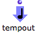

Navigation : [Previous](TempValues "page précédente\(TemporalBoxes
Value\)") | [Next](MaquetteValue "Next\(Sub
Maquettes\)")

# Patches

The " value" of a patch is produced by the patches itself, but this value has
to be expressed in the maquette. The  **Tempout is a specific outlet which
allows to express this value.** "Tempout" stands for "Temporal Output".

## The TempOut

|

The ** Tempout **is used for expressing the musical value of the patch within
the maquette.  
  
---|---  
  
  * When a patch is created directly in a maquette, a tempout is automatically added in its internal editor. 
  * If a patch is dropped in the maquette editor, this box can be added manually.

Adding a TempOut in a Patch

To add a  tempout :

  * `Cmd` click and type "tempout",

  *     1. `Ctrl` / right click in the patch editor,

    2. select `TemporalBoxes / Temporal Output` in the contextual menu.

|

  
  
---|---  
  
Instances and Maquettes Don't Have a TempOut

TemporalBoxes representing ** instances, ** **global variables** or  **factory
boxes** only have  **one standard output** , as a matter of course, since they
are a value.

TemporalBoxes representing  **maquettes** only have standard inputs and
outputs, their potential musical value being expressed by the  maquette
itself.

Using a Patch Without a TempOut

Sub patches don't have to be integrated in the musical structure of a maquette
to be used there. Therefore, a Tempout can be deleted. To display and express
the value of the object, though, a connection to a Tempout still remains
necessary.

Here, the temporal object just performs an addition. It is not connected to
any item, and its value is not displayed in the maquette.

This patch can return / get data to / from other boxes via its inputs and
outputs.

## Setting the TempOut Value

The value of a sub patch is the value connected to the ** Tempout **. The user
can select the value(s) to express in the maquette.

Example

In the upper TemporalBox :

  1. the value of a chord-seq is expressed via the Tempout, which is connected to the "self" output of the  chord-seq

  2. the last chords of the  chord-seq are returned by the  cdr function to the standard **output** of the TemporalBox

|

  
  
---|---  
  

|

The value of the lower TemporalBox is calculated from the resulting list :

  1. The input of the patch returns the list to  flat . 

  2. All sub-lists are then concatenated in a single list, which is returned to the"midics" input of the chord.

  3. The "self" output of the chord is connected to a  **Tempout** .The chord becomes the value of the TemporalBox. 

  
  
---|---  
  
## The Tempin / Self Input Box

A patch created directly in a maquette has another default box : the
**Tempin** , or  **Self Input Box** .

|

The  **Tempin** , or  **Self Input Box** allows to control and use the
**relation** between the patch and the maquette wherein it is located as
**programming parameters** .

Hence, the Tempin is not compulsary for using a patch within a maquette, and
can be deleted.  
  
---|---  
  
Using the Self Input Box for Programming :

  * [Programming with TemporalBoxes](TempProgramming)

References :

Contents :

  * [OpenMusic Documentation](OM-Documentation)
  * [OM User Manual](OM-User-Manual)
    * [Introduction](00-Contents)
    * [System Configuration and Installation](Installation)
    * [Going Through an OM Session](Goingthrough)
    * [The OM Environment](Environment)
    * [Visual Programming I](BasicVisualProgramming)
    * [Visual Programming II](AdvancedVisualProgramming)
    * [Basic Tools](BasicObjects)
    * [Score Objects](ScoreObjects)
    * [Maquettes](Maquettes)
      * [Creating a Maquette](Maquette)
      * [TemporalBoxes](TemporalBoxes)
        * [Adding TemporalBoxes](AddingTempbox)
        * [Elementary Manipulations](elementary)
        * [Temporalboxes Appearance](Appearance)
        * [TemporalBoxes Value](TempValues)
          * Patches
          * [Sub Maquettes](MaquetteValue)
          * [Instances](InstancesValue)
      * [The Maquette Editor](Editor)
      * [Maquette Programming](Programming%20Maquette)
      * [Maquettes in Patches](Maquettes%20in%20Patches)
    * [Sheet](Sheet)
    * [MIDI](MIDI)
    * [Audio](Audio)
    * [SDIF](SDIF)
    * [Lisp Programming](Lisp)
    * [Reactive mode](Reactive)
    * [Errors and Problems](errors)
  * [OpenMusic QuickStart](QuickStart-Chapters)

Navigation : [Previous](TempValues "page précédente\(TemporalBoxes
Value\)") | [Next](MaquetteValue "Next\(Sub
Maquettes\)")

