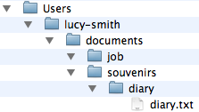
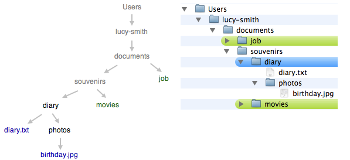
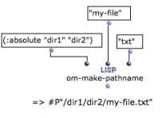
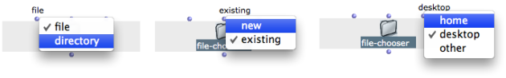
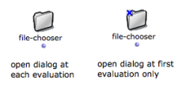

Navigation : [Previous](Files "page précédente\(Files\)") | [page
suivante](DefDirectories "Next\(Default Directories\)")

# Creating and Using Pathnames

## Generalities about Pathnames

** Pathnames ** designate files, folders and their location on a computer
system. They are mainly used by the programs to read and write information
stored on the hard disk.

Files Names

**File names** , such as "diary.txt", are generally made of a **main name** :
"diary", and an **extension** preceeded by a **dot** : ".txt"

Representations on Unix-Based Systems and Windows

  * On Unix-based systems, including MacOSX, the successive directories of the path that leads to the file are separated by a ** "/"**. 

This slash also represents the system root directory. For instance :

/Users/lucy-smith/documents/souvenirs/old-diary/diary.txt.

  * On Windows, the successive directories are separated by a "\" .

The root directory of the disk drive is represented by a **character
identifier** followed by ":" . For instance :

C :\Users\lucy-smith\documents\souvenirs\diary\diary.txt

|

  
  
---|---  
  
Absolute and Relative Pathnames

Pathnames can be absolute[1] or relative[2]. An aboslute pathname describes a
path from the root directory to an object. A relative pathname describes a
path from the directory wherein the user is working. This directory is called
the "current directory". Upstream directories are called "parent directories".

In relative pathnames, the **current directory** is expressed with "." .
Parent directories[3] are expressed with "..".

The current directory is "diary".

  * **./diary.txt** leads to a file named "diary" in the current directory.

  * **./photos/birthday.jpg** leads to a file that is located in a subdirectory of the current directory.

  * **../movies** refers to another directory, located in the parent directory of the current directory. 

  * **../../job** refers to a directory, located in another directory, two levels above the current directory.

## Manipulating Pathnames in Common Lisp

Independent Use of Pathnames

In **Common Lisp** , pathnames can be handled independently from any operating
system.

A pathname is represented with **" #P"** followed by the pathname, as
formulated in UNIX representations with a string[4].

For instance **** : #P"/Users/lucy-smith/documents/souvenirs/old-
diary/diary.txt

Constructing and Inspecting Pathnames with Common Lisp

  * Pathnames can be constructed with the function  make-pathname.

A pathname can be described with several components, such as : a name[5], a
type[6], a directory[7] and so on. Pathname **components** such as names,
types and directories are expressed with strings[4], such as :name "my-file"
or :type "txt"

  * Pathnames can be inspected with the functions  pathname-name ,  pathname-directory ,  pathname-type , etc. 

Converting Strings / Pathnames

The  namestring and  pathname functions alllow to convert pathnames into
simple strings and vice-versa.

Representing Directories in Lisp

To represent the directories wherein a file is located, write a list of
directory names preceeded by the :abolute or :relative symbols. For instance,
the pathname from a root directory to a file named "my-file" is created as
follows:

(make-pathname  :directory '( :absolute "Users" "my-name" "directory1") :name
"my-file" :type "txt")

Lisp Documentation

Find more information about pathnames in Common Lisp
[here](http://www.cs.cmu.edu/Groups/AI/cltl/clm/node204
"http://www.cs.cmu.edu/Groups/AI/cltl/clm/node204 \(nouvelle
fenêtre\)").

## Pathnames in OM

Creating a Pathname

The Lisp pathname functions can be used in OM as any other Lisp functions. The
** om-make-pathname ** is an additional facility provided by OM to build
pathnames.

The keywords arguments of this function allow to specify a file name,
extension, and a directory separately.

|

  
  
---|---  
  
Using Strings in OM

In OM, many functions requiring pathnames as inputs also accept a string
representation.

The File Chooser Box

The ** file-chooser ** box allows to select a file or folder via a pop up
window.

It has three [optional arguments](AdditionalInputs), which offer several
options to define the type of object and its location :

  * file / folder: 
  * existing / new
  * home / desktop / other

The output of the file chooser is the selected file or directory pathname, or
nil.

Locking the File-Chooser

**Note  **: [lock the box](LockMode) to keep the selected pathname in the
box. Otherwise, the file chooser dialog window will pop up at each evaluation.

|

  
  
---|---  
  
References :

  1. Absoluate Pathname

An absolute pathname, also referred to as an absolute path or a full path, is
the location of a filesystem object - file, directory or link- relative to the
**root directory**.

  2. Relative Pathname

A relative pathname tells the location of a filesystem object relative to the
directory **in which the user is currently working**.

  3. Parent Directory

A parent directory is the directory in which a given directory is located. In
an absolute path, the parent directoy is the predecessor of the current
directory.

  4. String

A characters chain between two inverted commas.

  5. Name

The name of a group of files that can be thought of as the "same'' file

  6.   7. Directory

Corresponds to the "directory'' concept in many host file systems: the name of
a group of related files (typically those belonging to a single user or
project).

Plan :

  * [OpenMusic Documentation](OM-Documentation)
  * [OM 6.6 User Manual](OM-User-Manual)
    * [Introduction](00-Sommaire)
    * [System Configuration and Installation](Installation)
    * [Going Through an OM Session](Goingthrough)
    * [The OM Environment](Environment)
    * [Visual Programming I](BasicVisualProgramming)
    * [Visual Programming II](AdvancedVisualProgramming)
      * [Abstraction](Abstraction)
      * [Evaluation Modes](EvalModes)
      * [Higher-Order Functions](HighOrder)
      * [Control Structures](Control)
      * [Iterations: OMLoop](OMLoop)
      * [Instances](Instances)
      * [Interface Boxes](InterfaceBoxes)
      * [Files](Files)
        * Pathnames
        * [Default Directories](DefDirectories)
        * [File-Box](File-Box)
    * [Basic Tools](BasicObjects)
    * [Score Objects](ScoreObjects)
    * [Maquettes](Maquettes)
    * [Sheet](Sheet)
    * [MIDI](MIDI)
    * [Audio](Audio)
    * [SDIF](SDIF)
    * [Lisp Programming](Lisp)
    * [Errors and Problems](errors)
  * [OpenMusic QuickStart](QuickStart-Chapters)

Navigation : [Previous](Files "page précédente\(Files\)") | [page
suivante](DefDirectories "Next\(Default Directories\)")

