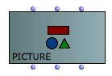
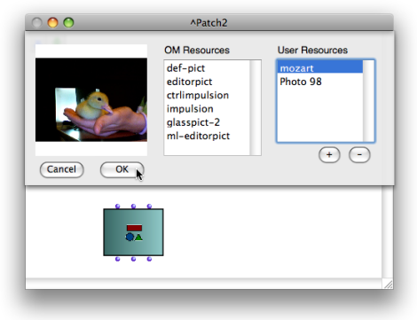
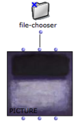
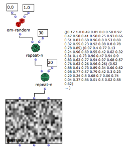
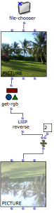
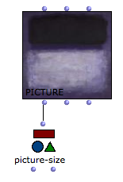
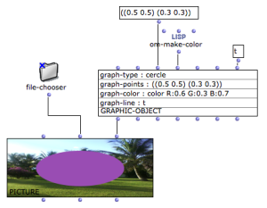
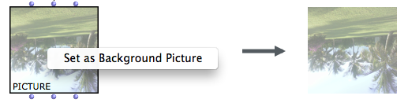
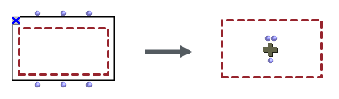
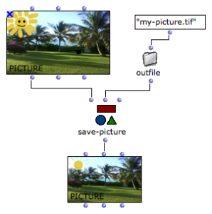

Navigation : [Previous](Picture "page précédente\(Picture\)") |
[Next](PictureEditor "Next\(Picture Editor\)")

# Picture Box

Sommaire

  1. Initializing the Picture Box
  2. Picture Programming
  3. Graphics
  4. Create Patch Background Pictures
  5. Saving / Exporting Pictures

|

The  picture class can be found in the packahges/menus `Basic Tools/ Picture`.

The box has three inputs/outputs :

  * self : the picture object
  * background : the main background picture (pixel array)
  * graphics : a list of vector graphics

  
  
---|---  
  
## Initializing the Picture Box

If a picture box is evaluated (and [ unlocked ](LockMode)) a picture
chooser window opens, so that the picture box can be initialized.

To select the picture, follow the procedure described in the
[Resources](resources) section :

  1. Choose a picture in one of the **Resources** frames.

Pictures can possibly be added or deleted via the `+` and `-` buttons of the
**User Resources** frame.

  2. Choose `Cancel` to cancel your choice or `OK` to validate your choice.

The Picture Chooser Dialog Window

  * [Resources](resources)

[Lock](LockMode) the box in order to preserve the chosen picture and
prevent rinitialization at the next evaluation.

Select the box and press `m` to display the current picture and additional
graphics.

|

  
  
---|---  
  
The picture can also be loaded and changed from the Picture Editor.

More about the Picture Editor

  * [Picture Editor](PictureEditor)

## Picture Programming

The picture can also be initialized from a visual program using the
background input.

**Connect  :**

  * A pathname to initialize the picture with any picture file on the disk.

Note : the picture will then be dependent on the corresponding file (only the
file pathname is "stored" in the picture object). Use the previous precdeure
in order to "internalize" the picture into your current OM workspace.

|

  
  
---|---  
  
  * A pixel array (list of list of gray level value - 0.1 => 1.0 - or RGBA lists for each pixel).

The list must be of dimension h (for height - number of lines) and each
sublist must be of the same size (w - width or number of columns / pixel in
each line).

Each item in this list of lists is the color value of a pixel. It can be
expressed as a number between 0.0 and 1.0 for a gray-level picture, or as a
list (R G B A) for the level of red, green and blue. "A" stands for "alpha"
and represents the transparency of the pixel.

|

  
  
---|---  
  
Getting the RGBA Pixel Array of a Picture

Use **get-RGB** to get the RGB array from a picture box, be it generated from
such an array or from a picture file. This data can be modified and used to
initialize new pictures.

|

  
  
---|---  
  
Manipulating Pixel Arrays

The large amount of data in standard sized picture may lead to long processing
time of the RGB array.

Pictures generated from a pixel array also have this array stored in the patch
which may lead to long saving time and large file sizes. Consider
reinitializing the picture box contents before saving (`SHIFT` \+ `I`) when
the content has not necessarily to be saved or can be regenerated at the next
session.

Picture Size

Use **picture-size** to get the size (width height) of a picture in the
picture object.

|

  
  
---|---  
  
## Graphics

The third input of the picture box ( graphics ) is a list of vectorial
graphics displayed on top of the picture.

There exist several types of such graphics : lines, arrrows rectangles,
circles, text, etc.

They can be created in an OM patch as instances of the **graphic-object**
class, or (more easily) from the picture editor. They can also be connected
and transferred from one picture box to another.

The graphic-object box contains information about a graphics to include in the
figure (shape, color, style, size, etc.)

The points depend on the shape (here, for a circle, they represent the center
and dimension). They are always given as values between 0.0 and 1.0, which are
scaled depending on the real picture size.

|

  
  
---|---  
  
Editing Graphics in the Picture Editor

  * [Picture Editor](PictureEditor)

Note that a **picture** object can contain only graphics and no background.

## Create Patch Background Pictures

To turn a picture box into the background picture of a patch  `Ctrl` / right
click on the picture box and choose `Set as Background Picture` in the
contextual menu.

The background picture fits the current size of the box.

More about Patch Background Pictures

  * [Background Pictures](Pictures)

Graphics and Backgrounfd Pictures

Using the graphics of a picture box as a background picture is very convenient
to document or augment your patches with additional information - arrows,
rectangles, etc.

Conversely, in order to turn a patch background pictures into a picture box :

  1. Press `y` to select a background picture. If several background pictures are located in a patch, press `y` successively to select the desired box.

  2. `Ctrl` / right click on it and choose `Make Box` in the contextual menu.

This is a convenient way to modify and resize a picture.

|

  
  
---|---  
  
## Saving / Exporting Pictures

The **SAVE-PICTURE** function allows to export the picture object including
its vector graphics as a picture file.

Vector graphics, therefore, are not vectorial anymore and are included in the
pixel array of teh exported picture.

|

  
  
---|---  
  
The `File / Save Picture` menu in the picture editor also allows to export the
current picture.

References :

Plan :

  * [OpenMusic Documentation](OM-Documentation)
  * [OM User Manual](OM-User-Manual)
    * [Introduction](00-Sommaire)
    * [System Configuration and Installation](Installation)
    * [Going Through an OM Session](Goingthrough)
    * [The OM Environment](Environment)
    * [Visual Programming I](BasicVisualProgramming)
    * [Visual Programming II](AdvancedVisualProgramming)
    * [Basic Tools](BasicObjects)
      * [Curves and Functions](CurvesAndFunctions)
      * [Array](ClassArray)
      * [TextFile](textfile)
      * [Picture](Picture)
        * Picture Box
        * [Picture Editor](PictureEditor)
    * [Score Objects](ScoreObjects)
    * [Maquettes](Maquettes)
    * [Sheet](Sheet)
    * [MIDI](MIDI)
    * [Audio](Audio)
    * [SDIF](SDIF)
    * [Lisp Programming](Lisp)
    * [Errors and Problems](errors)
  * [OpenMusic QuickStart](QuickStart-Chapters)

Navigation : [Previous](Picture "page précédente\(Picture\)") |
[Next](PictureEditor "Next\(Picture Editor\)")

