Navigation : [Previous](PictureBox "page précédente\(Picture
Box\)") | [Next](ScoreObjects "Next\(Score Objects\)")

# Picture Editor

The  **picture editor** allows to edit the contents of the picture object and
to add figures or sketches.

## Background Picture

Load / Remove

To load or remove a background picture in the object editor, go to `Edit Pitch
/ Load Picture - Remove Picture`.

|

[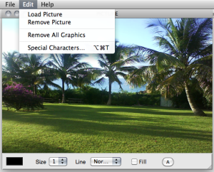](../res/pict-editor.png "Cliquez pour
agrandir")  
  
---|---  
  
## Editing Graphics : Tools and Options

The picture editor opens, along with a **drawing palette** .

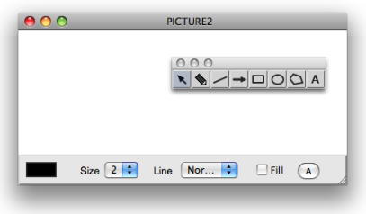

Adding Graphics : Palette

The palette provides a seven drawing tools, in addition to the standard
selection cursor  :

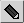 : the "pen" tool allows free drawings.

 : "line" tool

 : "arrow" tool

 : "square / rectangle" tool

|

 "circle / ellipse" tool

 "polygon" tool

 "text" tool  
  
---|---  
  
Click and draw in the editor to create - additional - graphics in the picture
editor.

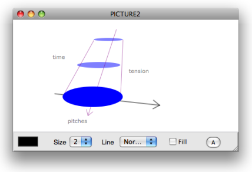

Text Tool and Polygon Tool

| |

Text Tool

| | |

Polygon Tool  
  
---|---|---|---|---|---  
  
1\.

|

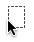

|

Click somewhere in the editor then type some text.

|

1\.

|

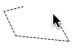

|

Click in the editor to add points.  
  
2\.

|

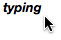

|

Click again to validate.

|

2\.

|

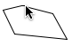

|

Double click to validate and close the polygon.  
  
Editor Options

The lower part of the editor provides drawing options :

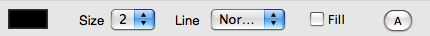

  *  : click on the coloured patch and choose a colour in the Colour Chooser.
  * `Size` pop up menu : select a number of pixel for lines thickness.
  * `Line` pop up menu : plain or dashed line style.
  * `Filled` : check the option to fill figures automatically.
  * `A` button : font dialog window.

## Editing Graphics : Commands and Menus

Selection / Remove

  * To select a foreground item and to switch from an item to the other within the editor, press the `TAB` key. The name of this item is visible in the upper right corner of the editor's window.
  * To remove a selected item, use the `Backspace` key.

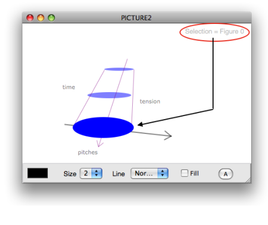

To remove all the graphics from the editor, select `Edit Pict / Remove All
Graphics`.

|

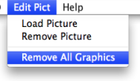  
  
---|---  
  
Move

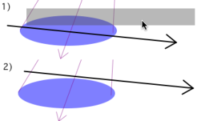

|

To move a selected item in the picture, drag and drop it with the pointer.  
  
---|---  
  
Reminder

Remember that the `Editor Command Keys` are available via the `Help` menu.

|

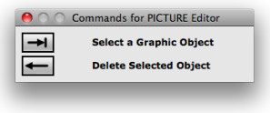  
  
---|---  
  
References :

Plan :

  * [OpenMusic Documentation](OM-Documentation)
  * [OM User Manual](OM-User-Manual)
    * [Introduction](00-Sommaire)
    * [System Configuration and Installation](Installation)
    * [Going Through an OM Session](Goingthrough)
    * [The OM Environment](Environment)
    * [Visual Programming I](BasicVisualProgramming)
    * [Visual Programming II](AdvancedVisualProgramming)
    * [Basic Tools](BasicObjects)
      * [Curves and Functions](CurvesAndFunctions)
      * [Array](ClassArray)
      * [TextFile](textfile)
      * [Picture](Picture)
        * [Picture Box](PictureBox)
        * Picture Editor
    * [Score Objects](ScoreObjects)
    * [Maquettes](Maquettes)
    * [Sheet](Sheet)
    * [MIDI](MIDI)
    * [Audio](Audio)
    * [SDIF](SDIF)
    * [Lisp Programming](Lisp)
    * [Errors and Problems](errors)
  * [OpenMusic QuickStart](QuickStart-Chapters)

Navigation : [Previous](PictureBox "page précédente\(Picture
Box\)") | [Next](ScoreObjects "Next\(Score Objects\)")

