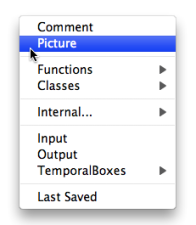
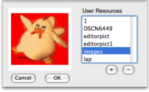
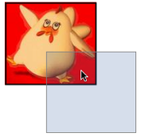

Navigation : [Previous](Comments "page précédente\(Comments\)") |
[Next](SavingPatch "Next\(Saving / Reloading a
Patch\)")

# Background Pictures

Pictures can be added as a background or illustration for patch editors.

## Creating a Background Picture

|

To add a picture box in a patch editor :

  * `Ctrl` / right click in the patch editor, choose `Picture`

  
  
---|---  
  
Choose an item among the registered **User Resources** of the Picture Chooser,
and click on `OK`.

  * To add a resource, press `+` and select an item from any location in your computer.
  * To delete a resource, press `-` .

Resources and Picture Chooser

  * [Resources](resources)

## Managing Background Pictures

Selection / Delete

  * To activate a background picture, press `y` . A selected picture features a bold border. 
  * The selected picture can be moved around the patch and resized by a simple drag and drop.
  * To switch to another background picture, press `y` again .
  * To delete a selected picture, press `Backspace` .
  * To reinitialize the picture size, press `i`.

|

  
  
---|---  
  
The Picture Object

A Picture object also exist in OM, and allows to create and edit pictures as a
standard OM object. It is possible to convert a background picture to a
picture object and vice-versa.

More About Picture Objects

  * [Picture Box](PictureBox)

References :

Plan :

  * [OpenMusic Documentation](OM-Documentation)
  * [OM User Manual](OM-User-Manual)
    * [Introduction](00-Sommaire)
    * [System Configuration and Installation](Installation)
    * [Going Through an OM Session](Goingthrough)
    * [The OM Environment](Environment)
    * [Visual Programming I](BasicVisualProgramming)
      * [Patch Introduction](ProgrammingIntro)
      * [Adding Boxes Into a Patch](AddingBoxes)
      * [Elementary Manipulations](ElementaryManips)
      * [Boxes](Boxes)
      * [Box Inputs](BoxInputs)
      * [Connections](Connections)
      * [Evaluation](Evaluation)
      * [Documentation and Info](DocAndInfo)
      * [Comments](Comments)
      * Pictures
      * [Saving / Reloading a Patch](SavingPatch)
      * [Dead Boxes](DeadBox)
    * [Visual Programming II](AdvancedVisualProgramming)
    * [Basic Tools](BasicObjects)
    * [Score Objects](ScoreObjects)
    * [Maquettes](Maquettes)
    * [Sheet](Sheet)
    * [MIDI](MIDI)
    * [Audio](Audio)
    * [SDIF](SDIF)
    * [Lisp Programming](Lisp)
    * [Errors and Problems](errors)
  * [OpenMusic QuickStart](QuickStart-Chapters)

Navigation : [Previous](Comments "page précédente\(Comments\)") |
[Next](SavingPatch "Next\(Saving / Reloading a
Patch\)")

