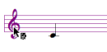

Navigation : [Previous](Editor-Rhythm "page précédente\(Rhythmic
Objects\)") | [Next](Editor-PageMode "Next\(Page
Mode\)")

# Polyphonic Objects : Poly and Multi-seq Editors

## Common Features

A  poly and a  multi-seq objects are a superimposition of  voices or  chord-
seqs .

They both have one additional tool : the  **poly tool**
, which allows to edit all voices at once.

|

  
  
---|---  
  
Add / Delete Staves

  * To add a staff : 

    1. select the voice  or the poly tool  ,

    2. to add a new staff, `Cmd` click on a staff.

Notice that new staves are automatically added  above the "lower" staff .

  * To delete a staff :

    1. select the voice tool,

    2. click and drag a staff 

    3. press `backspace`.

Respacing Staves

As in voices editors, staves can be moved up of down, and consequently,
respaced.

To respace staves :

  1. click on the clefs of the staves you want to respace

  2. use the `↓` `↑` keys.

Internal Voice or Chord-Seq Edition

|

To open a  voice or a  chord-seq as an internal object from a  poly or a
multi-seq  :

  1. select the voice tool,

  2. click and drag a staff to select a voice or a chord-seq,

  3. press `o`, or double click on it. 

  
  
---|---  
  
Individual Chord-Seq and Voice Staff Configuration

To define clefs individually :

  1. click on a clef

  2. choose a configuration in the `staff` pop up menu. 

|

  
  
---|---  
  
Remember that multiple staves configurations - e.g. `FF`, `GF`, `GGFF` etc. -
do not allow individual staff editing or respacing.

## Poly Editor and Multi-Seq Specific Features

Poly : Polytemporality and Polymeter

Within a  poly, each voice can have its own time signatures, channel and
tempo, so as to build polytemporal and metric structures. The score is then
organized according to absolute durations.

  * To change the tempo or midichannel of a  voice :

    1. select the voice

    2. enter a value or scroll the mouse up or down in the voice inspector.

  * To change the meter of a measure :

    1. select it with the measure tool

    2. enter values in the measure inspector.

Multi-Seqs : Internal Chord-Seq Edition

Within a multi-seq, chord-seqs must be open in internal windows to be edited
separately.

References :

Contents :

  * [OpenMusic Documentation](OM-Documentation)
  * [OM User Manual](OM-User-Manual)
    * [Introduction](00-Contents)
    * [System Configuration and Installation](Installation)
    * [Going Through an OM Session](Goingthrough)
    * [The OM Environment](Environment)
    * [Visual Programming I](BasicVisualProgramming)
    * [Visual Programming II](AdvancedVisualProgramming)
    * [Basic Tools](BasicObjects)
    * [Score Objects](ScoreObjects)
      * [Presentation](Score-Objects-Intro)
      * [Rhythm Trees](RT)
      * [Score Players](ScorePlayer)
      * [Score Editors](ScoreEditors)
        * [Overview](Editor-Overview)
        * [Preferences](Editors-Prefs)
        * [Score Display](Editor-Display)
        * [Basic Editing](Editor-Basics)
        * [Harmonic Objects](Harmonic-Obj-Editor)
        * [Rhythmic Objects](Editor-Rhythm)
        * Polyphonic Objects
        * [Page Mode](Editor-PageMode)
        * [Tonal Display](Editor-Tonality)
        * [Microintervals Notation](Editor-Microintervals)
        * [Play Controls](Editor-Play)
      * [Quantification](Quantification)
      * [Export / Import](ImportExport)
    * [Maquettes](Maquettes)
    * [Sheet](Sheet)
    * [MIDI](MIDI)
    * [Audio](Audio)
    * [SDIF](SDIF)
    * [Lisp Programming](Lisp)
    * [Errors and Problems](errors)
  * [OpenMusic QuickStart](QuickStart-Chapters)

Navigation : [Previous](Editor-Rhythm "page précédente\(Rhythmic
Objects\)") | [Next](Editor-PageMode "Next\(Page
Mode\)")

