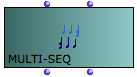
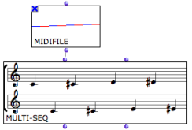
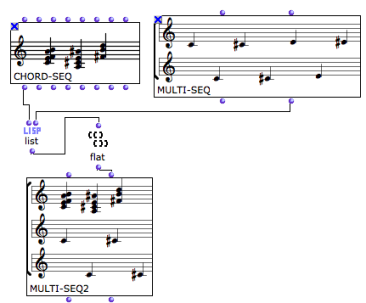
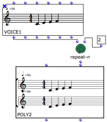

Navigation : [Previous](RhythmicObjects "page précédente\(Rhythmic
Objects\)") | [Next](RT "Next\(Rhythm Trees\)")

# Polyphonic Objects

## The Multi-Seq Object

|

The  multi-seq object allows to "superimpose" several  chord-seqs .  
  
---|---  
  
Inputs and Outputs

Multi-seqs have two inputs and outputs.

  * The first input - self - takes  chord-seqs or  midifiles .The second input takes a list of  chord-seqs .
  * The first output returns the self of the  multi-seq . The second output returns a list of  chord-seqs .

Applications

To convert a  midifile into a  multi-seq  :

  * connect a  midifile object's "self" output to the "self" input of a  multi-seq ,
  * evaluate the  multi-seq .

The  midifile is expressed as a standard musical score, which can be accessed
and modified via its editor.

You will have to select a midi file when the object is evaluated. Lock the box
in order not to have to choose a file again.

|

  
  
---|---  
  
Modifying Score Objects

  * [Polyphonic Objects : Poly and Multi-seq Editors](Poly-Multi-Editor)

To convert a  midifile  and a  chord-seq into a  multi-seq :

  1. convert the  midifile into a  multi-seq ,

  2. connect the second output of the  multi-seq , and the "self" output or the  chord-seq to  list .

  3. If the  midifile has more than one voice, use flat to get a single level list of chord-seqs.

  4. Connect  list or  flat to the second input of the multi-seq.

Multi-Seq to Midifile

You can possibly convert the resulting  multi-seq into a midifile with a
simple connection and evaluation.

## The Poly Object

|

The  poly object allows to "superimpose" several  voices .  
  
---|---  
  
Inputs and Outputs

The poly object has two inputs and outputs :

  * The first input - self - takes  polys or  midi files . The second input take a list of  voices .
  * The first output returns the self of the  poly . The second output returns a list of  voices .

Applications

To create a poly out of a series of  voices  :

  * create a list of voices with a  list function, or any other type of relevant function, 
  * connect the list function to the second input of the  poly and evaluate the box.

|

  
  
---|---  
  
About Polys and Multi-Seq Editors

  * [Polyphonic Objects : Poly and Multi-seq Editors](Poly-Multi-Editor)

References :

Plan :

  * [OpenMusic Documentation](OM-Documentation)
  * [OM User Manual](OM-User-Manual)
    * [Introduction](00-Sommaire)
    * [System Configuration and Installation](Installation)
    * [Going Through an OM Session](Goingthrough)
    * [The OM Environment](Environment)
    * [Visual Programming I](BasicVisualProgramming)
    * [Visual Programming II](AdvancedVisualProgramming)
    * [Basic Tools](BasicObjects)
    * [Score Objects](ScoreObjects)
      * [Presentation](Score-Objects-Intro)
        * [Harmonic Objects](Note-Chord-Chord-seq)
        * [Rhythmic Objects](RhythmicObjects)
        * Polyphonic Objects
      * [Rhythm Trees](RT)
      * [Score Players](ScorePlayer)
      * [Score Editors](ScoreEditors)
      * [Quantification](Quantification)
      * [Export / Import](ImportExport)
    * [Maquettes](Maquettes)
    * [Sheet](Sheet)
    * [MIDI](MIDI)
    * [Audio](Audio)
    * [SDIF](SDIF)
    * [Lisp Programming](Lisp)
    * [Errors and Problems](errors)
  * [OpenMusic QuickStart](QuickStart-Chapters)

Navigation : [Previous](RhythmicObjects "page précédente\(Rhythmic
Objects\)") | [Next](RT "Next\(Rhythm Trees\)")

