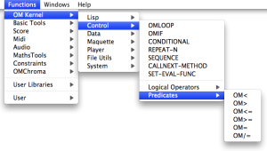
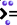
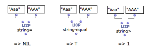
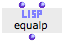

ci a ete desactive. Certaines fonctionnalites de ce guide sont restreintes.

# Comparison Predicates

There are many comparison predicates. These can apply to numbers, but also to
symbols, characters, words, and so on.

## Comparing Numbers

Common Algebraic Predicates

Comparing numbers is a widespread use of predicates in OM.

Some algebraic predicates can be accessed via the `Functions / Kernel /
Control` menu. Like other functions, they can also be added in a patch editor
by typing their name.

|

  
  
---|---  
  
Here is a non exhaustive presentation of OM algebraic predicates:

Predicate

|

Write

|

Test  
  
---|---|---  
  

|

OM=

|

A equal to B ?  
  

|

OM/=

|

A different from B ?  
  

|

OM<=

|

A inferior or equal to B ?  
  

|

OM>=

|

A superior or equal to B ?  
  

|

OM<

|

A inferior to B ?  
  

|

OM>

|

A superior to B ?  
  
Equivalent Lisp predicates

There are equivalent Lisp predicates to OM predicates. They can be used
directly in OM type the predicate name without "OM", for instance "=", ">=",
etc.

They can sometimes offer ineteresting possibilities, as they accept more than
two arguments.

## Comparison Predicates and Non Algebraic Objects

Lisp provides other predicates specifically dedicated to the comparison of
other type of objects.

Some useful comparison predicates concern  strings - or "words"-. They allow
to test if two strings are equal, considering the characters case or not,
precedence in alphabetical order, etc.

Here are examples of avalable string-predicates :

  * string-equal ,  string=

  * string< ,  string>= ...

|

  
  
---|---  
  
String Predicates in Lisp

More information about string comparison in Lisp can be found
[here](http://www.cs.cmu.edu/Groups/AI/cltl/clm/node166
"http://www.cs.cmu.edu/Groups/AI/cltl/clm/node166 \(nouvelle
fenêtre\)").

## Equality Predicates

Application

Equality predicates test if two items are **equal or not**. They apply to a
broader range of data than the algebraic predicates.

There are a number of equality predicates. Indeed, equality can encompass
different concepts, depending on the type of object it is applied to.

For instance, the character "a" is a **concept** that can be represented by
several different glyphs - A, a, **a** - which can be considered identical or
not, depending on the predicate.

EQ is the the most specific predicate, and  EQUALP the most general :

|

Returns "t" if

|

Examples  
  
---|---|---  
  

|

  * **** Object are the  same identical object , and not only have the same value.

This can have unpredictible results when testing numbers, for instance, since
the underlying language may make internal copies of the numbers with same
values.

**Two objects with the same reference** are eq.

|

eq 'A 'A -> t

eq 'A 'a -> t

eq "A" "A" -> nil

eq '(A B C) '(A B C) -> nil

eq 2 2/1 -> t

eq 2 2 -> t

eq 2.5 2.5 -> nil  
  
|

Returns "t" if

|

Examples  
  

|

  * Objects are  eq

  * Objects are numbers or characters with the same type and the same value .

|

eql 2.0 2.0 -> t

eql 2.0 2 -> nil  
  
|

Returns "t" if

|

Examples  
  

|

  * Objects are **structurally similar**

  * Strings have **identical** glyphs

|

equal (A (b) C) (a (B) c) -> t

equal "A" "A" -> t

equal "A" "a" ->nil

equal 2.5 2.5 ->t  
  
|

Returns "t" if

|

Examples  
  

|

  * Objects are eq, eql or equal

  * Objects have the same **value**

  * Strings have **similar** glyphs 

|

equalp 2 2/1 -> t

equalp 2.5 2.5 -> t

equalp 2 2.0 -> t

equalp "A" "a" -> t  
  
Equality Predicates in Lisp

Equality predicates are **Lisp functions**. They may not be in the OM menus
but can be added by typing their name directly in a patch editor.

More information about equality predicates in Common Lisp
[here](http://www.cs.cmu.edu/Groups/AI/cltl/clm/node74
"http://www.cs.cmu.edu/Groups/AI/cltl/clm/node74 \(nouvelle
fenêtre\)").

Numbers Equality

As shown above, general equality predicates offer more specific options in the
evaluation of **equality between** **numbers**. They consider the **value** of
numbers, but also their **type** (integer, float, ratio, etc.) and the
**internal Lisp object** they refer to.

Lisp Predicates and OM Functions

Many Lisp and OM functions need a predicate to operate. Some functions that
perform operations upon lists, for instance, have a **default equality
predicate** used for identifying similar items.

This predicate can be redefined to modify the behaviour of the function : a
comparison predicate or a lambda function can be used for rejecting a given
type of numbers, an so on.

Using Lambda Functions as Predicates :

  * [Lambda Mode Examples: Test Functions](LambdaTest)

References :

Plan :

  * [OpenMusic Documentation](OM-Documentation)
  * [OM 6.6 User Manual](OM-User-Manual)
    * [Introduction](00-Sommaire)
    * [System Configuration and Installation](Installation)
    * [Going Through an OM Session](Goingthrough)
    * [The OM Environment](Environment)
    * [Visual Programming I](BasicVisualProgramming)
    * [Visual Programming II](AdvancedVisualProgramming)
      * [Abstraction](Abstraction)
      * [Evaluation Modes](EvalModes)
      * [Higher-Order Functions](HighOrder)
      * [Control Structures](Control)
        * [Predicates](Predicates)
          * Comparison Predicates
          * [Type Predicates](PredTypes)
          * [In Practice](PredExample)
        * [Conditional Operators](ConditionalOps)
        * [Logical Operators](Logical)
        * [Sequential Operators](Sequencial)
      * [Iterations: OMLoop](OMLoop)
      * [Instances](Instances)
      * [Interface Boxes](InterfaceBoxes)
      * [Files](Files)
    * [Basic Tools](BasicObjects)
    * [Score Objects](ScoreObjects)
    * [Maquettes](Maquettes)
    * [Sheet](Sheet)
    * [MIDI](MIDI)
    * [Audio](Audio)
    * [SDIF](SDIF)
    * [Lisp Programming](Lisp)
    * [Errors and Problems](errors)
  * [OpenMusic QuickStart](QuickStart-Chapters)

Navigation : [page precedente](Predicates "page
précédente\(Predicates\)") | [page suivante](PredTypes "page
suivante\(Type Predicates\)")

