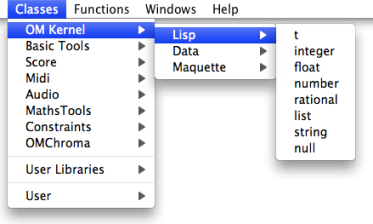
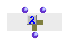
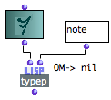

Navigation : [Previous](PredComparison "page
précédente\(Comparison Predicates\)") | [Next](PredExample "page
suivante\(In Practice\)")

# Type Predicates

A **type predicate** tests if an **object** belongs to a **type of object** .
Most of these types are Lisp types, which can be found in the `Classes` of the
`OMKernel / Lisp` package.

Type predicates are not available in the OM menus or packages, but their name
can be typed in a patch editor directly. It conventionally ends with the
letter "p" for "predicate".

## Numbers

There are several number types, which can be tested by the following
predicates.

  * **numberp** : numbers

|

  * i **ntegerp** : integer numbers

|

  * **rationalp** : rational numbers

|

  * **floatp** : decimal numbers

  
---|---|---|---  
  
By extension, other predicates test the **properties** of numbers.

  * **plusp** : positive numbers

|

  * **minusp** : negative numbers

|

  * **zerop** : zero

|

  * **evenp** : even integers

|

  * ****oddp** : odd integers**

  
---|---|---|---|---  
  
## Other Type Predicates

Here are some other frequently used type predicates :

Predicate

|

Returns "t" for

|

Example  
  
---|---|---  
  
** **characterp** **

|

the name of a character that has a printable glyph.

|

#\Space ; #\a ... -> t  
  
**symbolp**

|

something that can be named but numbers, strings, lists, some characters.

|

'cow ; note ; 2-ERz -> t  
  
** **atom** **

|

anything not between parenthesis but strings.

|

A ; 38 ; -> t  
  
** **listp** **

|

anything between parenthesis, or nil. In Lisp, nil = empty list.

|

(A B C) ; (A (B C) -> t  
  
** **consp** **

|

a list with a car[1] and a  cdr[1].

|

(A B) ; (A (B C)) -> t

(A) -> nil  
  
** **stringp** **

|

anything between inverted commas.

|

"vangogh#\Tab;;2" -> t  
  
**functionp**

|

function names and function boxes on "lambda" mode.

|

 -> t  
  
**nullp**

|

anything that is nil.

|

nil -> t ; ( ) -> t  
  
**typep**

|

an object of a given type.

|

  
  
References :

  1. CAR, CDR, CADR, CDDR, CADDR...

Elementary Lisp functions, allowing the access to one or more elements in a
list.

Lisp fonctions are actually linked list. Lists are actually "conses" (or
"pairs") made of a first element and a pointer to the rest (or "tail") of the
list (another cons). These two parts of the list are accessed with the CAR and
CDR functions, respectively.

Let the following list be : (A B C D).

CAR (A B C D) = A.

CDR (A B C D) = (B C D).

CDR (B) => NIL [this list has no CDR]

"CAR" and "CDR" are technical terms which originally refer to the way data is
handled by the computer. CAR is the acronym of "Contents of the Address part
of Register number". CDR is the acronym of "Contents of the Decrement part of
Register number".

The rest of the functions below are built upon these two kernel accessors.

CADR (A B C D) = B. CADR means CAR of the CDR.

CDDR (A B C D) = (C D). CDDR means CDR of the CDR.

CADDR (A B C D) = C. CADDR means CAR of the CDDR.

NTHCDR (A B C D) = NTH CDR of the list - N must be specified as argument.
NTHCDR 3 (A B C D) = (D).

And so on...

Contents :

  * [OpenMusic Documentation](OM-Documentation)
  * [OM User Manual](OM-User-Manual)
    * [Introduction](00-Contents)
    * [System Configuration and Installation](Installation)
    * [Going Through an OM Session](Goingthrough)
    * [The OM Environment](Environment)
    * [Visual Programming I](BasicVisualProgramming)
    * [Visual Programming II](AdvancedVisualProgramming)
      * [Abstraction](Abstraction)
      * [Evaluation Modes](EvalModes)
      * [Higher-Order Functions](HighOrder)
      * [Control Structures](Control)
        * [Predicates](Predicates)
          * [Comparison Predicates](PredComparison)
          * Type Predicates
          * [In Practice](PredExample)
        * [Conditional Operators](ConditionalOps)
        * [Logical Operators](Logical)
        * [Sequential Operators](Sequencial)
      * [Iterations: OMLoop](OMLoop)
      * [Instances](Instances)
      * [Interface Boxes](InterfaceBoxes)
      * [Files](Files)
    * [Basic Tools](BasicObjects)
    * [Score Objects](ScoreObjects)
    * [Maquettes](Maquettes)
    * [Sheet](Sheet)
    * [MIDI](MIDI)
    * [Audio](Audio)
    * [SDIF](SDIF)
    * [Lisp Programming](Lisp)
    * [Reactive mode](Reactive)
    * [Errors and Problems](errors)
  * [OpenMusic QuickStart](QuickStart-Chapters)

Navigation : [Previous](PredComparison "page
précédente\(Comparison Predicates\)") | [Next](PredExample "page
suivante\(In Practice\)")

