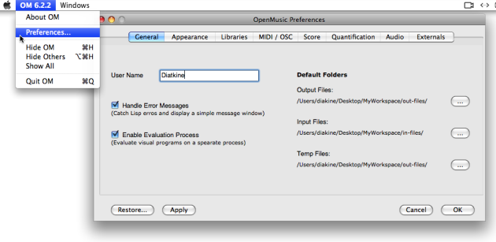

The OM interface and programming components are ruled by a series of default
parameters that can be modified via the ` Preferences` pane during an OM
session. These parameters are associated to and saved with the workspace that
was open at this session.

## Preferences Pane

Access

[Zoom](../res/prefswindow_scr_1.png "Zoom \(nouvelle fenêtre\)")

To open the `Preferences` pane, select `OM 6.X.X / Preferences` . A series of
tabs that give access to a set of preferences is shown on the left.

Preferences Tabs

**General** : user name, default storage folders, evaluation process control

**Appearance** : appearance of the workspace, patches, and maquettes

**Libraries** :  libraries to be loaded automatically when starting a session,
extra libraries folder

**MIDI / OSC** : MIDIShare and MicroPlayer preferences

**Score** : score editors preferences, such as staffs number, microtonal
notation scale...

**Quantification** : musical data conversions default parameters, such as
tempo (60 bpm) , measure (4/4) ...

**Audio** : general audio preferences

**Externals** : external sound processing applications communication

More information about each tab is provided within the corresponding sections.

Commands

  * `Restore` : resets the default preferences.
  * `Apply` : applies the preference defined in the pane.
  * `Cancel` : closes the pane without applying the preferences.
  * `OK` : applies and saves the preferences.

## Saving Preferences

The preferences are attached to the workspace and are saved with it during or
at the end of the session.

Quit / Save

  * [Quitting OM and Saving](QuittingSaving)

Reinitializing Preferences

The preferences are stored in the file  preferences.lisp located in the [
`Workspace` ](Workspace\(s\)) folder. In case of problems when loading a
former workspace with a new OM version, this file can be removed. The OM
preferences will then be reinitialized.

References :

Plan :

  * [OpenMusic Documentation](OM-Documentation)
  * [OM 6.6 User Manual](OM-User-Manual)
    * [Introduction](00-Sommaire)
    * [System Configuration and Installation](Installation)
    * [Going Through an OM Session](Goingthrough)
    * [The OM Environment](Environment)
      * [Environment Windows](MainWindows)
      * Preferences
      * [Workspace](Workspace)
      * [Library](Library)
      * [Tutorials](Tutorials)
      * [Resources](resources)
    * [Visual Programming I](BasicVisualProgramming)
    * [Visual Programming II](AdvancedVisualProgramming)
    * [Basic Tools](BasicObjects)
    * [Score Objects](ScoreObjects)
    * [Maquettes](Maquettes)
    * [Sheet](Sheet)
    * [MIDI](MIDI)
    * [Audio](Audio)
    * [SDIF](SDIF)
    * [Lisp Programming](Lisp)
    * [Errors and Problems](errors)
  * [OpenMusic QuickStart](QuickStart-Chapters)

Navigation : [page precedente](MainWindows "page précédente\(Environment
Windows\)") | [page suivante](Workspace "page suivante\(Workspace\)")

