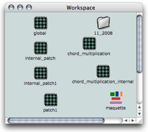
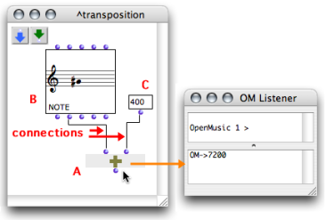

Navigation : [Previous](BasicVisualProgramming "page
précédente\(Visual Programming I\)") | [Next](AddingBoxes "page
suivante\(Adding Boxes Into a Patch\)")

# Introduction to Patch Programming

Almost all programming in OpenMusic is done in patches, which are visual
representations of programs.

## Location

Patches are created in the workspace[1] window.

More Information about Patches and Other Documents :

  * [Workspace](Workspace)

Most visual programming is done in the  **patch** ** editor **, which opens by
a double click on the patch icon.

## Content

Patches contain ** boxes,** which represent :

  * ** functions ** that are called or used by the program,
  * ** objects **- such as notes, sound files and so on -, that are created and processed in the program.

** Connections **link these components together to define the functional
structure of the program.

Boxes and Programs

The various box types that might interact in a program generally have
different properties. Each box type is described in the [Boxes and Patch
Components](Boxes) section. You will also learn how to create patches
within other patches. This very convenient procedure is called  [functional
abstraction](Abstraction). The user will resort to it as soon as he or
she gets familiar with OM.

A Simple Patch Example : Performing a Transposition

This patch contains three items :

  * A : the ** **om+** **function** **, which executes additions
  * B : a ** note ** object
  * C : a  **data box** . 

The note is a G#4, which means its pitch is equal to 6800 midicents[2]. This
pitch can be accessed via the second inlet and outlet of the box.

The first input of om+ is connected to the second outlet of the note : the
pitch of the note is the first term of the addition.

The data box represents a value : 400. It is connected to the second inlet of
om+. It is the second term of the addition.

When om+ is evaluated, the Listener displays the value of the resulting pitch
in midicents.

References :

  1. Workspace

OpenMusic's working environment. Each session starts with choosing a
workspace, the equivalent of a desktop where programs are created and
organized, and where items can be stored.

  2. Midicent

A midicent is a unit representing one cent of the usual MIDI pitch unit, that
is, a half-tone. For instance, a C4 corresponds to 60 in MIDI, and to 6000
midicents, C4# to 61, i.e. 6100 midicents, and so on.

Plan :

  * [OpenMusic Documentation](OM-Documentation)
  * [OM User Manual](OM-User-Manual)
    * [Introduction](00-Sommaire)
    * [System Configuration and Installation](Installation)
    * [Going Through an OM Session](Goingthrough)
    * [The OM Environment](Environment)
    * [Visual Programming I](BasicVisualProgramming)
      * Patch Introduction
      * [Adding Boxes Into a Patch](AddingBoxes)
      * [Elementary Manipulations](ElementaryManips)
      * [Boxes](Boxes)
      * [Box Inputs](BoxInputs)
      * [Connections](Connections)
      * [Evaluation](Evaluation)
      * [Documentation and Info](DocAndInfo)
      * [Comments](Comments)
      * [Pictures](Pictures)
      * [Saving / Reloading a Patch](SavingPatch)
      * [Dead Boxes](DeadBox)
    * [Visual Programming II](AdvancedVisualProgramming)
    * [Basic Tools](BasicObjects)
    * [Score Objects](ScoreObjects)
    * [Maquettes](Maquettes)
    * [Sheet](Sheet)
    * [MIDI](MIDI)
    * [Audio](Audio)
    * [SDIF](SDIF)
    * [Lisp Programming](Lisp)
    * [Errors and Problems](errors)
  * [OpenMusic QuickStart](QuickStart-Chapters)

Navigation : [Previous](BasicVisualProgramming "page
précédente\(Visual Programming I\)") | [Next](AddingBoxes "page
suivante\(Adding Boxes Into a Patch\)")

