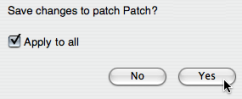

Navigation : [Previous](Workspace\(s\) "page
précédente\(Workspace(s) Management\)") | [Next](Environment
"Next\(The OM Environment\)")

# Quitting OM and Saving

## Quitting OM

To quit OM :

  * choose `OM X.X.X / Quit`
  * press `Cmd` \+ `q`.

OM always asks if the current workspace must be saved when quitting.

Two dialogue windows will open successively

  1. to ask you to confirm quitting : choose `Yes` ,

  2. to save the current workspace : choose `Yes` or `No`.

## Saving a Workspace and its Content

Saving Files, Folders and Workspaces

To save the content of an item :

  * select `File / Save`
  * press `Cmd` \+ `s`. 

Saving a workspace or a folder triggers the saving of its settings and unsaved
content.

The saving dialogue window asks if unsaved items have to be saved. The `apply
to all` option allows to apply your choice to the  **whole content of the
folder** **or workspace** .

All modified items are saved in the corresponding workspace folders.

|

  
  
---|---  
  
Full Information About the Workspace

  * [Workspace](Workspace)

References :

Plan :

  * [OpenMusic Documentation](OM-Documentation)
  * [OM User Manual](OM-User-Manual)
    * [Introduction](00-Sommaire)
    * [System Configuration and Installation](Installation)
    * [Going Through an OM Session](Goingthrough)
      * [Launching OM](Launching%20OM)
      * [Workspace(s) Management](Workspace\(s\))
      * Quitting OM and Saving
    * [The OM Environment](Environment)
    * [Visual Programming I](BasicVisualProgramming)
    * [Visual Programming II](AdvancedVisualProgramming)
    * [Basic Tools](BasicObjects)
    * [Score Objects](ScoreObjects)
    * [Maquettes](Maquettes)
    * [Sheet](Sheet)
    * [MIDI](MIDI)
    * [Audio](Audio)
    * [SDIF](SDIF)
    * [Lisp Programming](Lisp)
    * [Errors and Problems](errors)
  * [OpenMusic QuickStart](QuickStart-Chapters)

Navigation : [Previous](Workspace\(s\) "page
précédente\(Workspace(s) Management\)") | [Next](Environment
"Next\(The OM Environment\)")

