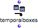

Navigation : [Previous](addexamples "page précédente\(Examples\)")
| [Next](REF4 "Next\(Removing Boxes\)")

# Accessing TemporalBoxes of a Maquette from a Patch

Accessing TemporalBoxes from a patch is especially necessary for removing them
from a maquette, and for manipulating them from outside the maquette.

## Temporalboxes Function : Use

|

The temporalboxes function allows to access and modifiy all the temporal
objects contained in a maquette.

To add the temporalboxes function :

  * `Cmd` click and type "temporalboxes"
  * select `Functions / OMKernel / Maquette / Temporalboxes`. 

  
---|---  
  
## Procedure

  1. Connect the maquette box on "reference" mode to the input of the  temporalboxes function.

  2. Connect the output of the temporalboxes function to the program. The boxes contained in the maquette can be manipulated from the patch.

|

The temporal objects enclosed in the maquette is returned as a TemporalBoxes
list when evaluating the function.  
  
---|---  
  
References :

Contents :

  * [OpenMusic Documentation](OM-Documentation)
  * [OM User Manual](OM-User-Manual)
    * [Introduction](00-Contents)
    * [System Configuration and Installation](Installation)
    * [Going Through an OM Session](Goingthrough)
    * [The OM Environment](Environment)
    * [Visual Programming I](BasicVisualProgramming)
    * [Visual Programming II](AdvancedVisualProgramming)
    * [Basic Tools](BasicObjects)
    * [Score Objects](ScoreObjects)
    * [Maquettes](Maquettes)
      * [Creating a Maquette](Maquette)
      * [TemporalBoxes](TemporalBoxes)
      * [The Maquette Editor](Editor)
      * [Maquette Programming](Programming%20Maquette)
      * [Maquettes in Patches](Maquettes%20in%20Patches)
        * [Build Mode](Build)
        * [Functional Mode](Maquettes%20in%20Patches1)
        * [Reference Mode](Maquettes%20in%20Patches2)
          * [Adding TemporalBoxes](addprocedure)
          * [Examples](addexamples)
          * Accessing Boxes
          * [Removing Boxes](REF4)
          * [Interaction (1)](REF5)
          * [Interation (2)](Intercation2)
    * [Sheet](Sheet)
    * [MIDI](MIDI)
    * [Audio](Audio)
    * [SDIF](SDIF)
    * [Lisp Programming](Lisp)
    * [Errors and Problems](errors)
  * [OpenMusic QuickStart](QuickStart-Chapters)

Navigation : [Previous](addexamples "page précédente\(Examples\)")
| [Next](REF4 "Next\(Removing Boxes\)")

