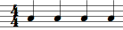
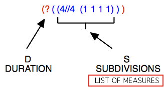
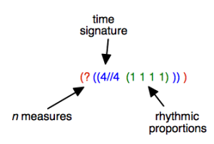
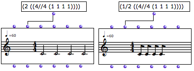
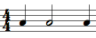
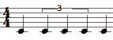
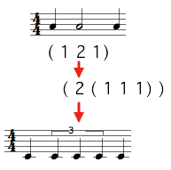
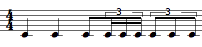

Navigation : [Previous](RT "page précédente\(Rhythm Trees\)") |
[Next](RT2 "Next\(Notation : in Practice\)")

# Rhythm Trees Structure

Traditionally, rhythm is broken up into several data : meter, measure(s) and
duration(s). Rhythm trees must enclose these information in lists and sub
list.

This elementary rhythm :

can be expressed as follows :

  * **(  ? ( (4//4 (1 1 1 1) ) ) )**
  * **(  ? ( ( (4 4) (1 1 1 1) ) ) )**

A tree structure can be reduced to a list : (D (S)).

## Main Components : Duration and Subdivisions

  * D = a  **duration** , or number of measures : ( ? ) or a number (  n ).

When D = ?, OM calculates the duration.

By default, this duration is equal to 1.

  * S =  **subdivisions** (S) of this duration, that is a  **time signature** and  **rhythmic proportions**.

    1. Time signature =  n // n   or ( n n ). 

It must be specified at each new measure, even if it remains unchanged.

    2. Rhythm =  proportions : ( n n n n )

|

Here, the (1 1 1 1) sub list represents four equal subdivisions of a 4/4
measure. OM calculated that the tree has two measures.  
  
---|---  
  
Parenthesis Levels

A rhythm tree has at least three levels of parenthesis :

  1. number of measures

  2. list of measures

  3. time signature and proportions.

Note that different rhythm trees with equal proportional structures produce
the same rhythmic result :

( 1 1 1 1) = (2 2 2 2) = (124 124 124 124)

|

  
  
---|---  
  
## Durations

Manipulating Durations

By default, the duration of a measure is equal to 1. 1 represents the global
measurement unit traditionally expressed by the time signature, such as : 4/4,
2/2  = ,  3/8 =  etc.

Changing this value multiplies or divides all the durations by a given
coefficient.

## Subdivisions : Measures and Groups

Measures

Trees define the way ** measures ** are split into proportional durations.

The following rhythm :

is written : **(  ? ( (4//4 (1 2 1) ) ) **)**** .

Groups

Trees also define internal subdivisions, or  ** groups[1] ** , within a
measure **.**

The following rhythm :

is written : **(  ? ( (4//4 (1 ( 2 (1 1 1) ) 1) ) ) ****** )**** .

Writing Groups

Note that groups must be written with a new subordinate level of parenthesis.

|

  
  
---|---  
  
References :

  1. Group

An internal subdivision, that is, a list of proportions within a measure. A
group can enclose a sub group. Basic examples are tuplets, groups of eighth,
sixteenth notes. Groups of quarter, semibreves, whole notes or any other
values are also admitted in rhythm trees.

For instance :

(? ((4//4 ( (2 ( 1 1)) (1 ( 1 (1 (1 1 1)))) (1 (1 1 1 1 1)) )))).

This one measure tree has one group - two quarter notes - , one group with a
sub group - one eighth note and a sixteenth notes triplet, and a last group -
a quintuplet.

Plan :

  * [OpenMusic Documentation](OM-Documentation)
  * [OM User Manual](OM-User-Manual)
    * [Introduction](00-Sommaire)
    * [System Configuration and Installation](Installation)
    * [Going Through an OM Session](Goingthrough)
    * [The OM Environment](Environment)
    * [Visual Programming I](BasicVisualProgramming)
    * [Visual Programming II](AdvancedVisualProgramming)
    * [Basic Tools](BasicObjects)
    * [Score Objects](ScoreObjects)
      * [Presentation](Score-Objects-Intro)
      * [Rhythm Trees](RT)
        * Rhythm Trees Structure
        * [Notation : in Practice](RT2)
      * [Score Players](ScorePlayer)
      * [Score Editors](ScoreEditors)
      * [Quantification](Quantification)
      * [Export / Import](ImportExport)
    * [Maquettes](Maquettes)
    * [Sheet](Sheet)
    * [MIDI](MIDI)
    * [Audio](Audio)
    * [SDIF](SDIF)
    * [Lisp Programming](Lisp)
    * [Errors and Problems](errors)
  * [OpenMusic QuickStart](QuickStart-Chapters)

Navigation : [Previous](RT "page précédente\(Rhythm Trees\)") |
[Next](RT2 "Next\(Notation : in Practice\)")

