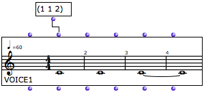
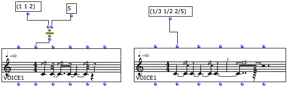
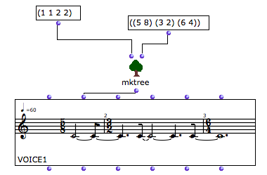
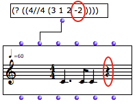
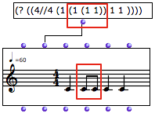
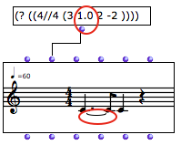
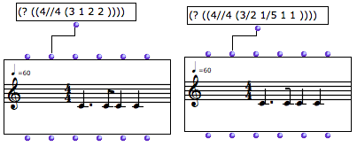
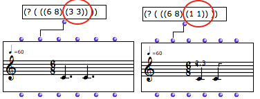
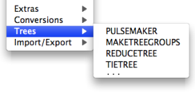

Navigation : [Previous](RT1 "page précédente\(Rhythm Trees
Structure\)") | [Next](ScorePlayer "Next\(Score
Players\)")

# Notation : in Practice

Contents

  1. Proportions
  2. Rests, Beams and Ties
  3. Dotted Values
  4. Functions of the Rhythm Trees Package

## Proportions

Elementary Proportions Lists

|

Rhythm trees can also be expressed with simple proportion lists, which ignore
the duration and time signature levels. At a basic level, OM always interprets
proportions according to two criteria :

  *  = 1
  * Time signature = 4/4.

  
  
---|---  
  
This way of writing rhythm trees can lead to very interesting processes in the
manipulation of temporality. A given rhythmic structure can be modified or
read according to various beats patterns, by associating given proportions to
more or less sophisticated functions or programs.

Integers, Ratios and Floats

Proportions can be expressed with integers, floats or ratios. Nevertheless :

  * A same group cannot take both floats and ratios. 
  * Values between 0 and 1 are not accepted by rhythm trees. 

In both cases, OM renders an approximation of the rhythm tree.

The MakeTree function

The  ** mktree ** function allows to associate a list of proportions to a list
of time signatures.

  * If a list contains a single time signature, the rhythmic pattern is extended as much as required by the duration of the tree.
  * If a list contains several time signatures, each time signature is valid for one measure only, so that the rhythm may remain incomplete. 

## Rests, Beams and Ties

Rests

Silences are expressed by negative values.

|

  
  
---|---  
  
Beams

|

Values within a group are beamed automatically.  
  
---|---  
  
Ties

Add **.0** to create a tie with the previous note.

|

  
  
---|---  
  
## Dotted Values

Automatic Notation

Dotted values are "naturally" expressed by relevant proportions, in the case
of "binary" time signatures - n/ 4, n/ 2, n/1 -, or elementary ternary time
signatures - 3/8, 3/16.

Constraints

In other cases - 6/8 and its paradigm -, OM's behaviour doesn't always apply
the conventions of traditional notation. Proportions can be expressed with
different but equivalent rhythmic notations, depending on the values used in
rhythm trees.

  * The quarter note being the default beat value, ternary notation is adapted to the use of the quarter note and its multiples. In other words, OM privileges the use of tuplets, rather than that of dotted values.
  * To get dotted values in a ternary time signature, use multiples of 3 to express proportions. 

## Functions of the Rhythm Trees Package

|

A set of functions dedicated to rhythm tree is available in the `Functions /
Score / Trees` menu. For thorough information about these functions, refer the
online documentation.  
  
---|---  
  
References :

Contents :

  * [OpenMusic Documentation](OM-Documentation)
  * [OM User Manual](OM-User-Manual)
    * [Introduction](00-Contents)
    * [System Configuration and Installation](Installation)
    * [Going Through an OM Session](Goingthrough)
    * [The OM Environment](Environment)
    * [Visual Programming I](BasicVisualProgramming)
    * [Visual Programming II](AdvancedVisualProgramming)
    * [Basic Tools](BasicObjects)
    * [Score Objects](ScoreObjects)
      * [Presentation](Score-Objects-Intro)
      * [Rhythm Trees](RT)
        * [Rhythm Trees Structure](RT1)
        * Notation : in Practice
      * [Score Players](ScorePlayer)
      * [Score Editors](ScoreEditors)
      * [Quantification](Quantification)
      * [Export / Import](ImportExport)
    * [Maquettes](Maquettes)
    * [Sheet](Sheet)
    * [MIDI](MIDI)
    * [Audio](Audio)
    * [SDIF](SDIF)
    * [Reactive mode](Reactive)
    * [Lisp Programming](Lisp)
    * [Errors and Problems](errors)
  * [OpenMusic QuickStart](QuickStart-Chapters)

Navigation : [Previous](RT1 "page précédente\(Rhythm Trees
Structure\)") | [Next](ScorePlayer "Next\(Score
Players\)")

