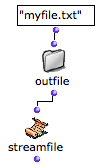
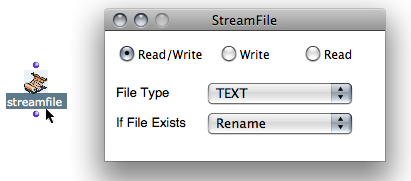
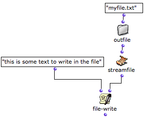
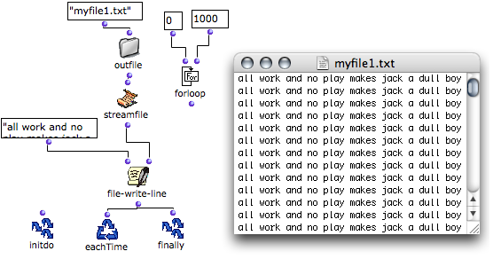
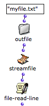

Navigation : [Previous](FileBoxIntro "page
précédente\(Introduction\)") | [Next](FileBoxIterations "page
suivante\(Designing Iterations\)")

# Reading and Writing Files

## StreamFile : a Pointer to Read and Write Files

The StreamFile box represents the file to read or write during the File-Box
process. It is attached to the file via its [pathname](Pathnames).

|

It has one input and one output :

  * its input takes a pathname to a file
  * its output returns a file pointer used for reading or writing operations.

  
  
---|---  
  
Actions and Formats

The properties of the StreamFile can be edited if needed.

To open the `StreamFIle properties` window, double click on the box.

  * Three options are offered a the top of the window : `Read / Write`, `Write`, `Read`. 
  * The `File Type` pop up menu offers two file formats : text or SDIF. 

File Options

The `File Exists` pop up menu offers four options, which apply to the targeted
file if it exists. Each of the different options determine the way the program
behaves when the text file is open or created to access its contents and the
choice of a  **destructive or non destructive** action.

  * " **Rename** " : the existing file is renamed and a new file is created.
  * " **Supersede** " : the existing file is superseded; that is, a new file with the same name as the old one is created. The old file is deleted.
  * " **Overwrite** " : the file is not deleted but modified with the input data. For instance, if an existing file contains ten lines, and that the new data represents three lines, the three first lines of the existing file are replaced. 
  * " **Append** " : the new data is added after the ending of the previous content of the file.

## Writing Contents

File-Write

The ** file-write ** function writes something in the file.

It has two inputs and one output:

  * "line" : the text or data to write in the file, 
  * "stream" : a targeted file pointer to write in, that is, the output of the streamfile box within the File-Box.
  * Its output returns the text of the first input.

|

  
  
---|---  
  
File-Write-Line

The  **file-write-line** function is similar to  file-write, but adds a line
return at the end of the input data.

Write 1001 times in the file - loop from 0 to 1000

To write several lines, an iterative process must be introduced in the
program. Most of the time, each iteration triggers one operation in the File-
Box loop.

Iterative File-Box Processes

  * [Designing an Iterative Process with the File-Box](FileBoxIterations)

## Reading Data from a File

File-Read-Line

The **file-read-line** function **** allows to read one line in a file.

It has one input and one output :

  * "stream" : a targeted file pointer to write in, that is, the output of the streamfile box within the File-Box.
  * Its output returns a text line.

When all the lines of the text are exhausted, file-read-line returns "nil".

|

  
  
---|---  
  
Most of the time, each iteration triggers one operation. In this case, the
successive lines can be stored with an accumulator such as collect, as in an
OMLoop.

Reading and collecting the contents of the six first lines in a file - loop
from 0 to 5.

Reading Files in Iterations

  * [Designing an Iterative Process with the File-Box](FileBoxIterations)

File-Eof-p

"Eof" stands for "end of file", "p" for "predicate".

The  **file-eof-p** function is a predicate, which tests if a streamfile is at
the end of the file.

It has one input and one output :

  * "stream" : a targeted file pointer to write in, that is, the output of the streamfile box within the File-Box.
  * Its output returns "t" or "nil".

It can be associated with  **whileloop** and **OMIF** , which execute a
specific operation when the end of the file has been reached. Hence, this
function allows to read a file whose number of lines is unknown.

|

As long as the predicate finds no streamfile, it returns "nil", and lines are
collected.  
  
---|---  
  
References :

Contents :

  * [OpenMusic Documentation](OM-Documentation)
  * [OM User Manual](OM-User-Manual)
    * [Introduction](00-Contents)
    * [System Configuration and Installation](Installation)
    * [Going Through an OM Session](Goingthrough)
    * [The OM Environment](Environment)
    * [Visual Programming I](BasicVisualProgramming)
    * [Visual Programming II](AdvancedVisualProgramming)
      * [Abstraction](Abstraction)
      * [Evaluation Modes](EvalModes)
      * [Higher-Order Functions](HighOrder)
      * [Control Structures](Control)
      * [Iterations: OMLoop](OMLoop)
      * [Instances](Instances)
      * [Interface Boxes](InterfaceBoxes)
      * [Files](Files)
        * [Pathnames](Pathnames)
        * [Default Directories](DefDirectories)
        * [File-Box](File-Box)
          * [Introduction](FileBoxIntro)
          * Reading / Writing
          * [Designing Iterations](FileBoxIterations)
    * [Basic Tools](BasicObjects)
    * [Score Objects](ScoreObjects)
    * [Maquettes](Maquettes)
    * [Sheet](Sheet)
    * [MIDI](MIDI)
    * [Audio](Audio)
    * [SDIF](SDIF)
    * [Lisp Programming](Lisp)
    * [Reactive mode](Reactive)
    * [Errors and Problems](errors)
  * [OpenMusic QuickStart](QuickStart-Chapters)

Navigation : [Previous](FileBoxIntro "page
précédente\(Introduction\)") | [Next](FileBoxIterations "page
suivante\(Designing Iterations\)")

