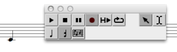

Navigation : [Previous](Microintervals "page
précédente\(Microintervals\)") | [Next](MIDI-Objects "page
suivante\(MIDI Objects\)")

# Recording / MIDI In

Some score editors allow the recording of MIDI keybord or other incoming note
events.

Use the "RECORD" button of the playing palette: all incoming events will be
recorded untill "STOP" is pressed.

The corresponding notes should then appear in the score editor and are stored
in the corresponding box.

|

  
  
---|---  
  
Input MIDI Port

The input MIDI port number can be changed in the OM `MIDI` Preferences tab.

The MidiShare Setup panel allows to control the connection of the different
output and input port to external devices (e.g. keyboards, etc.).

Setting MIDI Ports

  * [Managing MIDI Ports](MIDI-Ports)

References :

Contents :

  * [OpenMusic Documentation](OM-Documentation)
  * [OM User Manual](OM-User-Manual)
    * [Introduction](00-Contents)
    * [System Configuration and Installation](Installation)
    * [Going Through an OM Session](Goingthrough)
    * [The OM Environment](Environment)
    * [Visual Programming I](BasicVisualProgramming)
    * [Visual Programming II](AdvancedVisualProgramming)
    * [Basic Tools](BasicObjects)
    * [Score Objects](ScoreObjects)
    * [Maquettes](Maquettes)
    * [Sheet](Sheet)
    * [MIDI](MIDI)
      * [Introduction](Intro)
      * [Important MIDI Concepts](MIDI-Concepts)
      * [Rendering and Playback](MIDI-Playback)
        * [MIDI Parameters](MIDI-Params)
        * [MIDI Player Controls](MIDI-Controls)
        * [MIDI Selection Tools](MIDI-Utils)
        * [Managing MIDI Ports](MIDI-Ports)
        * [Microintervals](Microintervals)
        * Recording / MIDI In
      * [MIDI Objects](MIDI-Objects)
    * [Audio](Audio)
    * [SDIF](SDIF)
    * [Lisp Programming](Lisp)
    * [Reactive mode](Reactive)
    * [Errors and Problems](errors)
  * [OpenMusic QuickStart](QuickStart-Chapters)

Navigation : [Previous](Microintervals "page
précédente\(Microintervals\)") | [Next](MIDI-Objects "page
suivante\(MIDI Objects\)")

