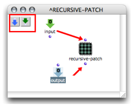
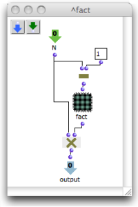
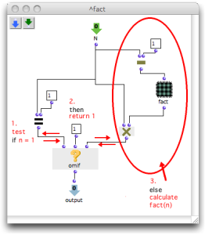
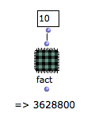

Navigation : [Previous](Recursion "page précédente\(Recursive
Patches\)") | [Next](RecursiveTree "Next\(Recursive
Trees\)")

# Recursion in OM

## Creating a Recursion

A recursive program can be designed putting the reference of a blue patch  in
its own editor - that is, putting a patch  within itself .

|

Creating a recursion : a patch is dropped into its own editor.  
  
---|---  
  
If this patch has inputs and outputs, they will also appear on the patch box,
so that the patch can be "called from inside itself".

|

  
  
---|---  
  
Infinite Calls / Termination

A **termination condition** is absolutely necessary in a recursive patch.
Otherwise, a succession of infinite calls will be triggered at the evaluation.

Remind to save all your material before calling a recursive patch.

Internal Patch Recursion

**Do not ever build recursive programs with internal - red - patches, or with
OMLoop boxes. **A function has to be **global** to apply within itself.

Example: Factorial Patch

This recursive patch implements a preliminary version of the  factorial
function. It is called inside itself and calculates fact(n) = n x fact(n-1).

**This function has no termination condition.** If it is called in its current
state, it will never end.

|

  
  
---|---  
  
**Termination  :**

  * The n values passed recursively are strictly decreasing, since they are each time equal to n-1. 
  * Besides, we know that **fact(1) = 1**.
  * Therefore, we will add a non recursive branch via omif, applying to cases where n = 1.

The resulting patch means : i **f** n = 1, then fact(n) = 1 **else** , fact(n)
= n x fact(n-1)

  1. When omif is evaluated, it evaluates the  **=** test.

  2. The  = test returns "nil" if n ≠ 1\. I t returns "t" if n = 1. **This is the termination condition of the patch.**

  3.     * omif returns the value of its second input (1), if it gets "t".
    * omif triggers the evaluation of the boxes that are connected to its third input if n ≠ 1\. 
    * The factorial of n is calculated by om-, the fact sub patch and om*. 

|

  
  
---|---  
  
Using Omif

  * [Conditional Operators](ConditionalOps)

References :

Plan :

  * [OpenMusic Documentation](OM-Documentation)
  * [OM 6.6 User Manual](OM-User-Manual)
    * [Introduction](00-Sommaire)
    * [System Configuration and Installation](Installation)
    * [Going Through an OM Session](Goingthrough)
    * [The OM Environment](Environment)
    * [Visual Programming I](BasicVisualProgramming)
    * [Visual Programming II](AdvancedVisualProgramming)
      * [Abstraction](Abstraction)
        * [Abstraction Boxes](AbsBoxes)
        * [Application](AbsApplication)
        * [Recursive Patches](Recursion)
          * Recursion in OM
          * [Recursive Trees](RecursiveTree)
      * [Evaluation Modes](EvalModes)
      * [Higher-Order Functions](HighOrder)
      * [Control Structures](Control)
      * [Iterations: OMLoop](OMLoop)
      * [Instances](Instances)
      * [Interface Boxes](InterfaceBoxes)
      * [Files](Files)
    * [Basic Tools](BasicObjects)
    * [Score Objects](ScoreObjects)
    * [Maquettes](Maquettes)
    * [Sheet](Sheet)
    * [MIDI](MIDI)
    * [Audio](Audio)
    * [SDIF](SDIF)
    * [Lisp Programming](Lisp)
    * [Errors and Problems](errors)
  * [OpenMusic QuickStart](QuickStart-Chapters)

Navigation : [Previous](Recursion "page précédente\(Recursive
Patches\)") | [Next](RecursiveTree "Next\(Recursive
Trees\)")

