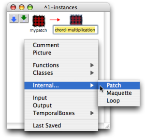
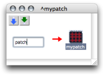
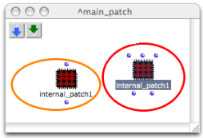

Navigation : [Previous](BlueAbstraction "page précédente\(Standard
Abstraction\)") | [Next](AbsConversion "page
suivante\(Conversions\)")

# Internal Abstractions

Internal abstractions are only created in patch editors. They are represented
by  **red patch boxes**  . This section shows how
to add an ** internal abstraction ** into a patch.

A red patch is autonomous :

  * it is not attached to any external reference, conversely to a blue patch,

  * it only "exists" inside the patch where it was created.

## Adding an Internal Abstraction : Procedures

Contextual Menu

To add an internal - red - patch in a patch editor :

  1. `Ctrl` / right click in the patch editor

  2. choose `Internal / Patch`. 

Double click on its name to edit it.

|

  
  
---|---  
  
Directly in the Patch Editor

To add an internal patch directly in a patch editor :

  * `Cmd` click in the patch editor

  * type "patch" and validate.

|

  
  
---|---  
  
Internal Programming

An internal patch is programmed just as in any patch, without restriction.

## Duplicates

An internal abstraction cannot be affected by the modification of a possible
duplicate.

Here a duplicate has been added inputs and outputs : the master item is
preserved.

|

  
  
---|---  
  
References :

Contents :

  * [OpenMusic Documentation](OM-Documentation)
  * [OM User Manual](OM-User-Manual)
    * [Introduction](00-Contents)
    * [System Configuration and Installation](Installation)
    * [Going Through an OM Session](Goingthrough)
    * [The OM Environment](Environment)
    * [Visual Programming I](BasicVisualProgramming)
    * [Visual Programming II](AdvancedVisualProgramming)
      * [Abstraction](Abstraction)
        * [Abstraction Boxes](AbsBoxes)
          * [Standard Abstraction](BlueAbstraction)
          * Internal Abstractions
          * [Conversions](AbsConversion)
        * [Application](AbsApplication)
        * [Recursive Patches](Recursion)
      * [Evaluation Modes](EvalModes)
      * [Higher-Order Functions](HighOrder)
      * [Control Structures](Control)
      * [Iterations: OMLoop](OMLoop)
      * [Instances](Instances)
      * [Interface Boxes](InterfaceBoxes)
      * [Files](Files)
    * [Basic Tools](BasicObjects)
    * [Score Objects](ScoreObjects)
    * [Maquettes](Maquettes)
    * [Sheet](Sheet)
    * [MIDI](MIDI)
    * [Audio](Audio)
    * [SDIF](SDIF)
    * [Lisp Programming](Lisp)
    * [Errors and Problems](errors)
  * [OpenMusic QuickStart](QuickStart-Chapters)

Navigation : [Previous](BlueAbstraction "page précédente\(Standard
Abstraction\)") | [Next](AbsConversion "page
suivante\(Conversions\)")

