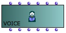
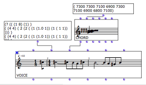
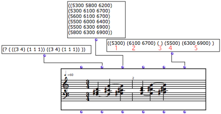
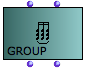
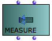
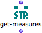

Navigation : [Previous](Note-Chord-Chord-seq "page
précédente\(Harmonic Objects\)") | [Next](Polyphonic "page
suivante\(Polyphonic Objects\)")

# Rhythmic Objects

## The Voice Object

A voice is a melodico-rythmic line.

Inputs and Outputs

|

The  voice object has six inputs and outputs.  
  
---|---  
  
  1. "self" : a  voice ,  measure or list of  measures , or a  chord-seq .

  2. "tree" : a rhythm tree[1].

  3. "chords" : a chord, broadly speaking - chord, list of chords, a list or sub lists of midicents.

  4. "tempo" : speed of a quarter note.

  5. "legato" : an overlapping percentage between two chords, calculated from the second chord's duration. 

  6. "ties" : sub lists - one sub list per chord - indicating notes to be tied to notes of the same value, in a next chord.

The combination of inputs programming and score edition allows a complete
musical edition of the object.

|

  
  
---|---  
  
Programming Rhythm Trees Basics

  * [Rhythm Trees](RT)

Ties

Ties are a specific parameter of rhythmic objects. To specified that a pitch
must be tied to the next one, enter this pitch in a sub list in the "ties"
input.

The rank of tied elements must match the rank of the corresponding chords or
notes in the "midic" input. Otherwise, OM won't recognize the elements to be
tied.

Detailed Information About Voices Edition

  * [Rhythmic Objects : Voice Editor](Editor-Rhythm)

## Measure and Group

 

|

Groups and  measures are complementary modules of the Score class.  
  
---|---  
  
They have two inputs and outputs :

  * "self" 
  * "rhythm tree[1]". 

They can also be isolated as distinct rhythmic elements within  voice editors.

About Measures and Groups within Voices :

  * [Rhythmic Objects : Voice Editor](Editor-Rhythm)

Uses

Groups and measures are used for :

  * programming elementary rhythmic structures, which can be saved as instances or global variables for a subsequent use
  * storing rhythmic structures once they have been extracted from a rhythm tree.

Switching the chords and rhythms of two measures using measure instance boxes.

Getting Measures

|

The  **get-measures** function returns a list of measures from a  voice .  
  
---|---  
  
References :

  1. Rhythm Tree

A rhythm tree expresses a rhythmic structure as a list.

This list is made of :

    * a duration, or number of measures,

    * a list of measures.

Each measure is made of

    * a time signature 

    * a list or proportions, or rhythmic values.

For instance : (1 (((4 4) (1 1 2))) is a rhythm of one measure, signature 4/4,
with two quarter and one half note (proportions = 1/4 1/4 2/4 = 1/4 1/4 1/2).

The term of "tree" refers to a recusrive structure: each item in the
proportions list can in turn be expressed as a duration with a list of
subdivisions.

For instance the second beat in our measure could be subdivided as follows :
((4 4) (1 (1 (2 3)) 2)).

Plan :

  * [OpenMusic Documentation](OM-Documentation)
  * [OM User Manual](OM-User-Manual)
    * [Introduction](00-Sommaire)
    * [System Configuration and Installation](Installation)
    * [Going Through an OM Session](Goingthrough)
    * [The OM Environment](Environment)
    * [Visual Programming I](BasicVisualProgramming)
    * [Visual Programming II](AdvancedVisualProgramming)
    * [Basic Tools](BasicObjects)
    * [Score Objects](ScoreObjects)
      * [Presentation](Score-Objects-Intro)
        * [Harmonic Objects](Note-Chord-Chord-seq)
        * Rhythmic Objects
        * [Polyphonic Objects](Polyphonic)
      * [Rhythm Trees](RT)
      * [Score Players](ScorePlayer)
      * [Score Editors](ScoreEditors)
      * [Quantification](Quantification)
      * [Export / Import](ImportExport)
    * [Maquettes](Maquettes)
    * [Sheet](Sheet)
    * [MIDI](MIDI)
    * [Audio](Audio)
    * [SDIF](SDIF)
    * [Lisp Programming](Lisp)
    * [Errors and Problems](errors)
  * [OpenMusic QuickStart](QuickStart-Chapters)

Navigation : [Previous](Note-Chord-Chord-seq "page
précédente\(Harmonic Objects\)") | [Next](Polyphonic "page
suivante\(Polyphonic Objects\)")

