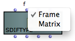

Navigation : [Previous](SDIF-Read "page précédente\(Accessing SDIF
Data\)") | [Next](SDIF-Write "Next\(Writing SDIF
Files\)")

# SDIF Classes

Contents

  1. SDIF Matrices
  2. SDIF Frames
  3. SDIF Types
  4. Name/Value Tables

OM provides a set of classes used to represent SDIF data. These class
basically follow the structure and components of the SDIF format. Thay can be
used to inspect or create data to write in SDIF files.

Creating SDIF Files in OM

  * [Writing SDIF Files](SDIF-Write)

## SDIF Matrices

Matrices are the basic data structure in SDIF. They are made of an arbitrary
number of elements (columns) and a number of fields (lines) depending on the
SDIF types.

The class **SDIFMATRIX** is a subclass of [CLASS-ARRAY](ClassArray). It
is initialized and created by specifying a number of components ( <numcols> )
and the values of these components for a number of fields.

The different fields are added like in the CLASS-ARRAY, as [keyword
inputs](AdditionalInputs).

SDIF matrix has one required specific slot ( <signature> ) corresponding to
the SDIF type signature of the matrix.

An SDIFMatrix of type "1FQ0" with 1 element and 3 fields.

More about SDIF Matrices

  * [Introduction to SDIF](SDIF-Intro)

More about the CLASS-ARRAY Object

  * [Array](ClassArray)

Alternative Matrix Class

Sometimes large numbers of SDIF matrices have to be generated and stored by
algorithmic processes where the potentialities of the CLASS-ARRAY object
become heavy and unnecessary. In this case, the class **RAW-SDIFMATRIX** may
be used instead.

RAW-SDIFMATRIX contains the raw matrix data with no specific storage nor
symbolic processing features. It is initialized with a type signature, a
number of elements and fields, and a plain list of data corresponding to the
matrix contents. This plain data can be written and stored directly on disk
when writing the matrix to an SDIF file, which can significantly reduce the
overall computation cost.

**Note:** In the RAW-SDIFMATRIX the data is specified column by column (or
element by element) and not field by field as with the SDIFMatrix or CLASS-
ARRAY.

The data list for the same example matrix with two identical elements would
therefore be (440.0 1 100.0 440.0 1 100.0)

## SDIF Frames

An SDIF frame gathers one or several SDIF matrices in a time-stamped data
unit.

Frames of different types are identified by a signature, and frames of a given
type can be grouped in streams thanks to their stream ID.

 **SDIFFRAME** represents an SDIF frame object in the OM framework.

SDIF Streams

SDIF frames can be groupped in streams, which can be used to discriminate, for
instance, interleaved parallel descriptions in the SDIF file.

SDIF streams are not real structural components in the SDIF format though, and
are only impliciely created depending on the frames' **stream ID**

The **SDIFSTREAM** class can be used to group a sequence of frames in a common
stream. It is an optional utility which allows in particular to automatically
set the correct stream ID to every frames in it.

|

  
  
---|---  
  
An SDIFSTREAM a can also be created from an existing SDIF file using
**GETSDIFSTREAM**. Internal extracted SDIFFrame and SDIFMatrix objects can
then be inspected and manipulated in OM patches.

Acessing Data from SDIF Files

  * [Accessing SDIF Data](SDIF-Read)

More About SDIF Structure (Frames, Types, Streams...)

  * [Introduction to SDIF](SDIF-Intro)

## SDIF Types

The class **SDIFType** allows to create SDIF type declatations to be embedded
in SDIF files.

Declare your SDIF types

All non-standard frame and matrix types used in a file MUST be declared in
this file beforehand.

The second input of the SDIFTyep box (<struct>)allows to select between Frame
or Matrix type.

|

  
  
---|---  
  
Frame Types

Frame types (<struct> = 'f) are initialized with a four ACSCII characters
<signature> and a <description> list.

The description list is a list of lists of strings indicating the contained
matrix type signatures and description label pairs.

|

Frame type declaration : the frame type "XFRA" contains matrices of types
"XNFO" (labelled "InfoMat") and "XMAT" (labelled "datamat").  
  
---|---  
  
Matrix Types

Matrix types (<struct> = 'm) are also initialized with a four ACSCII
characters signature and a description list.

The description list is of strings indicating the matrix field names.

|

MAtrix type declaration : the matrix type "XMAT" contains 3 fields labelled
"par1", "par2" and "par3".  
  
---|---  
  
More About SDIF Types

  * [Introduction to SDIF](SDIF-Intro)

## Name/Value Tables

Name/Value Tables (or  NVT s) are global information stored in the SDIF file
header.

They are represented in OM by the class **SDIFNVT**.

An SDIFNVT is initialized with a list of name/value pairs, a table name and a
table ID (optional).

|

  
  
---|---  
  
References :

Contents :

  * [OpenMusic Documentation](OM-Documentation)
  * [OM User Manual](OM-User-Manual)
    * [Introduction](00-Contents)
    * [System Configuration and Installation](Installation)
    * [Going Through an OM Session](Goingthrough)
    * [The OM Environment](Environment)
    * [Visual Programming I](BasicVisualProgramming)
    * [Visual Programming II](AdvancedVisualProgramming)
    * [Basic Tools](BasicObjects)
    * [Score Objects](ScoreObjects)
    * [Maquettes](Maquettes)
    * [Sheet](Sheet)
    * [MIDI](MIDI)
    * [Audio](Audio)
    * [SDIF](SDIF)
    * [Reactive mode](Reactive)
      * [Introduction to SDIF](SDIF-Intro)
      * [SDIFFile](SDIFFile)
      * [Accessing SDIF Data](SDIF-Read)
      * SDIF Classes
      * [Writing SDIF Files](SDIF-Write)
    * [Lisp Programming](Lisp)
    * [Errors and Problems](errors)
  * [OpenMusic QuickStart](QuickStart-Chapters)

Navigation : [Previous](SDIF-Read "page précédente\(Accessing SDIF
Data\)") | [Next](SDIF-Write "Next\(Writing SDIF
Files\)")

