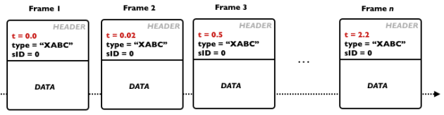
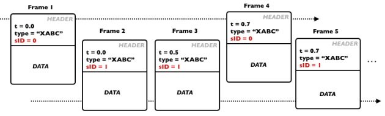
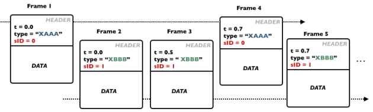
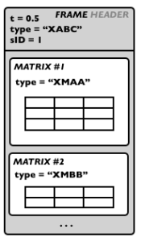
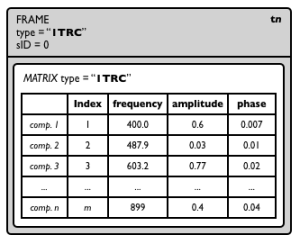
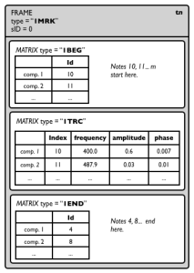

Navigation : [Previous](SDIF "page précédente\(SDIF\)") | [Next](SDIFFile "Next\(SDIFFile\)")

# Introduction to SDIF

Contents

  1. SDIF Frames and Streams
  2. SDIF Data/Matrices
  3. SDIF Types
  4. Examples of Common Standard SDIF Descriptions

In this section we give a general introduction of the main SDIF concepts
required to understand and make an efficient use of the OM SDIF tools.

## SDIF Frames and Streams

SDIF is a binary format where data are encoded in time-tagged  **FRAMES** .

"Time-tagged" means each frame embeds its own time localization and there is
no global (regular) sample rate for the data flow. Each frame has a  header ,
where the time-tag as well as other information are stored, and contain a
certain amount of data.

A sequence (stream) of SDIF frames.

The next paragraphs explicit the additional data contained in the SDIF frame
headers.

Frame Type

The frame  **TYPE** allows to determine the contents of the frame and the
structure of the data it contains. SDIF types are identified by a signature of
4 ASCII characters.

Examples of standard SDIF frame types are for instance "1TRC" (sinusoidal
tracks, used for additive sound descriptions), "1MRK" (markers), "1FQ0"
(fudamental frequency), "1ENV" (spectral envelope) etc.

Stream ID

Each frame also has a **stream** ID ( sID ). It is therefore possible to store
several interleaved frame streams (connected by their common stream ID and
frame type) in a same SDIF file.

** Stream ID and frame type will be crucial information to access and read the
data in SDIF files. **

Below are two examples of interleaved SDIF streams.

  * In the first example frames are divided in 2 streams and of identical types. This could be for instance the result of the same analysis of different parallel audio tracks. 

Note that the frames time-tags are not necessarily synchronous nor strictly
interleaved (they must only be in ascending temporal order). Reading
applications should handle and manage the stream separation using the frame
stream IDs.

  * In the second examples frames are different in the two streams (type "XAAA" in stream 0, and type "XBBB" in stream 1). This can be for instance the results of several analyses of a same sound extract, or even completely unrelated data merged in a same sequence of frames and in the SDIF file.

## SDIF Data/Matrices

Within every SDIF frame, the actual data is stored in bidimensional matrices.

A frame can contain one or several matrices. Each matrix is an array of data
preceded (like SDIF frames)by a "matrix header" containing some general
information. In particular, each matrix also has a **TYPE** (signature of 4
characters) used to identify the nature of the data it contains.

By conventions, the columns of the SDIF matrices are called  **fields  ** :
they correspond to the different parameters of a given description. For
instance, sinusoidal tracks matrices (type "1TRC") have 4  fields describing
partials : index, frequency, amplitude, phase.

Matrix lines are called ** components **. There is a fixed number of fields in
a matrix, but there can be any number of components.

As matrices are embedded in time-tagged frames, this description is supposed
to be at one particular time. In other words, SDIF matrices contain the value
of a given set of parameters for a number of  components at the time
determined by their containing frame.

|

  
  
---|---  
  
## SDIF Types

The SDIF signatures define types for frames and matrices, that is, it informs
about the data contained in these structures.

Concretely, the frame types list the possible of matrix types found in the
frame,a nd the matrix types list the matrix fields' names.

A set of SDIF types exist by default. Others can be declared in the SDIF
files.

An informative list of standard types is provided at
[http://sdif.sourceforge.net/standard/types-main
](http://sdif.sourceforge.net/standard/types-main
"http://sdif.sourceforge.net/standard/types-main \(nouvelle fenêtre\)")

Frame Types

SDIF Frame type declarations indicate a type signature and a set of allowed
matrix types.

Matrix Types

SDIF Matrix type declarations indicate a type signature and an ordered list of
fields.

Notes about SDIF type signatures

  * By convention, standard SDIF types' first character is a version number (most often, "1"), while experimental types start with an "X".

  * It can happend (and is correct) that a frame and matrix type have the same signature. 

Type extension

In addition to type declaration, it is also possible to declare extensions of
existing SDIF types, for instance, in order to add fields n a given matrix
type, or to add matrices in a frame type.

## Examples of Common Standard SDIF Descriptions

Here is a set of common sound descriptions used in musical applications.

Fundamental Frequency

The fundamental frequency estimation is one of the simplest sound descriptions
: it generally has one single field (the frequency) and one single component.

**The fudamental frequency matrix type signature is "1FQ0".**

It ususally has one single field (frequency) : here is what the type
declaration looks like :

1FQ0 { frequency }

Sometimes the fundamental frequency description can involve additional
parameter. The standard matrix type definition is actually of the form :

1FQ0 { frequency, confidence, score, realamplitude}

**The fudamental frequency frame type signature is also "1FQ0".** 1FQ0 frames
only contain one 1FQ0 matrix. The type declaration is therefore of the form :

1FQ0 { 1FQ0 FundamentalFrequencyEstimate}

|

  
  
---|---  
  
Partials / Sinusoidal Track

The partials are described frame by frame in SDIF. In each frame, the
parameters are described for each partial, which is identified by a unique
index.

**The partials matrix type signature is "1TRC".**

The standard matrix type definition is of the form :

1TRC { index, frequency, amplitude, phase }

An arbitrary number of partials can de stored in every matrix.

**The partials frame type signature is also "1TRC".** 1TRC frames only contain
one 1TRC matrix. The type declaration is therefore of the form :

1TRC { 1TRC SinusoidalTracks}

|

  
  
---|---  
  
Harmonic Partials

Harmonic partials are stored exactly like partials in frames / matrices of
type " **1HRM** "

Markers

Markers are simple time information. They are generally stored in **frames of
type "1MRK"** with adequate time-tag.

It is often the case, however, that markers embed additional data and
information. In particular, transient detection markers differentiate begin
and end of the transients. In this case, beginning marker frames contain a
matrix of type "1BEG", while end markers contain matrix of type "1END".

1BEG and 1END matrices contain ID values (matrix 1 x  n ).

Chord-Sequence Analysis

Chord-Sequence analysis or descriptions are not straightforward to embed in
SDIF, since they are closer to "symbolic" (MIDI-like) data than signal
descriptors. They can however be stored efficiently using markers and 1MRK
frames.

Following the model of the SDIF partials, each "note" in such analysis is
identified by a unique ID. The marker frames will then contains, at a given
time:

  * 1BEG matrices containing the ID of the notes beginning at this moment.

  * 1TRC matrices containing the value of the different parameters of the notes begining at this moment

  * 1END frames containing the ID of the notes ending at this moment.

Note that a same 1MRK frame does not necessarily contain both 1BEG and 1END
matrices.

|

  
  
---|---  
  
References :

Contents :

  * [OpenMusic Documentation](OM-Documentation)
  * [OM User Manual](OM-User-Manual)
    * [Introduction](00-Contents)
    * [System Configuration and Installation](Installation)
    * [Going Through an OM Session](Goingthrough)
    * [The OM Environment](Environment)
    * [Visual Programming I](BasicVisualProgramming)
    * [Visual Programming II](AdvancedVisualProgramming)
    * [Basic Tools](BasicObjects)
    * [Score Objects](ScoreObjects)
    * [Maquettes](Maquettes)
    * [Sheet](Sheet)
    * [MIDI](MIDI)
    * [Audio](Audio)
    * [SDIF](SDIF)
      * Introduction to SDIF
      * [SDIFFile](SDIFFile)
      * [Accessing SDIF Data](SDIF-Read)
      * [SDIF Classes](SDIF-Classes)
      * [Writing SDIF Files](SDIF-Write)
    * [Lisp Programming](Lisp)
    * [Reactive mode](Reactive)
    * [Errors and Problems](errors)
  * [OpenMusic QuickStart](QuickStart-Chapters)

Navigation : [Previous](SDIF "page précédente\(SDIF\)") | [Next](SDIFFile "Next\(SDIFFile\)")

