Navigation : [Previous](SDIFFile "page précédente\(SDIFFile\)") |
[Next](SDIF-Classes "Next\(SDIF Classes\)")

# Accessing SDIF Data

Contents

  1. File Overview / General Information
  2. Get SDIF Data
  3. High-Level Conversion Tools
  4. NVTs: Name/Value Tables

There exist several ways, more or less precise and specific, to inspect and
read the contents of an SDIF file in an OM visual program.

You'll probably have to know about the contents structure of the file before
to extract some particular data out of it. Several tools presented in this
section might help, but a quick preview of the file structure using the
SDIFFile editor is generally useful.

All the tools presented in this section must be used with an SDIFFile object
and can be found in the `SDIF/Read/` menus or packages. See the specific
reference pages for a more complete descriptions and details about the box
arguments and outputs (select the box and type `d`).

The SDIFFile Box and Editor

  * [SDIF Files in OM : The SDIFFile Object](SDIFFile)

## File Overview / General Information

A set of tools allow to get some general data and information about the
structure and contents of the file.

Streams and File Structure

**SDIFINFO** provides some information about the general file structure,
displayed as text in the OM Listener.

A list of "matrix streams" ( stream ID ,  frame type ,  matrix type tuples) is
returned.

This information basically corresponds to what can be observed on the left-
hand part of the SDIFFile editor.

|

[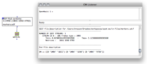](../res/sdif-read-info.png "Cliquez pour
agrandir")  
  
---|---  
  
Frame vs. Matrix Streams

Note that the "real" structure of an SDIF file consists in identified frame
streams in which matrices of different types are stored (and actually not
"matrix streams"). This actual stream structure can also be collected using
the **SDIFSTREAMS** box.

|

[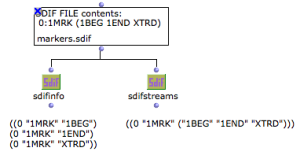](../res/sdif-read-stream-boxes.png
"Cliquez pour agrandir")  
  
---|---  
  
Contents Meta-Data

The following boxes allow to get some specific information about the farmes
and matrix in the SDIF file :

  * **NUMFRAMES** : number of frames of a given type (or in total) in the file

  * **FRAMEINFO** : information about frame number  n (of a specific type or in total) : type signature, stream ID, time, position, number of matrices inside.

  * **MATRIXINFO** : information about matrix number  m in frame number  n (of a specific type or in total) : type signature, number of fields, number of components..

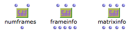

SDIF Data

Note that none of these tools give you any of the actual data contained in the
file, but some meta-data related to the file structure.

Type Descriptions

**SDIFTYPEDESCRIPTION** allows to get information about the frames and
matrices of a specific type.

Notes :

  * Although type description might seem like stream descriptions, they list  all possible matrix types allowed in frames of a given type, or  all possible fields in matrices of a given type. It is not guaranteed that such "allowed" data will actually be in part of the file data.

  * SDIF types are defined and initialized so they are attached to a particular file. It is therefore always necessary to connect the SDIF file to SDIFTYPEDESCRIPTION, in addition to the type signature.

|

[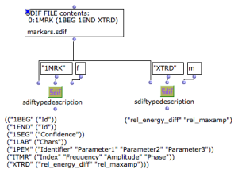](../res/sdif-read-type.png "Cliquez pour
agrandir")  
  
---|---  
  
## Get SDIF Data

There exist different ways to access the numerical values contained in an SDIF
file. It is important, in any case, to preliminary know what we are looking
for, or where to find it.

Extracting localized data

You might know exactly where to find the data you're looking for thanks to the
inspection tools described in the previous sections. In this case, the
functions **GETCOL** , **GETROW** or **GETVAL** allow you to extract the data
(either a whole column, a whole row or a single value) from a matrix localized
by its index in a frame and by the exact rank of this frame.

|

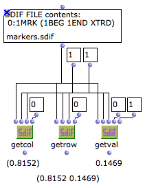  
  
---|---  
  
Extracting Specific Data

The more useful and efficient way to extract data from an SDIF file is to know
which type of data we want (that is, what are the frame and matrix type we are
looking for).

The **GETSDIFDATABOX** is the definite and more general way to get your data
out of the file.

The main (required) arguments are the stream ID, frame type and matrix type
which will allow to discriminate a particular SDIF "matrix stream". The other
ones allow to target a particular time interval (begin time, end time), a
particular matrix field (column number), and a particular range for the matrix
components (rmin, rmax).

  * The resulting data is a list of lists: each element represents the values of the different matrix components for the selected field. If several fields are requested (or no field number is given), the result will be a list of lists of lists: for each component, the values of the different requested (or all) fields will be retured.
  * The second output of GETSDIFDATA returns the time list corresponding to the values list in the first input.

|

[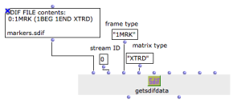](../res/sdif-read-getsdifdata.png
"Cliquez pour agrandir")  
  
---|---  
  
Avoiding Useless File Accesses

If both the values and time output are to be used, it is recommended to set
the GETSDIFFILE box to [mode "eval-once"](EvOnceMode) so as to avoid to
read and store the data twice for the same box.

Extracting SDIF as OM Objects

Instead of getting numerical values out of the SDIF file, the
**GETSDIFSTREAM** function can also create and return an  SDIFSTREAM object.

SDIFSTREAM is part of the classes provided in OM to represent and manipulate
SDIF data.  SDIFFRAMES and  SDIFMATRICES can extracted from and  SDIFSTREAM
and manipulated as well in OM visual programs. Some tools are also provided to
write a new SDIF file using these SDIF structures.

|

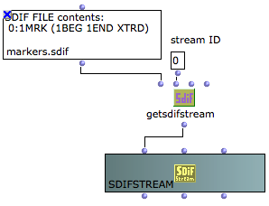  
  
---|---  
  
Manipulating SDIF Data as Objects in OM

  * [SDIF Classes](SDIF-Classes)

## High-Level Conversion Tools

Some commonly used SDIF descriptions can be straightforwardly converted to
specific OM data or objects. A number of predefined functions allow to make
this conversion for you.

Markers

Temporal markers may be contained in SDIF descriptions, for instance in the
results of transient detection analysis.

**SDIF- >MARKERS** extracts the time values of marker frames and returns them
as a simple list of values in seconds. This list can for instance be connected
to the  markers input of a [SOUND](Sound) object, containing the original
sound file.

By default, markers are extracted from all frames of type "1MRK". This default
type can be changed, however, using the SDIF->MARKERS [additional
inputs](AdditionalInputs). It is also possible to refine the markers
extraction by specifying a specific matrix type to target. You may want, for
instance, to extract only the transient begin markers (matrix type "1BEG") and
not the transient ends (type "1END") from the 1MRK frames.

|

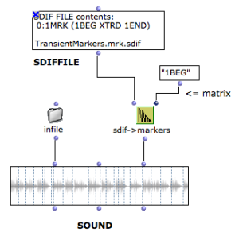  
  
---|---  
  
Markers and SDIF Structure

  * [Introduction to SDIF](SDIF-Intro)

About Sounds and Markers

  * [The Sound Object](Sound)

BPFs

Some SDIF descriptions consist of a single scalar parameter, which can easily
be extracted and converted to a [BPF object](BPF-BPC). This is typically
the case of the fundamental frequency analyses.

The **SDIF- >BPF** function allows to directly perform this conversion. If the
SDIF data is not a fundamental frequency (frame or matrix type is not "1FQ0"),
then the [additional inputs of this function](AdditionalInputs) allow to
consider different types of frames and matrices.

|

[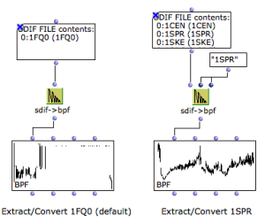](../res/sdif-bpf.png "Cliquez pour agrandir")  
  
---|---  
  
Chords

"Chords" can be extracted from SDIF data, either from "1TRC"/"1HRM" frames
(inharmonic/harmonic partials or sinusoidal track descriptions) or from "1MRK"
frames containing chord-sequence analyses.

Partials and Chord Sequences in SDIF

  * [Introduction to SDIF](SDIF-Intro)

Two main functions allow to extract chords (or, more precisely "notes") from
the partials in an SDIF file.

**1) GETSDIFCHORDS** returns a list of ( pitch [Hz]  onset [s]  duration [s]
velocity [lin]). In case of partials (1TRC/1HRM) the pitch and velocities are
the mean values of these parameters on the total duration of the original
partial.

Note: **GET-SDIF-RAW-DATA** allows to get the "original" unporcessed SDIF
data: for each partials, the list of time-tags, frequencies, amplitudes and
phases are returned.

**2) SDIF- >CHORD-SEQ** directly converts the data to a CHORD-SEQ object

|

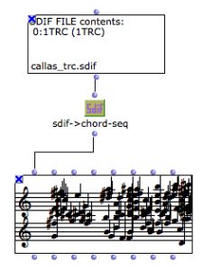  
  
---|---  
  
## NVTs: Name/Value Tables

Name/Value Tables (or  NVT s) are global information stored in the SDIF file
header. They can be read in OM with the function GETNVTLIST.

GETNVTLIST returns a list of **SDIFNVT** instances. SDIFNVT is a class
representing the name value table.

The value corresponding to a particular NVT entry name can be searched with
FIND-IN-NVT and FIND-IN-NVTLIST functions.

|

[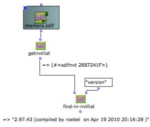](../res/sdif-read-nvt.png "Cliquez pour
agrandir")  
  
---|---  
  
More About OM Representation of SDIF NVTs

  * [SDIF Classes](SDIF-Classes)

References :

Contents :

  * [OpenMusic Documentation](OM-Documentation)
  * [OM User Manual](OM-User-Manual)
    * [Introduction](00-Contents)
    * [System Configuration and Installation](Installation)
    * [Going Through an OM Session](Goingthrough)
    * [The OM Environment](Environment)
    * [Visual Programming I](BasicVisualProgramming)
    * [Visual Programming II](AdvancedVisualProgramming)
    * [Basic Tools](BasicObjects)
    * [Score Objects](ScoreObjects)
    * [Maquettes](Maquettes)
    * [Sheet](Sheet)
    * [MIDI](MIDI)
    * [Audio](Audio)
    * [SDIF](SDIF)
      * [Introduction to SDIF](SDIF-Intro)
      * [SDIFFile](SDIFFile)
      * Accessing SDIF Data
      * [SDIF Classes](SDIF-Classes)
      * [Writing SDIF Files](SDIF-Write)
    * [Lisp Programming](Lisp)
    * [Reactive mode](Reactive)
    * [Errors and Problems](errors)
  * [OpenMusic QuickStart](QuickStart-Chapters)

Navigation : [Previous](SDIFFile "page précédente\(SDIFFile\)") |
[Next](SDIF-Classes "Next\(SDIF Classes\)")

