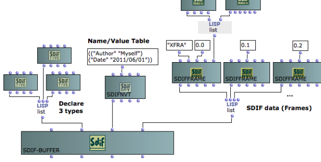
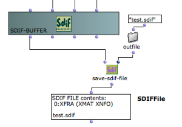
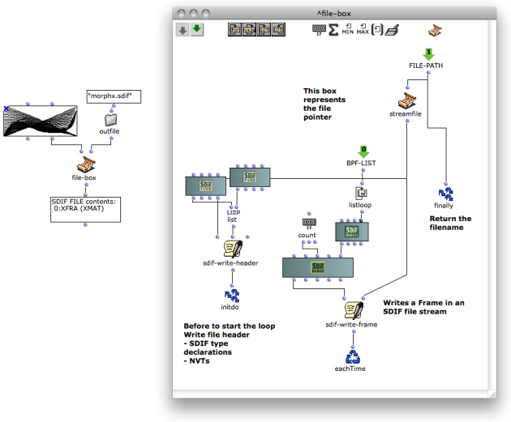
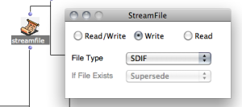

Navigation : [Previous](SDIF-Classes "page précédente\(SDIF
Classes\)") | [Next](Lisp "Next\(Lisp Programming\)")

# SDIF-Buffer

The class **SDIF-BUFFER** allows to gather SDIF objects and makes the
connection with "real" SDIF files.

An SDIF-Buffer contains :

  * A list of SDIF Frames or SDIF Streams
  * A list of SDIFTypes (type declarations)
  * A list of Name/Value tables

More about the SDIF classes (SDIFFrame, SDIFType, SDIFNVT...)

  * [SDIF Classes](SDIF-Classes)

The SDIF-BUFFER and its contents can then be saved in a file using SAVE-SDIF-
FILE.

|

  
  
---|---  
  
## Iterative SDIF file Writing using the File-Box

SDIF data can also be written in a file using the File-Box tool.

This alternative avoids storing large sets of data in your OM patches and
write generated SDIF data on-the-fly during an iterative process.

How to use the File-Box

  * [File-Box : Iterative File Input/Output Processes](File-Box)

SDIF Write Tools in the File-Box

In order to write data in an SDIF file, the STREAMFILE pointer must be set to
"SDIF" first.

|

  
  
---|---  
  
The process must then start with a call to **SDIF-WRITE-HEADER** connected to
this pointer (see picture above). SDIF-WRITE-HEADER will write type
declarations and name/value tables in the file header, but also some other
general data, so it must be called **even if there is no type or NVT to
write**.

Use **SDIF-WRITE-FRAME** in the rest of your program in order to write the
sequence of SDIF frames in the file.

References :

Plan :

  * [OpenMusic Documentation](OM-Documentation)
  * [OM User Manual](OM-User-Manual)
    * [Introduction](00-Sommaire)
    * [System Configuration and Installation](Installation)
    * [Going Through an OM Session](Goingthrough)
    * [The OM Environment](Environment)
    * [Visual Programming I](BasicVisualProgramming)
    * [Visual Programming II](AdvancedVisualProgramming)
    * [Basic Tools](BasicObjects)
    * [Score Objects](ScoreObjects)
    * [Maquettes](Maquettes)
    * [Sheet](Sheet)
    * [MIDI](MIDI)
    * [Audio](Audio)
    * [SDIF](SDIF)
      * [Introduction to SDIF](SDIF-Intro)
      * [SDIFFile](SDIFFile)
      * [Accessing SDIF Data](SDIF-Read)
      * [SDIF Classes](SDIF-Classes)
      * Writing SDIF Files
    * [Lisp Programming](Lisp)
    * [Errors and Problems](errors)
  * [OpenMusic QuickStart](QuickStart-Chapters)

Navigation : [Previous](SDIF-Classes "page précédente\(SDIF
Classes\)") | [Next](Lisp "Next\(Lisp Programming\)")

