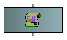
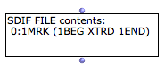
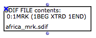
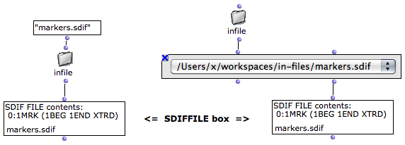
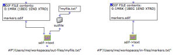
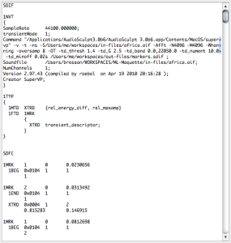
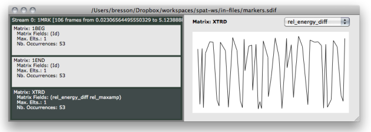

Navigation : [Previous](SDIF-Intro "page précédente\(Introduction
to SDIF\)") | [Next](SDIF-Read "Next\(Accessing SDIF
Data\)")

# SDIF Files in OM : The SDIFFile Object

SDIF files are handled in OM via the **SDIFFILE** object. SDIFFILE boxes (when
correctly initialized) are attached to a file on the computer hard disk.
Therefore the actual data is not intern in the OM patch but always remains in
the external file.

SDIFFILE has one single input/output used to initialize the box or access the
contents of the attached SDIF file.

|

  
  
---|---  
  
## SDIFFile Initialization

Default Initialization

If nothing is connected to the SDIFFILE box input, when it is evaluated, a
file chooser dialog opens and allows to choose a file to load.

When initialized, the box miniview (press `m`) displays some general
information about the contents of the SDIF file. Each line is a stream ID
followed by a frame type signature and a list of contained matrix type
signatures.

|

  
  
---|---  
  
About the Structure of an SDIF File (Streams, Frames, Matrices...)

  * [Introduction to SDIF](SDIF-Intro)

File Name

When the name of the box is visible (press `n`) the name of the file is
displayed and updated at initializing the box.

After the SDIF file is loaded, you may want to [lock the box](LockMode)
(press `b`) in order to avoid reinitalizing it at next evaluations.

|

  
  
---|---  
  
Pathname Initialization

The SDIFFILE box is more generally initialized with a file pathname, which can
be connected to its input.

This pathname can be typed textually or come from another box or function.

About Pathnames in OM

  * [Creating and Using Pathnames](Pathnames)

Sound Analysis Results

Most of the sound analysis tools available in OM (generally part of external
libraries such as OM-SuperVP or OM-pm2) write analysis results in SDIF files
and just return the written file pathname.

These return values are therefore suitable for connection to the SDFFILE box.

|

Fundamental frequency analysis with pm2-f0 from the OM-pm2 library. The result
of analysis is a created SDIF file pathname, connected to the SDIFFILE box.  
  
---|---  
  
## File Contents

Like MIDI or AIFF, SDIF is a binary data format: the contents of an SDIF file
can not be read or edited as a simple text but requires specific tools and
conversions. [A number of different tools are available in OM for this
purpose](SDIF-Read), which will be presented in these SDIF manual pages.

It is however possible to convert an SDIF file to text in order to check the
full exact contents of a file.

  * The SDIF->TEXT box allows to write a text file from an input SDIFFIle. If no pathname is given for the text file, the created files will have the same name and location as the original SDIF file, with the "txt" extension.

|

  
  
---|---  
  
  * The output of SDIF->TEXT is the pathname of the text file created. This pathname can therefore also be used to initialize a [TEXTFILE](textfile) object and visualize the text conversion in OM.

  * For convenience, it is also possible to directly connect the output of SDIFFILE to the first input of [TEXTFILE](textfile) in order to convert the SDIF data to text and initialize the TEXTFILE in one single step. The file created on the disk will have the same name and location as the original SDIF file, with the "txt" extension.

|

  
  
---|---  
  

|

Here is an example of the text conversion of an SDIF file. We can already
observe a number of information:

  * The **1NVT** block ( name-value tables ) contains some global textual information about the file contents

  * The **1TYP** block contains some type declarations

  * The (main) **SDFC** part contains a succession of SDIF frames. All frames are listed (each described by its type signature, number of matrices inside, stream ID, time tag) and followed by a description of the different matrices (type signature, data size, number of components - rows, number of fields - columns) and their numerical data (matrix of numbers).

  
  
---|---  
  
The SDIF Format

  * [Introduction to SDIF](SDIF-Intro)

Reading SDIF File Data in OM

  * [Accessing SDIF Data](SDIF-Read)

## SDIFFile Editor

Once initialize and attached to a file , double click on the SDIFFILE box to
open the SDIFFile editor.

The SDIFFile editor is divided in two main areas :

  * **On the left-part** , the different streams in the SDIF file are listed in separate blocks. Each block in turns contains a number of sub-blocks corresponding to the different SDIF matrix types found in this stream. Total number of frames, as well as beginning and end time are given for the different streams. For each matrix type, the different fields are given,as well as the maximum number of elements found in such matrix and its number of occurences in the stream.

Selecting a matrix block allows to visualize details of its contents on the
right-part of the editor.

  * **On the right part** , some data from the selected "matrix stream" is displayed. A specific field must be selected in the top-right menu. For this field, the evolution (in time) of a number of components is plotted as a set of curves. (When there is no evolution -- that is, only one matrix of this type has been found in the frame stream -- the single numerical values are displayed insteand of a curve).

More Information about the Structure of an SDIF File

  * [Introduction to SDIF](SDIF-Intro)

The SDIFFile editor allows to inspect and visualize the contents of the SDIF
file, but does not allow any modification or data edition.

An alternative editor for SDIF files : SDIF-Edit

SDIF-Edit is a program allowing to visualize and edit SDIF files in 3D.

It was used as the default editor for SDIFFile boxes in former versions of OM
(< 6.4)

In OM 6.4 you can use SDIF-Edit instead of the default SDIF Editor installing
a dedicated external library.

All information and downloads for SDIF-Edit available here :
[http://repmus.ircam.fr/sdifedit](http://repmus.ircam.fr/sdifedit
"http://repmus.ircam.fr/sdifedit \(nouvelle fenêtre\)")

References :

Contents :

  * [OpenMusic Documentation](OM-Documentation)
  * [OM User Manual](OM-User-Manual)
    * [Introduction](00-Contents)
    * [System Configuration and Installation](Installation)
    * [Going Through an OM Session](Goingthrough)
    * [The OM Environment](Environment)
    * [Visual Programming I](BasicVisualProgramming)
    * [Visual Programming II](AdvancedVisualProgramming)
    * [Basic Tools](BasicObjects)
    * [Score Objects](ScoreObjects)
    * [Maquettes](Maquettes)
    * [Sheet](Sheet)
    * [MIDI](MIDI)
    * [Audio](Audio)
    * [SDIF](SDIF)
      * [Introduction to SDIF](SDIF-Intro)
      * SDIFFile
      * [Accessing SDIF Data](SDIF-Read)
      * [SDIF Classes](SDIF-Classes)
      * [Writing SDIF Files](SDIF-Write)
    * [Lisp Programming](Lisp)
    * [Reactive mode](Reactive)
    * [Errors and Problems](errors)
  * [OpenMusic QuickStart](QuickStart-Chapters)

Navigation : [Previous](SDIF-Intro "page précédente\(Introduction
to SDIF\)") | [Next](SDIF-Read "Next\(Accessing SDIF
Data\)")

