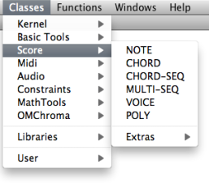
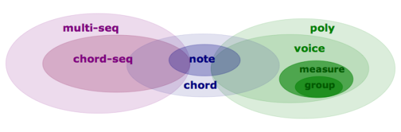
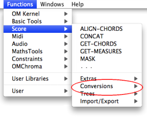
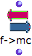
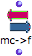
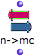
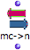
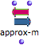
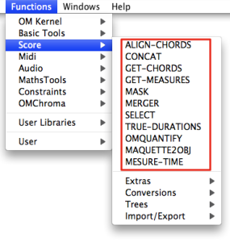

Navigation : [Previous](ScoreObjects "page précédente\(Score
Objects\)") | [Next](Note-Chord-Chord-seq "page
suivante\(Harmonic Objects\)")

# Score Objects Presentation

Sommaire

  1. Types : "Harmonic", "Rhythmic" and "Polyphonic" Objects.
  2. Time Representation
  3. Pitches
  4. General Score Modules

|

Score classes enclose the musical objects that compose a score :  notes ,
chords ,  chord-seqs ,  voices ,  polys . Out of convenience, we have gathered
these objects in three categories : "harmonic", "rhythmic" and "polyphonic"
objects.

They can be accessed via the `Classes / Score` menu.  
  
---|---  
  

## Types : "Harmonic", "Rhythmic" and "Polyphonic" Objects.

  1. **Harmonic objects** include  notes ,  chords and  chord-seqs . 

  2. **Rhythmic objects** include voices (internally made of  measures and  groups). 

  3. **Polyphonic objects** include  polys and  multi-seqs . These are "superimpositions" of objects :

    * voices on one hand, 
    * chord-seqs on the other hand.

## Time Representation

These objects can be classified into two temporal categories :

  * ** Pulsed, or rhythmic representations ** are based on a traditional  **rhythmic expression** of events in time, via rhythm trees[1].  Voices and  polys are pulsed representations.
  * ** Linear representations ** are based on the ** absolute duration ** of events - in milliseconds. Chord-seqs and  multi-seqs are linear representations.
  * Notes and  chords are atomic objects and correspond to both temporal categories.

Expressing Rhythms

  * [Rhythm Trees](RT)

## Pitches

Pitches in OM are usually represented in midicents.

A midicent is a cent of one MIDI unit, that is, of a half-tone.

MIDI pitch units

In MIDI, the middle C is represented by the value 60, then 61=C#, 62=D, 63=D#,
etc.

In midicent, therefore, C=6000, C#=6100, ...

Midicents allow to represent microintervals, which standard MIDI values can't
do : 6050 = C+1/4 tone, 6020=C+ 1/10th tone, etc.

How to Play MicroIntervals

  * [Playing Microintervals with MIDI](Microintervals)

Manipulating Pitches in OM : Basic Tools

|

A set of functions and conversion modules allows to manipulate midicents and
pitches in general. They can be accessed via the `Functions / Score /`menu.  
  
---|---  
  

|

The  **frequency-to-midicents** function converts frequencies (or lists of
frequencies) to midicents.  
  
---|---  
  

|

The  **midicents-to-frequencies** function converts midicents to frequencies.

Its input takes atoms or lists.  
  

|

The  **name-to-midicents** function converts a note name (like "C3") or a list
of note names, to midicent value(s).  
  

|

The  **midicents-to-name** function converts a midicents value (or a list of
values) to note name(s).  
  

|

The  **approximate-midicents** function approximates a midicents value to the
closest tempered division of the octave (for isntance 4 = quarter tones).  
  
## General Score Modules

A set of score objects manipulation modules are avalable in the Functions` /
Score` menu

|

  
  
---|---  
  
References :

  1. Rhythm Tree

A rhythm tree expresses a rhythmic structure as a list.

This list is made of :

    * a duration, or number of measures,

    * a list of measures.

Each measure is made of

    * a time signature 

    * a list or proportions, or rhythmic values.

For instance : (1 (((4 4) (1 1 2))) is a rhythm of one measure, signature 4/4,
with two quarter and one half note (proportions = 1/4 1/4 2/4 = 1/4 1/4 1/2).

The term of "tree" refers to a recusrive structure: each item in the
proportions list can in turn be expressed as a duration with a list of
subdivisions.

For instance the second beat in our measure could be subdivided as follows :
((4 4) (1 (1 (2 3)) 2)).

Plan :

  * [OpenMusic Documentation](OM-Documentation)
  * [OM 6.6 User Manual](OM-User-Manual)
    * [Introduction](00-Sommaire)
    * [System Configuration and Installation](Installation)
    * [Going Through an OM Session](Goingthrough)
    * [The OM Environment](Environment)
    * [Visual Programming I](BasicVisualProgramming)
    * [Visual Programming II](AdvancedVisualProgramming)
    * [Basic Tools](BasicObjects)
    * [Score Objects](ScoreObjects)
      * Presentation
        * [Harmonic Objects](Note-Chord-Chord-seq)
        * [Rhythmic Objects](RhythmicObjects)
        * [Polyphonic Objects](Polyphonic)
      * [Rhythm Trees](RT)
      * [Score Players](ScorePlayer)
      * [Score Editors](ScoreEditors)
      * [Quantification](Quantification)
      * [Export / Import](ImportExport)
    * [Maquettes](Maquettes)
    * [Sheet](Sheet)
    * [MIDI](MIDI)
    * [Audio](Audio)
    * [SDIF](SDIF)
    * [Lisp Programming](Lisp)
    * [Errors and Problems](errors)
  * [OpenMusic QuickStart](QuickStart-Chapters)

Navigation : [Previous](ScoreObjects "page précédente\(Score
Objects\)") | [Next](Note-Chord-Chord-seq "page
suivante\(Harmonic Objects\)")

