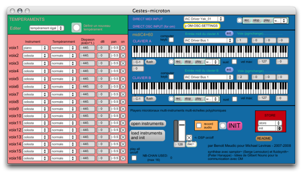

Navigation : [Previous](RT2 "page précédente\(Notation : in
Practice\)") | [Next](ScoreEditors "Next\(Score
Editors\)")

# Score Players

OM mainly relies on the MidiShare libray for MIDI playback and rendering of
score objects.

It is possible, however, to install additional players and use them to play
the core objects.

Default MIDI Playback

  * [Rendering and Playback Control](MIDI-Playback)

In order to change the default player of an object, select use the `Player`
item in the box contextual menu, or the player selection menu (if any) in the
corresponding editor.

|

  
  
---|---  
  
The **MicroPlayer** is the only available alternative player to date.

|

Selecting the MicroPlayer in the score editors.  
  
---|---  
  
The MicroPlayer

 **MicroPlayer** is an independent application which must be installed
separately. It is distributed in the [IRCAM forumnet
webpage](http://forumnet.ircam.fr/363 "http://forumnet.ircam.fr/363
\(nouvelle fenêtre\)") and is available on MacOSX only.

At selecting the MicroPlayer for the first time in OM, the application will
take a while in starting up and initializing. It can then be put to the
background.

The MicroPlayer interface.[Zoom](../res/microplayer11_scr_1.png "Zoom
\(nouvelle fenêtre\)")

MicroPlayer communicates with OM via OSC.

The `MIDI/OSC` tab in the OpenMusic Preferences allows to set the path to the
application and the OSC ports to use for communication (default OM preferences
should be compatible wirth the default MicroPlayer ports).

References :

Plan :

  * [OpenMusic Documentation](OM-Documentation)
  * [OM 6.6 User Manual](OM-User-Manual)
    * [Introduction](00-Sommaire)
    * [System Configuration and Installation](Installation)
    * [Going Through an OM Session](Goingthrough)
    * [The OM Environment](Environment)
    * [Visual Programming I](BasicVisualProgramming)
    * [Visual Programming II](AdvancedVisualProgramming)
    * [Basic Tools](BasicObjects)
    * [Score Objects](ScoreObjects)
      * [Presentation](Score-Objects-Intro)
      * [Rhythm Trees](RT)
      * Score Players
      * [Score Editors](ScoreEditors)
      * [Quantification](Quantification)
      * [Export / Import](ImportExport)
    * [Maquettes](Maquettes)
    * [Sheet](Sheet)
    * [MIDI](MIDI)
    * [Audio](Audio)
    * [SDIF](SDIF)
    * [Lisp Programming](Lisp)
    * [Errors and Problems](errors)
  * [OpenMusic QuickStart](QuickStart-Chapters)

Navigation : [Previous](RT2 "page précédente\(Notation : in
Practice\)") | [Next](ScoreEditors "Next\(Score
Editors\)")

