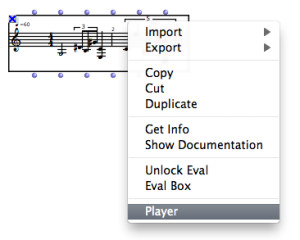
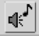

Navigation : [Previous](RT2 "page précédente\(Notation : in
Practice\)") | [Next](ScoreEditors "Next\(Score
Editors\)")

# Score Players

OM mainly relies on the [PortMidi](https://portmedia.sourceforge.net/portmidi/) libray for MIDI playback and rendering of
score objects.

Default MIDI Playback

  * [Rendering and Playback Control](MIDI-Playback)

In order to change the default player of an object, select use the `Player`
item in the box contextual menu, or the player selection menu (if any) in the
corresponding editor.

|

  
  
## FLUIDSYNTH AND OM

> This information applies to OM v.7.2 and higher

### Introduction

Since version 7.2, FluidSynth is integrated to OM as a dynamic library.

However, you will need to install fluidsynth on Linux and Mac platforms.

### Installing FluidSynth on Linux

You just have to use your package manager (apt for Debian, dnf for Fedora).

### Installing FluidSynth on Mac

One easy method to install on Mac is to use the [Homebrew](https://brew.sh/) package manager. This will also allow you to install Csound, Lilypond, etc.

Here are the steps you must follow to install Homebrew and FluidSynht:

Press Command+Space and type Terminal and press enter/return key.

Copy and paste the following command in Terminal app:

...

        /bin/bash -c "$(curl -fsSL https://raw.githubusercontent.com/Homebrew/install/HEAD/install.sh)"
...

        
        
 and press enter/return key. Wait for the command to finish.
 
 If you are prompted to enter a password, please type your Mac user's login password and press ENTER. 
 
 Mind you, as you type your password, it won't be visible on your Terminal (for security reasons), but rest assured it will work.
 
 Now, copy/paste and run this command to make brew command available inside the Terminal: 

...

            echo 'eval "$(/opt/homebrew/bin/brew shellenv)"' >> ~/.zprofile

...

Copy and paste the following command:

...

        brew install fluidsynth

...

Done! You can now use fluidsynth.

### Setting up Preferences

In order to use FluidSynth as your basic player, first go to the OM preferences MIDI tab:

Then select "**fluidsynth**" in the pop-up menu.

This will allow to set the **fluidsynth** **player** as the default **player** for all your SCORE objects (chord, chord-seq, voice, etc.)  

**Note:** Once **fluidsynth** is selected as the default **player**, **Shift of MIDI channels** will be set by default as **always** and **Number of channels** to **depending on approx**. 

In case you have imported patches with different **players** settings, you can still change the **player** individualy using the SCORE's editor button .

Choose from this panel the desired **player**:

 

### Creating FluidSynth instances

You can create as much FluidSynth instances as your RAM allows. 

For each instance of a Fluidsynth created it will be allocated a default port. Ports start from 0.

In order to create FluidSynth instances, go to the **Fluidsynth** tab in the preference window.

Choose the number of synths you need in the **Number of Synths.** box and press **Apply** button.

Then press on **Load Synths** button

If you need to delete synths use the **Delete Synths** button.

### SF2 managment

By default, **SF2 File** button will load the soudfont into all the synth already created.

If you need to load different soundfonts for each synth, use the **SF2 setup** button.

You can then load individualy for each synth a different soudfont by clicking on the folder button 

It is possible do save the setup in a text file using the **Save** button. The **Load** button will load your setup. The format of the playlist is a pathname for each sf2 and looks something like this:

### Still not working ? 

Please report/comment on the ForumNet thread :      
[https://discussion.forum.ircam.fr/c/openmusic/42](https://discussion.forum.ircam.fr/c/openmusic/42)

References :

Contents :

  * [OpenMusic Documentation](OM-Documentation)
  * [OM User Manual](OM-User-Manual)
    * [Introduction](00-Contents)
    * [System Configuration and Installation](Installation)
    * [Going Through an OM Session](Goingthrough)
    * [The OM Environment](Environment)
    * [Visual Programming I](BasicVisualProgramming)
    * [Visual Programming II](AdvancedVisualProgramming)
    * [Basic Tools](BasicObjects)
    * [Score Objects](ScoreObjects)
      * [Presentation](Score-Objects-Intro)
      * [Rhythm Trees](RT)
      * Score Players
      * [Score Editors](ScoreEditors)
      * [Quantification](Quantification)
      * [Export / Import](ImportExport)
    * [Maquettes](Maquettes)
    * [Sheet](Sheet)
    * [MIDI](MIDI)
    * [Audio](Audio)
    * [SDIF](SDIF)
    * [Lisp Programming](Lisp)
    * [Errors and Problems](errors)
  * [OpenMusic QuickStart](QuickStart-Chapters)

Navigation : [Previous](RT2 "page précédente\(Notation : in
Practice\)") | [Next](ScoreEditors "Next\(Score
Editors\)")

