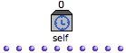
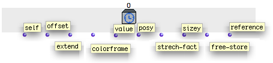
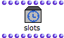
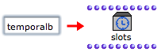

Navigation : [Previous](TempProgramming "page
précédente\(TempBoxes Programming\)") | [Next](Examplestempbox
"Next\(Programming with the Tempin\)")

ci a ete desactive. Certaines fonctionnalites de ce guide sont restreintes.

# The Self Input Box - Tempin

## The Self Input box

|

A  **Self Input box** can be added in a patch, to **apply or control the
characteristics** of a Temporalbox from the very  **inside of the patch** .

Consequently, the Self Input box is only useful if the patch is represented in
a maquette.  
  
---|---  
  
Adding a Self Input box

To add a Self Input Box in a patch :

  * `Ctrl` / right click in the editor and choose `TemporalBoxes / Self Input`
  * `Cmd` click and type "tempin".

Self Input Parameters

The Self Input box parameters are very similar to those of a musical object.
In addition, it has temporal and graphic values, which allow the interaction
with the maquette.

**1\. self** **:**

|

the Temporalbox itself - like a "self" output

|

**6\. p **osy**** **:**

|

vertical position  
  
---|---|---|---  
  
**2\. offset **:****

|

starting point of the box in milliseconds

|

**7\. stretch-fac** t **:**

|

time stretch factor, expresses the size modification of a TemporalBox.  
  
**3\. extend** **:**

|

calculated duration

|

**8\. sizey** **:**

|

vertical size of the box  
  
**4\. color frame** **:**

|

box colour

|

**9\. free-store** **:**

|

a "free" parameter  
  
**5\. value** **:**

|

whatever is connected to the Tempout of a TemporalBox.

|

**10\. reference** **:**

|

an object connected to the "reference" input of a TemporalBox instance.  
  
Actual Duration of a TemporalBox

duration = extend * stretch-fact

## Accessing the Parameters of the Self Input

Using the Information of the Self Input box

Information provided by the Self Input box can be used in the patch with
simple connections with other boxes.

For instance, we can use :

  * the "posy" value to define the pitch of a chord
  * the "offset" value to define the velocity or duration of the chord...

A Programming Example

  * [Example 1 : Programming With the Self Input Box](Examplestempbox)

Information can also possibly be returned by the output(s) of the TemporalBox
to other TemporalBoxes, in order to define relations between their respective
properties or temporal qualities.

Another Example

  * [Example 2 : Defining Temporal Relations Between TemporalBoxes](EX2)

Slots box : Defining the Properties of the Self Input from the Patch

The Self Input box shows no inputs, like an  instance box. Yet, we sometimes
need to access and modify the parameters of a TemporalBox from its internal
program. To do so, we can resort to a slots box that will represent this
TemporalBox.

|

  
  
---|---  
  

|

To create a slots box out of a TemporalBox instance :

  1. `Cmd`  click in a patch editor and type "temporalbox"

  2. validate while keeping `SHIFT` pressed.

  
  
---|---  
  
The  slot box can define the properties of the TemporalBox from the patch.
Using a slot box amounts to modifying the attributes of the "self" output of
the Self Input Box.

Hence, we can use slots for defining :

  * the colour of the TemporalBox,
  * its position according to other parameters, 
  * data returned by other boxes...

Defining TemporalBoxes From their Internal Patch

  * [Adding TemporalBoxes : Examples](addexamples)

Using the Slots Box

  * [Reference Mode](Maquettes%20in%20Patches2)

Slots Box Value

The slots box must be connected to the ** "self" output ** of the self input
box otherwise, it has no value.

References :

Contents :

  * [OpenMusic Documentation](OM-Documentation)
  * [OM User Manual](OM-User-Manual)
    * [Introduction](00-Contents)
    * [System Configuration and Installation](Installation)
    * [Going Through an OM Session](Goingthrough)
    * [The OM Environment](Environment)
    * [Visual Programming I](BasicVisualProgramming)
    * [Visual Programming II](AdvancedVisualProgramming)
    * [Basic Tools](BasicObjects)
    * [Score Objects](ScoreObjects)
    * [Maquettes](Maquettes)
      * [Creating a Maquette](Maquette)
      * [TemporalBoxes](TemporalBoxes)
      * [The Maquette Editor](Editor)
      * [Maquette Programming](Programming%20Maquette)
        * [Functional Components](InputsOutputs)
        * [Evaluation](MaquetteEvaluation)
        * [The Synthesis Patch](Synthpatchprog)
        * [TempBoxes Programming](TempProgramming)
          * The Self Input Box - Tempin
          * [Programming with the Tempin](Examplestempbox)
          * [Temporal Relations](EX2)
      * [Maquettes in Patches](Maquettes%20in%20Patches)
    * [Sheet](Sheet)
    * [MIDI](MIDI)
    * [Audio](Audio)
    * [SDIF](SDIF)
    * [Lisp Programming](Lisp)
    * [Reactive mode](Reactive)
    * [Errors and Problems](errors)
  * [OpenMusic QuickStart](QuickStart-Chapters)

Navigation : [Previous](TempProgramming "page
précédente\(TempBoxes Programming\)") | [Next](Examplestempbox
"Next\(Programming with the Tempin\)")

