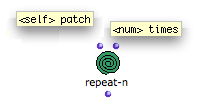
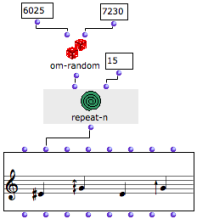
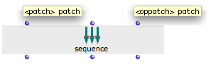
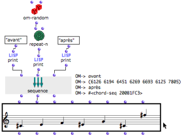

Navigation : [Previous](Logical "page précédente\(Logical
Operators\)") | [Next](OMLoop "Next\(Iterations:
OMLoop\)")

# Sequential Operators

Sequential operators control the occurrences of operations in program. They
can apply to the iteration of an operation, or to the succession of several
operations at a single evaluation.

Sequential operators can be accessed via the `OM Kernel / Control` menu.

## Repeat-n : Iteration

** Repeat-n ** evaluates something a number of times and collects the results
in a list, so that the manual evaluation doesn't have to be repeated.

Features

|

**** Repeat-n has two default inputs :

  * "self" takes any type of data, a function, or a lambda function.

  * "num" takes a number. 

The data assigned to "self" is repeated n times. The result is returned as a
list by the output.  
  
---|---  
  
Example

Here, repeat-n is applied to om-random to produce a random notes sequence.

Repeat-n evaluates om-random 15 times : each time, a random value is returned.
The resulting list is returned to the pitches input of the factory box.

|

  
  
---|---  
  
Advanced Use of Iteration : OMLoop

More complex or specific iterative processes can be designed and controlled
via the **OMLoop module editor**.

The Omloop Module

  * [Iterations: OMLoop](OMLoop)

## Sequence : Executing Several Tasks

Features

|

The  ** sequence ** box executes a sequence of distinct operations.

  * It has one default input and output. The "patch" input takes any kind of box.

  * It can be added as many "oppatch" additional inputs - "patch" input q- as necessary : 

  * **Multiple outputs** can return the result of corresponding upstream operations to other boxes. 

  
  
---|---  
  
Example

A chord-seq is generated while other tasks are executed.

When the chord-seq is evaluated, sequence performs three tasks :

  1. print "avant", 

  2. generate and print a random list of numbers,

  3. print "apres".

Then, the value of its second output is returned to the "pitch" input of the
chord-seq.

Note that without print, the Listener wouldn't display the values the outputs
of sequence. These values can be returned with an individual evaluation of
each output.

References :

Contents :

  * [OpenMusic Documentation](OM-Documentation)
  * [OM User Manual](OM-User-Manual)
    * [Introduction](00-Contents)
    * [System Configuration and Installation](Installation)
    * [Going Through an OM Session](Goingthrough)
    * [The OM Environment](Environment)
    * [Visual Programming I](BasicVisualProgramming)
    * [Visual Programming II](AdvancedVisualProgramming)
      * [Abstraction](Abstraction)
      * [Evaluation Modes](EvalModes)
      * [Higher-Order Functions](HighOrder)
      * [Control Structures](Control)
        * [Predicates](Predicates)
        * [Conditional Operators](ConditionalOps)
        * [Logical Operators](Logical)
        * Sequential Operators
      * [Iterations: OMLoop](OMLoop)
      * [Instances](Instances)
      * [Interface Boxes](InterfaceBoxes)
      * [Files](Files)
    * [Basic Tools](BasicObjects)
    * [Score Objects](ScoreObjects)
    * [Maquettes](Maquettes)
    * [Sheet](Sheet)
    * [MIDI](MIDI)
    * [Audio](Audio)
    * [SDIF](SDIF)
    * [Reactive mode](Reactive)
    * [Lisp Programming](Lisp)
    * [Errors and Problems](errors)
  * [OpenMusic QuickStart](QuickStart-Chapters)

Navigation : [Previous](Logical "page précédente\(Logical
Operators\)") | [Next](OMLoop "Next\(Iterations:
OMLoop\)")

