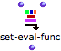
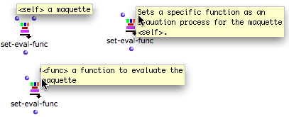

Navigation : [Previous](Synthpatchexample "page
précédente\(Synthesis Patch Example\)") | [Next](TempProgramming
"Next\(TempBoxes Programming\)")

ci a ete desactive. Certaines fonctionnalites de ce guide sont restreintes.

# Assigning a Synthesis Patch to a Maquette with the Set-Eval Function

## Features

Function

|

The  ** set- eval-func ** function can assign a synthesis patch to an internal
maquette  **from the patch** where it is located. The maquette must be on
["reference" mode](RefMode).  
  
---|---  
  
To access the set-eval-function :

  * select `OM Kernel / Control / Set-Eval-Func`, 
  * press `Cmd` and type "set-eval-func".

To set a box on "reference" mode in a patch, select it, press `b` and click
twice on the  label to display the
 reference label.

Maquettes on "Reference" Mode

  * [Reference Mode](Maquettes%20in%20Patches2)

Inputs and Outpus

Set-eval-func has two inputs and one output :

  * " self" : a maquette on "reference" mode. 
  * "func" : a patch or function on "reference" mode.
  * Its output returns a reference.

## Connection

The resulting chord-seq is obtained when evaluating the factory box, with the
maquette on normal mode.

|

The calculation of the maquette's value takes place at the evaluation of set-
eval-func.

Note that the maquette's output can also be connected to an object that will
possibly materialize its new value. Nevertheless, the maquette must be reset
on normal mode so that the object can be evaluated.  
  
---|---  
  
References :

Plan :

  * [OpenMusic Documentation](OM-Documentation)
  * [OM User Manual](OM-User-Manual)
    * [Introduction](00-Sommaire)
    * [System Configuration and Installation](Installation)
    * [Going Through an OM Session](Goingthrough)
    * [The OM Environment](Environment)
    * [Visual Programming I](BasicVisualProgramming)
    * [Visual Programming II](AdvancedVisualProgramming)
    * [Basic Tools](BasicObjects)
    * [Score Objects](ScoreObjects)
    * [Maquettes](Maquettes)
      * [Creating a Maquette](Maquette)
      * [TemporalBoxes](TemporalBoxes)
      * [The Maquette Editor](Editor)
      * [Maquette Programming](Programming%20Maquette)
        * [Functional Components](InputsOutputs)
        * [Evaluation](MaquetteEvaluation)
        * [The Synthesis Patch](Synthpatchprog)
          * [Maquette Value](Synthesispatch)
          * [Synthesis Patch Example](Synthpatchexample)
          * Set-Eval Function
        * [TempBoxes Programming](TempProgramming)
      * [Maquettes in Patches](Maquettes%20in%20Patches)
    * [Sheet](Sheet)
    * [MIDI](MIDI)
    * [Audio](Audio)
    * [SDIF](SDIF)
    * [Lisp Programming](Lisp)
    * [Errors and Problems](errors)
  * [OpenMusic QuickStart](QuickStart-Chapters)

Navigation : [Previous](Synthpatchexample "page
précédente\(Synthesis Patch Example\)") | [Next](TempProgramming
"Next\(TempBoxes Programming\)")

