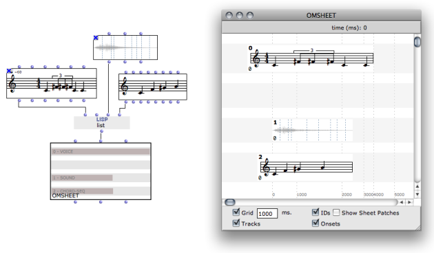
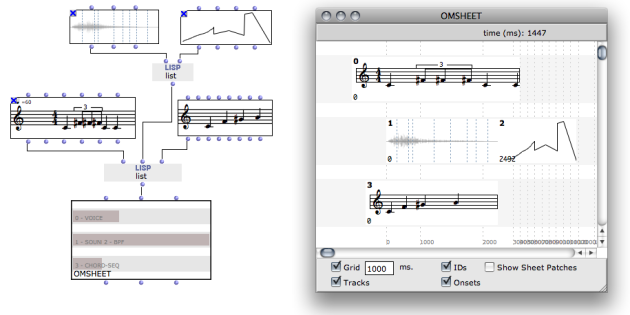
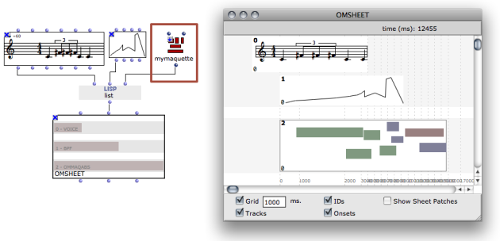
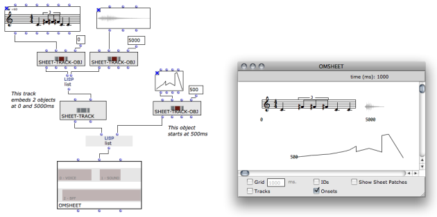
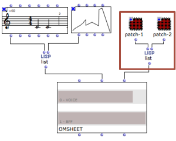

Navigation : [Previous](Sheet-Editor "page précédente\(Sheet
Editor\)") | [Next](Sheet-Patch "Next\(Sheet
Patches\)")

# Building Sheets in Visual Programs

As other musical objects, a sheet can be simply created in an OM patch. This
can be done at several levels of precision and complexity.

Remainder : objects allowed in the OMSheet

You can insert in a sheet most of the standard OM musical objects :

  * CHORD-SEQ
  * VOICE
  * SOUND
  * BPF / MIDICONTROL
  * MAQUETTE

## Connecting Objects

Objects are to be connected to the <voices> input of the OMSheet in order to
be included in it.

<voices> expects to receive a list, each element corresponding to one new
sheet track.

Empty Tracks

In the example above, note that the NIL element in the input list produced an
empty track in the OMSheet object created.

Polyphonic Objects

If you try to create a track from a polyphonic object ( **multi-seq** or
**poly** ), the sheet will automatically split it at initialization and create
a new track with each voice of the object.

Compound Tracks

Several musical objects can coexist (generally, sequencially) on a same track.
To create several objects on a same track, just connect a list of objects
instead of a single object to the first-level input list :

Objects Onsets

In compound tracks, objects are automatically positioned one after the other
(an object starts right at the end of the previous one in the list). See next
section for more advanced control on the position of the objects.

Maquettes

Maquettes can be embedded in OMSheets as other musical objects. Just use the
maquette box in the "reference" evaluation mode and connect it as any other
object box.

"Reference" Evaluation Mode

  * [Reference Mode](RefMode)

Note that the size of the maquette boxes may be distorted due to the non-
linear graphical representation of the score in the editor.

Maquette Result

If the maquette has a "synthesis function", the result will appear along with
the boxes in the maquette representation.

Maquette Computation

  * [An Alternate Evaluation Tool : the Synthesis Patch](Synthpatchprog)

## Controlling the Structure

For a more accurate control of the sheet structure (and in particular of the
temporal structure), the internal components of the sheet can be created and
assembled directly in the OM patch. The classes **SHEET-TRACK** and **SHEET-
TRACK-OBJ** can be used for this purpose.

Build the tracks and connect them instead of simple objects :

  *  **SHEET-TRACK** is just initialized with a list of **SHEET-TRACK-OBJs**.

  *  **SHEET-TRACK-OBJ** is initialized with an object, a start time (or "onset") and an ID number (optional).

## Sheet Patches

The other input of the OMSheet box (<patch-list>) allows you to
programmatically set the patches used internally in the sheet.

Programming Inside the Sheet

  * [Sheet Patches](Sheet-Patch)

Just connect a list of patch boxes in "reference" mode.

|

  
  
---|---  
  
Patches in "Reference" Mode ?

  * [Reference Mode](RefMode)

References :

Plan :

  * [OpenMusic Documentation](OM-Documentation)
  * [OM 6.6 User Manual](OM-User-Manual)
    * [Introduction](00-Sommaire)
    * [System Configuration and Installation](Installation)
    * [Going Through an OM Session](Goingthrough)
    * [The OM Environment](Environment)
    * [Visual Programming I](BasicVisualProgramming)
    * [Visual Programming II](AdvancedVisualProgramming)
    * [Basic Tools](BasicObjects)
    * [Score Objects](ScoreObjects)
    * [Maquettes](Maquettes)
    * [Sheet](Sheet)
      * [Sheet Editor](Sheet-Editor)
      * Sheet Box
      * [Sheet Patches](Sheet-Patch)
    * [MIDI](MIDI)
    * [Audio](Audio)
    * [SDIF](SDIF)
    * [Lisp Programming](Lisp)
    * [Errors and Problems](errors)
  * [OpenMusic QuickStart](QuickStart-Chapters)

Navigation : [Previous](Sheet-Editor "page précédente\(Sheet
Editor\)") | [Next](Sheet-Patch "Next\(Sheet
Patches\)")

