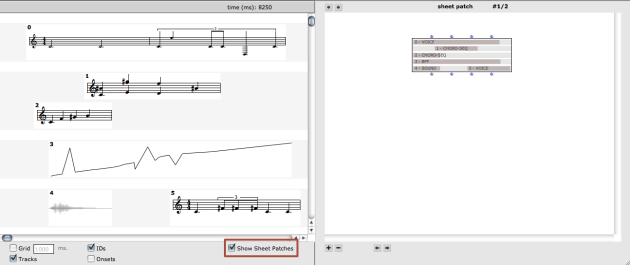
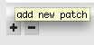
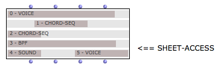
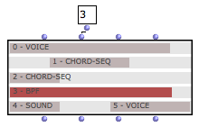
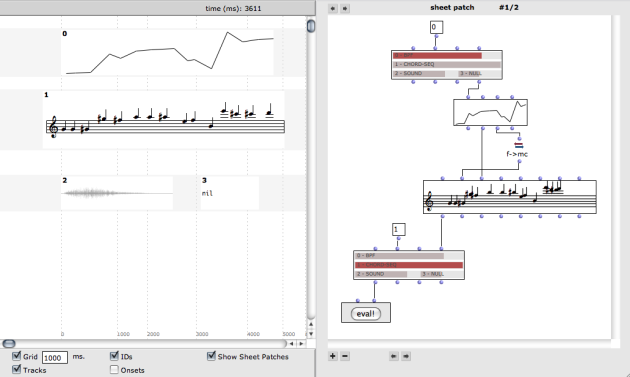
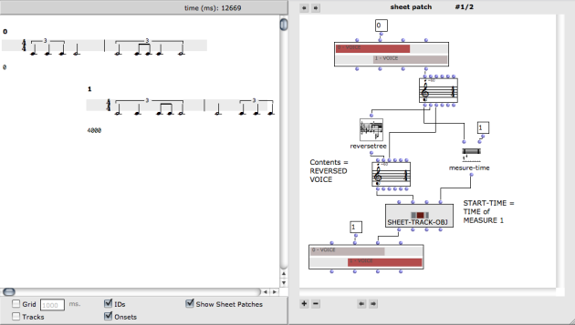

Navigation : [Previous](Sheet-Box "page précédente\(Sheet Box\)")
| [Next](MIDI "Next\(MIDI\)")

In addition to their musical contents, OMSheets embed some programmatic
aspects materialized as a list of internal patches.

To make these patches visible, use the `Show Sheet Patches` box in the sheet
editor.

## Basic Operations on the Sheet Patches

A number of buttons are visible around the patch editor part of the window.

Tooltips

Used `CMD` to show the "tooltip" help of the different buttons

|

  
  
---|---  
  
Creating/Removing Sheet Patches

Sheet patches can be attached to a given sheet object at initialisation, or
using the `+` / `-` buttons in the editor. There can be any number of patches
attached to a sheet.

The  arrow buttons at the top allow to navigate
between the different patches attached to a sheet.

The  arrow buttons at the bottom allow to change the
order of the patches attached to a sheet by moving the current one up or down
in the list.

Adding Patches using the OMSheet Box

  * [Building Sheets in Visual Programs](Sheet-Box)

## Sheet Access

The sheet patches are like standard patches, except that they can contain a
special kind of box called **SHEET-ACCESS** (one is created by defalut when
adding a new patch with the `+` button in the sheet-patch window).

This box is meant to represent and allow to read or modify the contents of the
objects in the sheet containing the patch.

The SHEET-ACCESS box has 4 inputs/outputs

  * The usual <self> input corresponds to the sheet containing the patch.

  * The <object-ID> input allows to target a specific object in the sheet using its ID number. When the **sheet-access** box is evaluated, the corresponding rectangle is highlighted in it :

  * <object-access> and <object-contents> allow to read and/or modify repectively the corresponding object in the sheet (a SHEET-TRACK-OBJ instance including the value and temporal location) or its contents (the value only, that is, the musical object it contains).

Sheet Accesses

The Sheet patches can contain as many sheet access boxes as needed.

Note that the contents of the sheet access itself may change depending on the
evaluation performed on it, so the order of evaluations may matter at the time
of programming advanced relations between the objects.

Example of Sheet programming Using Sheet-Access (1)

In this example, the Chord-seq (ID=1) is determined from the data coming from
object ID=0 (a BPF)

Example of Sheet programming Using Sheet-Access (2)

In this exemple, the object on track 2 (object ID=1) is determined using a
**sheet-track-obj** in order to set its onset at the position of measure 1 in
object 0 (this first voice).

The contents of object 1 is the reverse rhythm of voice 0.

References :

Plan :

  * [OpenMusic Documentation](OM-Documentation)
  * [OM 6.6 User Manual](OM-User-Manual)
    * [Introduction](00-Sommaire)
    * [System Configuration and Installation](Installation)
    * [Going Through an OM Session](Goingthrough)
    * [The OM Environment](Environment)
    * [Visual Programming I](BasicVisualProgramming)
    * [Visual Programming II](AdvancedVisualProgramming)
    * [Basic Tools](BasicObjects)
    * [Score Objects](ScoreObjects)
    * [Maquettes](Maquettes)
    * [Sheet](Sheet)
      * [Sheet Editor](Sheet-Editor)
      * [Sheet Box](Sheet-Box)
      * Sheet Patches
    * [MIDI](MIDI)
    * [Audio](Audio)
    * [SDIF](SDIF)
    * [Lisp Programming](Lisp)
    * [Errors and Problems](errors)
  * [OpenMusic QuickStart](QuickStart-Chapters)

Navigation : [Previous](Sheet-Box "page précédente\(Sheet Box\)")
| [Next](MIDI "Next\(MIDI\)")

