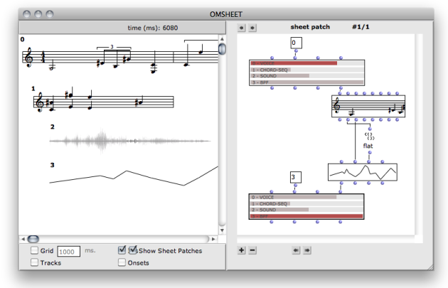
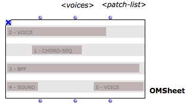
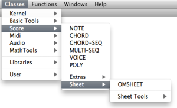

Navigation : [Previous](Intercation2 "page précédente\(Interation
\(2\)\)") | [Next](Sheet-Editor "Next\(Sheet Editor\)")

# Sheet

The **OMSheet** object is a special polyphonic container allowing to bring
together heterogeneous musical objects on its different voices. The OMSheet
editor has specific features ensuring space/time alignments between the
notation and other temporal objects.

Different types of musical objects can be embedded in a sheet  :

  * CHORD-SEQ
  * VOICE
  * SOUND
  * BPF / MIDICONTROL
  * MAQUETTE

The Sheet also allows to process and generate the contents of these different
tracks using visual programs.

Structure

The OMSheet is made of a number of **TRACKS** (<voices>). Each track can
contain one or several internal **OBJECTS** localized with a given onset time
and identified in the Sheet by a unique ID number.

An OMSheet has also a number of attached inbuilt patches (<patch-list>)
allowing to generate the contents or link the sheet track objects together.

Find the OMSheet object and tools in the `Classes / Score / Sheet` menu.

|

  
  
---|---  
  
References :

Contents :

  * [OpenMusic Documentation](OM-Documentation)
  * [OM User Manual](OM-User-Manual)
    * [Introduction](00-Contents)
    * [System Configuration and Installation](Installation)
    * [Going Through an OM Session](Goingthrough)
    * [The OM Environment](Environment)
    * [Visual Programming I](BasicVisualProgramming)
    * [Visual Programming II](AdvancedVisualProgramming)
    * [Basic Tools](BasicObjects)
    * [Score Objects](ScoreObjects)
    * [Maquettes](Maquettes)
    * Sheet
      * [Sheet Editor](Sheet-Editor)
      * [Sheet Box](Sheet-Box)
      * [Sheet Patches](Sheet-Patch)
    * [MIDI](MIDI)
    * [Audio](Audio)
    * [SDIF](SDIF)
    * [Reactive mode](Reactive)
    * [Lisp Programming](Lisp)
    * [Errors and Problems](errors)
  * [OpenMusic QuickStart](QuickStart-Chapters)

Navigation : [Previous](Intercation2 "page précédente\(Interation
\(2\)\)") | [Next](Sheet-Editor "Next\(Sheet Editor\)")

