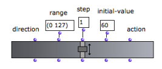
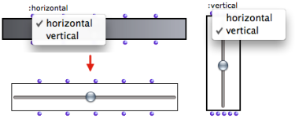
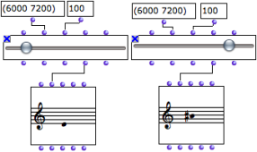
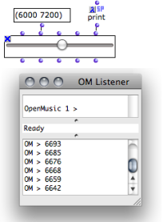
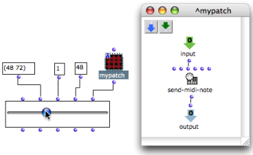

Navigation : [Previous](Button "page précédente\(Button\)") |
[Next](MenuBoxes "Next\(Pop-Up Menu Box\)")

# Controlling Values : Slider Box

Sommaire

  1. Features
  2. Settings
  3. Using the "Action" Input
  4. A Musical Application

The  ** slider ** box allows to select a value in a given range with a slider
interface.

## Features

The  slider has five inputs and outputs :

  1. " **direction** " : the slider's vertical or horizontal orientation.

  2. " **range** " : the slider's range, from a minimum to a maximum value.

  3. " **step** " : the precision of the slider - should be equal to 1.

  4. " **value** " : position of the slider.

  5. " **action** " : an action to perform specified by a lambda function or patch.

|

  
  
---|---  
  
## Settings

Completing the Slider's Setting

To complete the slider's setting :

  1. enter values in the inputs data boxes

  2. evaluate the box

  3. **lock the box afterwards** to avoid resetting the values at subsequent evaluations.

"Direction" Input

Note that the slider orientation might not be taken into account if it is
incompatible with the box's size. A horizontal slider can be "resized
vertically".

Slider's Value(s)

The range, step and value inputs can be used to set the slider. The initial
value is modified when the user moves the slider.

The slider's outputs give access to the different properties of the slider
box.

In particular, the **fourth "value" output** returns a slider's position's
current value.

## Using the "Action" Input

The "action" input of the slider can be used for triggering an operation that
will integrate the "value" input, that is,  **the slider's position,  ** as a
parameter.

|

The "action" input must be connected to a function or a [box on "lambda"
mode](LambdaMode) with one input or argument.

When the slider is moved, this function is called with the value of the
"value" input as argument.

To set or modify the function associated with the slider :

  1. connect the box or function to the fifth input,

  2. evaluate the slider  box .

  
  
---|---  
  
## A Musical Application

  * The "range" input takes midi values from 48 to 72 - C3 to C5.

  * The "step" value is equal to 1, so that each step of the slider corresponds to a semi-tone.

  * The "initial value" of the slider is equal to 48, the lowest pitch of the range.

  * The patch on "lambda" mode is a very simple program that applies the slider's value to the pitch input of the send-midi-note function. 

When the slider is moved, the note played by send-midi-note matches the value
of the slider.

References :

Plan :

  * [OpenMusic Documentation](OM-Documentation)
  * [OM User Manual](OM-User-Manual)
    * [Introduction](00-Sommaire)
    * [System Configuration and Installation](Installation)
    * [Going Through an OM Session](Goingthrough)
    * [The OM Environment](Environment)
    * [Visual Programming I](BasicVisualProgramming)
    * [Visual Programming II](AdvancedVisualProgramming)
      * [Abstraction](Abstraction)
      * [Evaluation Modes](EvalModes)
      * [Higher-Order Functions](HighOrder)
      * [Control Structures](Control)
      * [Iterations: OMLoop](OMLoop)
      * [Instances](Instances)
      * [Interface Boxes](InterfaceBoxes)
        * [General Features](GeneralFeatures)
        * [Text Boxes](TextBoxes)
        * [Check Box](CheckBox)
        * [List Boxes](ListBoxes)
        * [Button](Button)
        * Slider Box
        * [Pop-Up Menu Box](MenuBoxes)
        * [Examples of Use](InterfaceExample)
      * [Files](Files)
    * [Basic Tools](BasicObjects)
    * [Score Objects](ScoreObjects)
    * [Maquettes](Maquettes)
    * [Sheet](Sheet)
    * [MIDI](MIDI)
    * [Audio](Audio)
    * [SDIF](SDIF)
    * [Lisp Programming](Lisp)
    * [Errors and Problems](errors)
  * [OpenMusic QuickStart](QuickStart-Chapters)

Navigation : [Previous](Button "page précédente\(Button\)") |
[Next](MenuBoxes "Next\(Pop-Up Menu Box\)")

