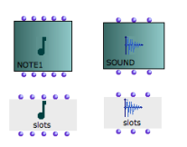
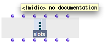
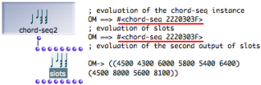
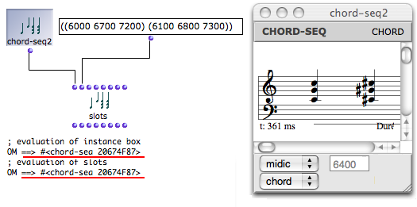
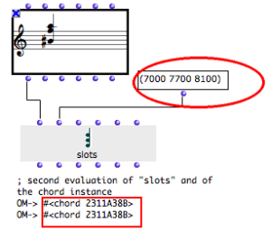
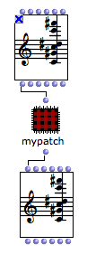
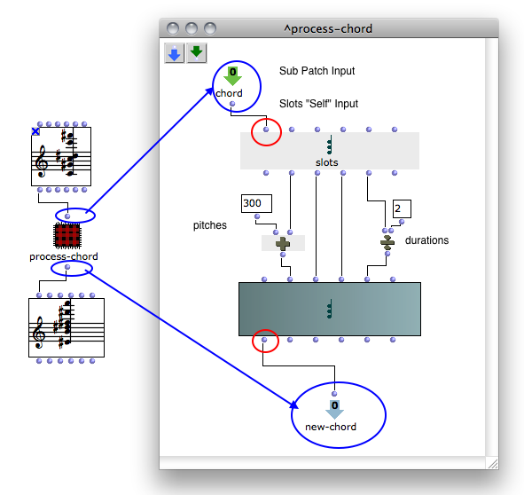
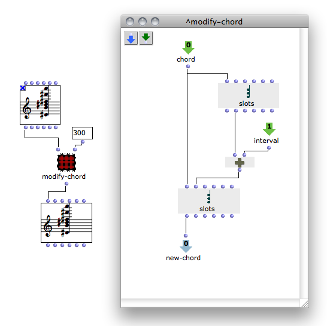

Navigation : [Previous](GlobalVariables "page précédente\(Global
Variables\)") | [Next](Store "Next\(The Store
Object\)")

# Reading and Modifying Instances : Slots

The slots box can read or modify the slots values - "fields" or parameters -
of an instance or global variable.

About Instance Boxes and Global Variables

  * [Instance Boxes](InstanceBoxes)
  * [Global Variables](GlobalVariables)

## Properties

Creating a Slots Box

**** To create a slots box :

  1. `Cmd` click in a patch editor and type a class name, as for any other box

  2. keep `SHIFT` pressed when validating.

You can also

  1. create a factory box

  2. select it and press `Alt`

  3. drag the box with `SHIFT` key pressed.

Morphology

|

The structure and morphology of a slots box is similar to those of its
corresponding factory box. The slots box also has a "self", and a number of
parametric slots.  
  
---|---  
  
For instance, the slots box created out of a chord instance has the same
inputs and outputs :  self ,  lmidic for midicents,  lvel for velocities,
loffset for notes offsets ,  ldur for durations,  lchan for midi channels. It
also has the same icon.

|

  
  
---|---  
  
Behaviour

When the slots box is evaluated :

  * The outputs of slots return the values of an instance's corresponding slots. 
  * The inputs of slots can take values which are assigned tothe corresponding slots of the object.

## Using the Slots Box to Modify an Instance

Using "slots" allows to read and modify the parameters of an object without
creating new instances out of new factory boxes :

Constraint

The  **" self"** **input** of slots must be connected to the ** "self"
output** of an object, in order to set the object whose slots are to be read
and/or modified.

Reading Values

To read the value(s) of an instance's slot :

  1. connect the instance to the "self" input of slots, 

  2. evaluate the corresponding output of slots.

Modifying the Values of an Object

To modify the value(s) of an instance's slot :

  1. connect the instance to the "self" input of slots, 

  2. enter new values in the relevant input of slots,

  3. evaluate slots

Note that the reference of the object hasn't changed, despite the fact the
object's content has changed.

Applying Slots to Factory Boxes

The same procedures can apply to factory boxes.

  1. Before evaluating, you may need to lock the factory box before evaluating slots : otherwise, it will be reset to its default values. 

  2. After evaluating, you may need to select the factory box and press `m` to refresh the miniview.

|

  
  
---|---  
  
## Modifying an Object in an Abstraction

With a slots box, an instance can be passed through the inputs of an
abstraction and mainpulated without resorting to a new factory boxes, which
would generate copies of the instance. This is sometimes necessary :

  * for optimization purposes

  * to ensure keeping the original instance one operates upon. 

|

To read or modify the parametric values of an instance from **inside an
abstraction** :

|

1\.

|

add an input and an output to the abstraction  
  
---|---  
  
2\.

|

connect the self output of the instance to the sub patch input  
  
3\.

|

connect the sub patch output to the self intput of an equivalent instance.  
  
1 - Using Instance Values in a Sub-Patch to Create a New Object

  1. In the sub patch editor, add a  chord box and create a corresponding  slots box.

Add the items required to modify the values of the chord, and connect them to
the .

Connect these items to slots, and to the factory box.

Connect the remaining inputs of the factory box to the corresponding outputs
of  slots box.

  2. Connect the **input** of the sub patch to the **" self" input of slots**

Connect the **output** of the sub patch to the "self" output of the factory
box.

Evaluate the factory box outside the patch.

The input instance values are read and used for generating a new object.

2 - Modifying an Instance in a Sub-Patch

The input values of the instance are read  and modified by the second  slots
box. Chord #2 is also modified, since chord #1 has been modified.

When the initial instance coming from a factory box is modified, you may need
to refresh the box minivie in order to visualize the changes.

References :

Contents :

  * [OpenMusic Documentation](OM-Documentation)
  * [OM User Manual](OM-User-Manual)
    * [Introduction](00-Contents)
    * [System Configuration and Installation](Installation)
    * [Going Through an OM Session](Goingthrough)
    * [The OM Environment](Environment)
    * [Visual Programming I](BasicVisualProgramming)
    * [Visual Programming II](AdvancedVisualProgramming)
      * [Abstraction](Abstraction)
      * [Evaluation Modes](EvalModes)
      * [Higher-Order Functions](HighOrder)
      * [Control Structures](Control)
      * [Iterations: OMLoop](OMLoop)
      * [Instances](Instances)
        * [Instance Boxes](InstanceBoxes)
        * [Global Variables](GlobalVariables)
        * Slots
        * [The Store Object](Store)
      * [Interface Boxes](InterfaceBoxes)
      * [Files](Files)
    * [Basic Tools](BasicObjects)
    * [Score Objects](ScoreObjects)
    * [Maquettes](Maquettes)
    * [Sheet](Sheet)
    * [MIDI](MIDI)
    * [Audio](Audio)
    * [SDIF](SDIF)
    * [Reactive mode](Reactive)
    * [Lisp Programming](Lisp)
    * [Errors and Problems](errors)
  * [OpenMusic QuickStart](QuickStart-Chapters)

Navigation : [Previous](GlobalVariables "page précédente\(Global
Variables\)") | [Next](Store "Next\(The Store
Object\)")

