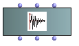
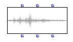
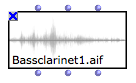
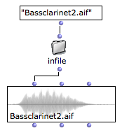
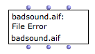
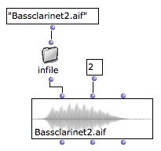
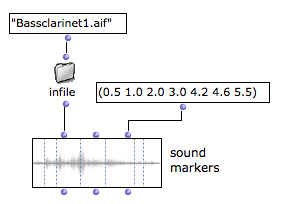
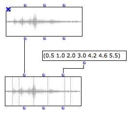

Navigation : [Previous](Audio "page précédente\(Audio\)") | [page
suivante](SoundEditor "Next\(Sound Editor\)")

The main audio object in OM is the SOUND object.

|

The SOUND box.  
  
---|---  
  
The 3 inputs inputs/outputs of the sound box represent :

  * The sound object
  * The audio track
  * A list of markers

## Sound File Initialization

Default Initialization

If nothing is connected to the SOUND box first input, when it is evaluated, a
file chooser dialog opens and allows to choose a file to load.

When initialized, the box miniview (press `m`) displays the sound waveform.

|

  
  
---|---  
  
File Name

When the name of the box is visible (press `n`) the name of the file is
displayed and updated at initializing the box.

After the sound is loaded, you may want to [lock the box](LockMode)
(press `b`) in order to avoid reinitalizing it at next evaluations.

|

  
  
---|---  
  
Accepted file formats :

OM currently accpets only AIFF or WAV audio formats.

Compressed audio formats such as MP3 are not supported.

File Pathname Initialization

A SOUND box is basically initialized with a sound file pathname, which can be
connected to its first input.

This pathname can be typed textually or come from another box or function.

|

  
  
---|---  
  
About Pathnames in OM

  * [Creating and Using Pathnames](Pathnames)

Sound Synthesis Results

Most of the sound synthesis tools available in OM (generally part of external
libraries) return a synthesized sound pathname after synthesis. These return
values are therefore suitable for connection to the SOUND box.

Initialization Error

When the file can not be loaded or found, a message may appear in the box
instead of the the sound waveform.

|

  
  
---|---  
  
File Attachment

The SOUND object is attached to the original file existing on a computer disk.
In other words, the sound data is not intern in the OM patch but always
remains in the external sound file.

Conflicts or unexpected behaviour may therefore happen if the sound file is
moved, renamed or removed from its original location, either by other program
or by manual modifications.

SOUND boxes may not be initialized correctly if the attached file is not found
at opening an existing patch.

## Playback

Basic Rendering

As other musical objects, the SOUND object can be played by selecting the box
and pressing `space`.

It can also be droped or algorithmically inserted in a
[Maquette](Maquettes).

Audio Tracks

The SOUND object have a  track slot, which can be used to attach a sound to a
particular audio track of the audio player.

|

  
  
---|---  
  
More About the Audio Player

  * [The Audio Player](AudioPlayer)

Sound Box Evaluation

Contrary to most boxes in OM, the other inputs of the **SOUND** box **ARE**
evaluated even if the fist input is connected. It is therefore possible to
initialize the sound with a pathname AND setting a particular track (as shows
the example above).

## Markers

The third inlet/outlet of the SOUND box is a list of  markers .

Markers are simple time values expressed in seconds. They can be set manually
(as a list), algoritmically (if they come from other patch boxes) or using the
sound editor.

They are displayed as vertical lines on the sound waveform if the box miniview
is visible.

|

  
  
---|---  
  
The SOUND Editor

  * [The Sound Editor](SoundEditor)

Sound Box Evaluation

Contrary to most boxes in OM, the other inputs of the SOUND box **ARE**
evaluated even if the fist input is connected. It is therefore possible to
initialize the SOUND with a pathname AND setting the markers (as shows the
example above).

Adding Markers to an Existing Sound

In order to add markers to an initialized (locked) sound box, you may need to
create a new box connected to the  self output of the first box with
additional connection for the markers.

References :

Plan :

  * [OpenMusic Documentation](OM-Documentation)
  * [OM 6.6 User Manual](OM-User-Manual)
    * [Introduction](00-Sommaire)
    * [System Configuration and Installation](Installation)
    * [Going Through an OM Session](Goingthrough)
    * [The OM Environment](Environment)
    * [Visual Programming I](BasicVisualProgramming)
    * [Visual Programming II](AdvancedVisualProgramming)
    * [Basic Tools](BasicObjects)
    * [Score Objects](ScoreObjects)
    * [Maquettes](Maquettes)
    * [Sheet](Sheet)
    * [MIDI](MIDI)
    * [Audio](Audio)
      * Sound Object
      * [Sound Editor](SoundEditor)
      * [Audio Player](AudioPlayer)
      * [Sound Tools](SoundTools)
      * [Sound Processing](SoundProcessing)
      * [Recording](SoundRecording)
      * [External Libraries](Externals)
      * [Audio Preferences](SoundPreferences)
    * [SDIF](SDIF)
    * [Lisp Programming](Lisp)
    * [Errors and Problems](errors)
  * [OpenMusic QuickStart](QuickStart-Chapters)

Navigation : [Previous](Audio "page précédente\(Audio\)") | [page
suivante](SoundEditor "Next\(Sound Editor\)")

