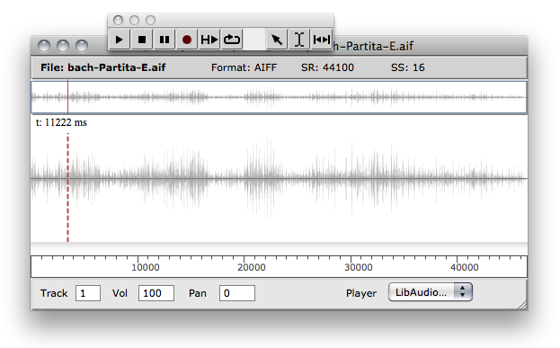
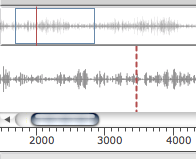
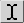
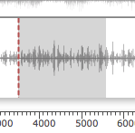
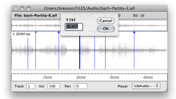
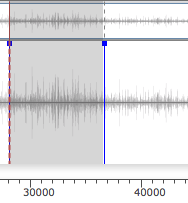

Navigation : [Previous](Sound "page précédente\(Sound Object\)") |
[Next](AudioPlayer "Next\(Audio Player\)")

# The Sound Editor

Double click on an initialized sound box to open its sound editor.

The sound editor displays the sund wave form as well as a number of additional
information : file name, format, sample rate (SR), sample size.

## Navigation and Playback

Use the palette button or the `space` key to play/stop the sound file.

Playing Parameters

Some playback parameter are accessible at the bottom part of the editor :
volume controller, L/R panning, and audio track.

It is also possible, when several players are available, to chosse among them
the one to use for playing the sound (`Player` menu).

More About Audio Tracks and the Audio Player

  * [The Audio Player](AudioPlayer)

Navigation

Use the ruler at the bottom of the waveform display to zoom in/out, and the
scrollbar to navigate in the sound.

The button resets the orginal scale.

|

  
  
---|---  
  
The red vertical line is a cursor indicating the starting point for the
playback of the sound.

Click anywhere on the main panel to set the cursor start position.

Regions

You can select a specific region in the sound using the
 tool of the palette.

When a region is selected, the space play command will trigger playback of
this region only.

To play a region from the palette, use the 
button.

|

  
  
---|---  
  
You can drag a selected region from the sound editor to a patch window in
order to create a new sound box with the selected part of the sound.

## Markers

The sound markers are also visible in the sound editor, and can be added,
moved or deleted from this window.

  * To add a marker, `CMD` \+ click on the sound panel ;
  * To select a maker or a set of markers, jus clic and drag as usual ;
  * To delete selected markers, press `<- ` ;
  * To move markers, drag them with the move or double click and edit the time value.

|

  
  
---|---  
  
Region from markers

Double click in a region between two markers to select it.

This region can then be played or used to create a new sound extract (see
above).

|

  
  
---|---  
  
Warning

Too small regions (under a 200ms) may not be played or extracted correctly.

References :

Plan :

  * [OpenMusic Documentation](OM-Documentation)
  * [OM 6.6 User Manual](OM-User-Manual)
    * [Introduction](00-Sommaire)
    * [System Configuration and Installation](Installation)
    * [Going Through an OM Session](Goingthrough)
    * [The OM Environment](Environment)
    * [Visual Programming I](BasicVisualProgramming)
    * [Visual Programming II](AdvancedVisualProgramming)
    * [Basic Tools](BasicObjects)
    * [Score Objects](ScoreObjects)
    * [Maquettes](Maquettes)
    * [Sheet](Sheet)
    * [MIDI](MIDI)
    * [Audio](Audio)
      * [Sound Object](Sound)
      * Sound Editor
      * [Audio Player](AudioPlayer)
      * [Sound Tools](SoundTools)
      * [Sound Processing](SoundProcessing)
      * [Recording](SoundRecording)
      * [External Libraries](Externals)
      * [Audio Preferences](SoundPreferences)
    * [SDIF](SDIF)
    * [Lisp Programming](Lisp)
    * [Errors and Problems](errors)
  * [OpenMusic QuickStart](QuickStart-Chapters)

Navigation : [Previous](Sound "page précédente\(Sound Object\)") |
[Next](AudioPlayer "Next\(Audio Player\)")

