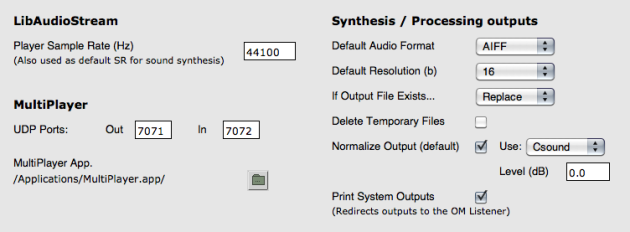

Navigation : [Previous](Externals "page précédente\(External
Libraries\)") | [Next](SDIF "Next\(SDIF\)")

The `Audio` tab in the OM Preferences window gathers a number of options
related to audio features and sound processing in OM.

General Information about OM Preferences

  * [Preferences](Preferences)

LibAudioStream Sample Rate

This option determines the sample rate of the default OM player. OM supports
audio file in any sample rate, but the player has one single rate so playing
files in a different sample rate may produce accelerations or slowdowns.

Some synthesis functions in [External sound processing
libraies](Externals) (e.g. OMChroma) use this parameter to determine the
default sound synthesis output sample rate (when not given explicitely in the
synthesis parameters).

About the Audio Player

  * [The Audio Player](AudioPlayer)

MultiPlayer Options

This part allows to set up the path and default OSC options for an alternative
audio Player.

More about the MultiPlayer and Options

  * [The Audio Player](AudioPlayer)

Default Audio Format

This option allows to choose between AIFF and WAV for the default output
format of sound synthesis or processing functions.

This parameter is used by the [SAVE-SOUND](SoundProcessing) function and
by some [External sound processing libraies](Externals).

Default Resolution

This options allows to choose a default resolution for the output of sound
synthesis or processing functions. Standard accepted standard values are 8, 16
or 24 bits. Some software also accept 32 bits.

This parameter is used by some [External sound processing
libraies](Externals) (e.g. OM2Csound, OM-SuperVP, OM-Chant, OMChroma...)

If Output File Exists...

This options allows OM to determine what to do when some file to be created by
a sound analysis/synthesis process (a sound file, but also possibly an SDIF
file for sound analyses, or other temporary files).

The two available possibilities are

  * **Replace  **: the new file deletes and replace the existing one
  * **Auto-rename**  : the new file is given a new name in order to preserve the existing one (new name is basically of the form <existingname> N , where  N is a number assigned automatically.

Delete Temporary Files

During sound processes, temporary files are often created to store parameters,
intermediary data, etc. With this option you can choose whether the temporary
files should be deleted after the process is done or not. Keeping temporary
file may allow to debug these process but may also saturate your disk space
with unnecessary files.

**Note  :** files are considered "temporary" when they do not appear in the OM
patches. If, for instance, you use an SDIF or text file as input or
intermediary data explicitely specified in your patch, this file should not be
trashed at the end of your process.

Normalize Output

Some sound processing and synthesis utilities from the [External sound
processing libraies](Externals) propose to normalize the resulting
output.

This option allows to set the default behaviour in this case, and to specify
the default normalization level (used if no information is given explicitely
in the patch).

Note that OM does not perform normlization by itself, so the contents of the
normalization menu is empty (and the option disabled) by default. Normalisers
are loaded with external libraries (e.g. OM2Csound or OM-SuperVP).

Print System Outputs

Thsi option allows to redirect the standard output of the external sound
analysis/synthesis processes to the OM Listener.

This option is  extremely useful in order to debug these process (see error
messages) and understand problems. When output prints are important, however,
this can significanltly slow down the evaluation.

References :

Plan :

  * [OpenMusic Documentation](OM-Documentation)
  * [OM 6.6 User Manual](OM-User-Manual)
    * [Introduction](00-Sommaire)
    * [System Configuration and Installation](Installation)
    * [Going Through an OM Session](Goingthrough)
    * [The OM Environment](Environment)
    * [Visual Programming I](BasicVisualProgramming)
    * [Visual Programming II](AdvancedVisualProgramming)
    * [Basic Tools](BasicObjects)
    * [Score Objects](ScoreObjects)
    * [Maquettes](Maquettes)
    * [Sheet](Sheet)
    * [MIDI](MIDI)
    * [Audio](Audio)
      * [Sound Object](Sound)
      * [Sound Editor](SoundEditor)
      * [Audio Player](AudioPlayer)
      * [Sound Tools](SoundTools)
      * [Sound Processing](SoundProcessing)
      * [Recording](SoundRecording)
      * [External Libraries](Externals)
      * Audio Preferences
    * [SDIF](SDIF)
    * [Lisp Programming](Lisp)
    * [Errors and Problems](errors)
  * [OpenMusic QuickStart](QuickStart-Chapters)

Navigation : [Previous](Externals "page précédente\(External
Libraries\)") | [Next](SDIF "Next\(SDIF\)")

