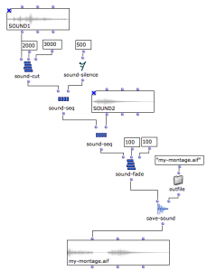
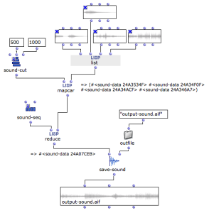

Navigation : [Previous](SoundTools "page précédente\(Sound
Tools\)") | [Next](SoundRecording "Next\(Recording\)")

Sommaire

  1. General Principles
  2. Processing Functions
  3. Cascading Processes
  4. Automating Processing

There exist a number of functions allowing to manipulate sound and audio data.
A number of them are based on the underlying LibAudioStream library
functionalities.

## General Principles

The LibAudioStream library used by OM manipulates sound resources under the
form of " streams ".  Streams can be seen as abstact pointers representing a
sound and possible transformations. In OM the LibAudioStream streams are
embedded in a structure called  SOUND-DATA.

|

The SOUND-MIX function creates a SOUND-DATA pointer corresponding to the mix
of two sounds.  
  
---|---  
  
SOUND-DATA pointers can eventually be rendered and converted back to sound
file using the SAVE-SOUND function.

|

SOUND-SAVE saves the result of SOUND-MIX into a new sound file. The new file
is loaded in a SOUND box.  
  
---|---  
  
## Processing Functions

Below are listed the available sound processing functions. They all produce
SOUND-DATA pointers.

  * **SOUND-MIX**  : mixes two input sounds

  * **SOUND-SEQ**  : concatenates two input sounds

  * **SOUND-VOL**  : modifies the volume of an input sound

  * **SOUND-CUT** : extracts a specified interval out of an inpt sound

  * **SOUND-FADE**  : adds a fade-in / fade-out effect to an input sound

  * **SOUND-LOOP**  : repeats an input sound a number of times

  * **SOUND-SILENCE**  : generates and empty (silent) sound of a given duration.

See the individual box documentation (press `d`) for more detailed
descriptions.

## Cascading Processes

The sound processing tools can also apply directly on SOUND-DATA pointers. It
is therefore possible to apply sequences and combinations of effects and
processes without using intermediary files.

SAVE-SOUND can be used eventually to store the final sound result in a sound
file.

Cascading Sound Processing : An Algorithmic "Montage"

This example implements the following process :

  * 1 second of sound (between 2000 and 3000 ms) is extracted from SOUND1 ( sound-cut )
  * 500ms of silence ( sound-silence ) is appended after the result ( sound-seq )
  * SOUND2 is appended after the previous result ( sound-seq )
  * A global fade-in/fade out of 100ms is applied to the resulting sound ( sound-fade )
  * The final result is saved in the file "my-montage.aif" ( save-sound ) [ outfile autoamtically generates the output file pathname using the OM default out-file folder]

|

  
  
---|---  
  
## Automating Processing

The different programming facilities provided in OM
([iterations](OMLoop), etc.) might be useful to automate sound processing
on sound files and SOUND-DATA pointers.

REDUCE, MAPCAR...

In this example, we use higher-order functions in order to process lists of
sound files and pointers.

  * **mapcar** sequencially cuts a segment from the sounds in the input list by calling SOUND-CUT. Note that the SOUND-CUT box is in  [lambda mode](LambdaMode) in order to be used as a functional argument to  mapcar . The result is a  list of SOUND-DATA pointers. 
  * The Lisp function **reduce** allows to use a function (left input) to combine the successive pairs of elements in a list (right input). **reduce** applies SOUND-SEQ with elements 1 and two in the list, then to the result and element 3, and so forth. We use this function to automatically build a sequence from our list of SOUND-DATA. Note that SOUND-SEQ is also in in  [lambda mode](LambdaMode) ; This time it has two free inputs since **reduce** requires a binary operation to be supplied.
  * Finally the sequence is saved in a new sound file.

(More advanced processed could be imagined, and implemented with
[abstractions](LambdaPatch) or using an [omloop](LoopGeneral)).

|

  
  
---|---  
  
Voir aussi

  * [Higher-Order Programs and Functions](HighOrder)

References :

Plan :

  * [OpenMusic Documentation](OM-Documentation)
  * [OM 6.6 User Manual](OM-User-Manual)
    * [Introduction](00-Sommaire)
    * [System Configuration and Installation](Installation)
    * [Going Through an OM Session](Goingthrough)
    * [The OM Environment](Environment)
    * [Visual Programming I](BasicVisualProgramming)
    * [Visual Programming II](AdvancedVisualProgramming)
    * [Basic Tools](BasicObjects)
    * [Score Objects](ScoreObjects)
    * [Maquettes](Maquettes)
    * [Sheet](Sheet)
    * [MIDI](MIDI)
    * [Audio](Audio)
      * [Sound Object](Sound)
      * [Sound Editor](SoundEditor)
      * [Audio Player](AudioPlayer)
      * [Sound Tools](SoundTools)
      * Sound Processing
      * [Recording](SoundRecording)
      * [External Libraries](Externals)
      * [Audio Preferences](SoundPreferences)
    * [SDIF](SDIF)
    * [Lisp Programming](Lisp)
    * [Errors and Problems](errors)
  * [OpenMusic QuickStart](QuickStart-Chapters)

Navigation : [Previous](SoundTools "page précédente\(Sound
Tools\)") | [Next](SoundRecording "Next\(Recording\)")

