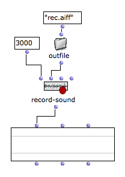
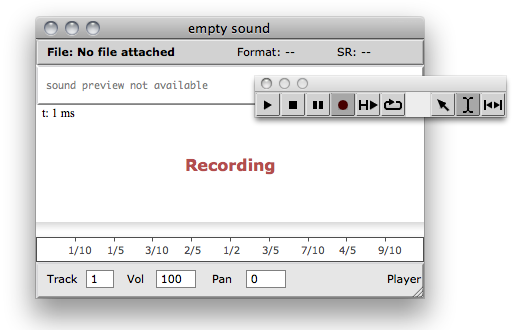

Navigation : [Previous](SoundProcessing "page précédente\(Sound
Processing\)") | [Next](Externals "Next\(External
Libraries\)")

# Recording

OM offers basic functionalities for recording audio input into sound files.

Only stereo recording is currently supported.

## Recording Audio in a Patch

The **RECORD-SOUND** box allows to write the system audio input in a file and
returns the path to this file.

First argument specifies a duration of audio recording. Evaluation will
therefore be "freezed" during this time, before to return the created sound
file.

## Recording Audio in the Sound Editor

Use the RECORD button  in the sound editor
in order to record a new sound.

At pressing RECORD, a dialog will allow to choose a location and name for the
new sound file.

Press the STOP button of the palette to stop recording. The recorded sound
will replace the previous sound in the editor and associated SOUND box.

More about the Sound Editor

  * [The Sound Editor](SoundEditor)

Stereo recording

Note that recorded audio files are always stereo.

External tools exist (ex. in the  OM-SuperVP library) to split multichannel
audio tracks.

References :

Contents :

  * [OpenMusic Documentation](OM-Documentation)
  * [OM User Manual](OM-User-Manual)
    * [Introduction](00-Contents)
    * [System Configuration and Installation](Installation)
    * [Going Through an OM Session](Goingthrough)
    * [The OM Environment](Environment)
    * [Visual Programming I](BasicVisualProgramming)
    * [Visual Programming II](AdvancedVisualProgramming)
    * [Basic Tools](BasicObjects)
    * [Score Objects](ScoreObjects)
    * [Maquettes](Maquettes)
    * [Sheet](Sheet)
    * [MIDI](MIDI)
    * [Audio](Audio)
      * [Sound Object](Sound)
      * [Sound Editor](SoundEditor)
      * [Audio Player](AudioPlayer)
      * [Sound Tools](SoundTools)
      * [Sound Processing](SoundProcessing)
      * Recording
      * [External Libraries](Externals)
      * [Audio Preferences](SoundPreferences)
    * [SDIF](SDIF)
    * [Lisp Programming](Lisp)
    * [Reactive mode](Reactive)
    * [Errors and Problems](errors)
  * [OpenMusic QuickStart](QuickStart-Chapters)

Navigation : [Previous](SoundProcessing "page précédente\(Sound
Processing\)") | [Next](Externals "Next\(External
Libraries\)")

