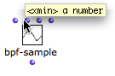
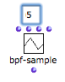
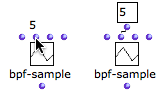

Navigation : [Previous](BoxInputs "page précédente\(Box Inputs\)")
| [Next](AdditionalInputs "Next\(Additional Inputs\)")

# Standard Inputs

## Information and Default Values

Getting Information : Tooltips

|

To display information about an inlet, keep `Cmd` pressed while hovering the
mouse over the inlet. A tooltip appears and displays

  * a parameter name,
  * a short documentation about this parameter.

  
  
---|---  
  
Default Values

All box inputs have default values that are used by the box if no values have
been specified by the user, or if the box is not connected to anything.

To visualize the default value of an inlet, hover the mouse over it. If it is
connected to any kind of component - such as a value or a box - this default
value will be ignored.

|

The default pitch of a note is 6000 midicents, that is, a C4.  
  
---|---  
  
Getting Information about Inputs

  * [Documentation and Info](DocAndInfo)

## Entering Values

To enter a value in an inlet :

  1. click on it

  2. type a value in the text field

  3. validate. 

The value remains hidden unless you hover the mouse over the inlet.

|

  
  
---|---  
  
`SHIFT` click on the inlet to display the input value in a connected data box
that will remain visible.

|

  
  
---|---  
  
Saving Values

** Always validate **after entering a value in an inlet :

  * **** click in the window 
  * press `Enter`.

This is very important since default values can remain hidden.

Input Menu

When the number of possible values is very limited for an argument, some
functions display a pop up menu where the user can pick the desired value.

To chose a menu item, click on the input, and click again in the pop up menu.

The list-filter function has three arguments : the numberp predicate, a list
and an action (pass or reject). Here, it passes numbers only (pass + numberp)
and returns (2).

References :

Plan :

  * [OpenMusic Documentation](OM-Documentation)
  * [OM User Manual](OM-User-Manual)
    * [Introduction](00-Sommaire)
    * [System Configuration and Installation](Installation)
    * [Going Through an OM Session](Goingthrough)
    * [The OM Environment](Environment)
    * [Visual Programming I](BasicVisualProgramming)
      * [Patch Introduction](ProgrammingIntro)
      * [Adding Boxes Into a Patch](AddingBoxes)
      * [Elementary Manipulations](ElementaryManips)
      * [Boxes](Boxes)
      * [Box Inputs](BoxInputs)
        * Standard Inputs
        * [Additional Inputs](AdditionalInputs)
      * [Connections](Connections)
      * [Evaluation](Evaluation)
      * [Documentation and Info](DocAndInfo)
      * [Comments](Comments)
      * [Pictures](Pictures)
      * [Saving / Reloading a Patch](SavingPatch)
      * [Dead Boxes](DeadBox)
    * [Visual Programming II](AdvancedVisualProgramming)
    * [Basic Tools](BasicObjects)
    * [Score Objects](ScoreObjects)
    * [Maquettes](Maquettes)
    * [Sheet](Sheet)
    * [MIDI](MIDI)
    * [Audio](Audio)
    * [SDIF](SDIF)
    * [Lisp Programming](Lisp)
    * [Errors and Problems](errors)
  * [OpenMusic QuickStart](QuickStart-Chapters)

Navigation : [Previous](BoxInputs "page précédente\(Box Inputs\)")
| [Next](AdditionalInputs "Next\(Additional Inputs\)")

