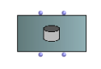
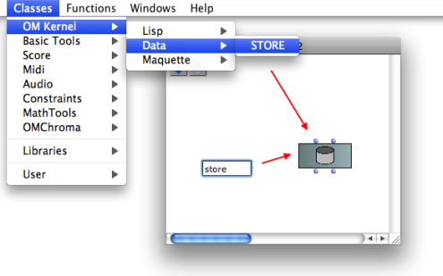
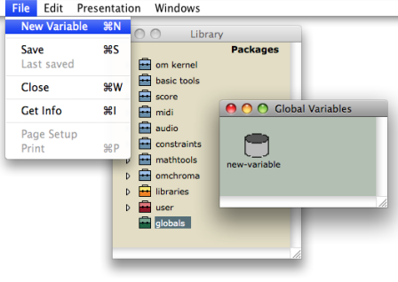
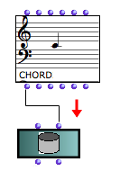
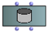
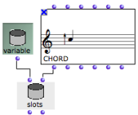
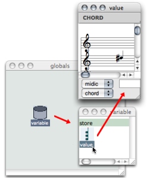

Navigation : [Previous](SlotsBox "page précédente\(Slots\)") |
[Next](InterfaceBoxes "Next\(Interface Boxes\)")

# The Store Object

The  ** store ** object is a **general-purpose object** , which is designed to
store any type of data. For instance, one may want to be able to design one or
more programs and use the **same object** everywhere without defining its type
from the beginning.

The icon of a store object  represents a memory
space.

  1. A store object can be manipulated in a patch just like any other type of object, via factory, instance or  [ slot boxes](SlotsBox) . 

  2. When a global variable[1] is created in the  [ Globals package](Packages) , it is a store object, by default. Consequently, any type of object can be stored into it. 

## The Store Factory Box

The store factory box allows to create any type of variable from any type of
object in a patch.

It has two inputs and outputs :

  * "self" : the store box itself
  * "value" : any data, including instances of other classes.

|

  
  
---|---  
  
To add a store factory box :

  * select `Classes / OMKernel / Data / Store`

  * type "store" directly in the patch editor.

## The Store Default Global Variable

By default, a global variable created in the Globals package is an instance of
the class  Store .

Reminder : Creating a Global Variable

To create a global variable from the Store class :

  *     1. open the Globals package window 

    2. double click on the upper part of the suitcase icon or `Ctrl` / right click and choose `Open`.

  * Select `File / New Variable`.

Creating and Manipulating a Global Variable

  * [Global Variables](GlobalVariables)

## Setting the Value of a Store Object

With a Store Factory Box

  1. Connect the output of an object to the "value" input of a store factory box.

  2. Evaluate the store box.

|

  
  
---|---  
  
Using a Slots Box and a Store Intance - or Global Variable

1\.

|

|

Add a  store instance or global variable  
  
---|---|---  
  
2.

|

|

Add a store slots box : `Cmd` click, type "store" and press `SHIFT` while
validating.  
  
|

3\.

| |

Connect the "self" output of the  store instance  to the "self" input of the
store slots box .  
  
---|---|---  
  
4\.

| |

Connect any type of box to the "value" input of the store slots box.  
  
5\.

| |

Evaluate slots.  
  
| |  
  

The value of the variable is now a chord.  
  
Editing a Store Global Variable With the Store Editor

A global variable can be edited, from the Globals window, or from a patch
editor. Double click on the icon of a store object 
to open its editor.

  * If the value of the store object hasn't been set as described above, the editor displays the following icon : .

This means the value of this variable is "nil". To modify this value, the user
must resort to the procedures described above.

  * If the value of the store object has already been set, it can be modified via the object's editor : 

    1. double click on the value icon to edit it

    2. validate by closing the editor if the object represents **instances** , or click on the editor if it represents **alphanumerical values**. 

Note that the editor of this value is the same as that of the corresponding
class.

|

  
  
---|---  
  
If the store object is a global variable, the corresponding variable in the
Globals package and all of its representations will be affected by possible
modifications.

Renaming Variables

Global variables can only be renamed from the Globals package of the Library
window, and only from this location.

References :

  1. Global variable

An instance of OM object that has been saved in order to be used in other
programs. Global variables are visible from the `Library` window and stored as
.omi files in the `Globals` folder of the workspace.

Contents :

  * [OpenMusic Documentation](OM-Documentation)
  * [OM User Manual](OM-User-Manual)
    * [Introduction](00-Contents)
    * [System Configuration and Installation](Installation)
    * [Going Through an OM Session](Goingthrough)
    * [The OM Environment](Environment)
    * [Visual Programming I](BasicVisualProgramming)
    * [Visual Programming II](AdvancedVisualProgramming)
      * [Abstraction](Abstraction)
      * [Evaluation Modes](EvalModes)
      * [Higher-Order Functions](HighOrder)
      * [Control Structures](Control)
      * [Iterations: OMLoop](OMLoop)
      * [Instances](Instances)
        * [Instance Boxes](InstanceBoxes)
        * [Global Variables](GlobalVariables)
        * [Slots](SlotsBox)
        * The Store Object
      * [Interface Boxes](InterfaceBoxes)
      * [Files](Files)
    * [Basic Tools](BasicObjects)
    * [Score Objects](ScoreObjects)
    * [Maquettes](Maquettes)
    * [Sheet](Sheet)
    * [MIDI](MIDI)
    * [Audio](Audio)
    * [SDIF](SDIF)
    * [Lisp Programming](Lisp)
    * [Reactive mode](Reactive)
    * [Errors and Problems](errors)
  * [OpenMusic QuickStart](QuickStart-Chapters)

Navigation : [Previous](SlotsBox "page précédente\(Slots\)") |
[Next](InterfaceBoxes "Next\(Interface Boxes\)")

