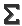
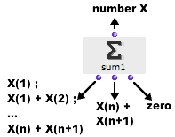
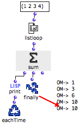
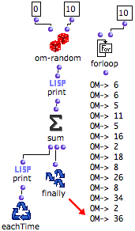

Navigation : [Previous](Collect "page précédente\(Collect\)") |
[Next](MinMax "Next\(Min / Max\)")

# Sum : Calculating Sums

** Sum** adds the successive input values.

## Inputs, Outputs

|

Sum has one input and three outputs :

  * "what" : collects the successive values coming from other boxes.
  * first output :

  1. triggers the collection of a new value, and the addition of this value to a sum

  2. returns the current value of the sum

  * second output : returns the value of the current state of sum
  * third output : resets sum to zero.

  
  
---|---  
  
## Examples

Calculating a Sum from a List

The components of a list are returned successively by listloop to sum.

  1. At each step of the loop, eachtime triggers and prints the sum of the components.

  2. The state of sum at the end of the loop, that is, the sum of all the components of the list, is returned by finally.

|

  
  
---|---  
  
Calculating the Sum of N Random Numbers

|

We now want to calculate the sum of 10 random numbers between 1 and 10.

  1. The number of loops is defined by forloop.

  2. At each step : 

    * a random number is returned by om-random and printed
    * the sum of the successive is returned by sum and printed.
  3. After ten loops, the iteration is stopped by forloop.

  4. Finally returns the sum of the whole set of numbers returned by om-random.

  
  
---|---  
  
References :

Plan :

  * [OpenMusic Documentation](OM-Documentation)
  * [OM User Manual](OM-User-Manual)
    * [Introduction](00-Sommaire)
    * [System Configuration and Installation](Installation)
    * [Going Through an OM Session](Goingthrough)
    * [The OM Environment](Environment)
    * [Visual Programming I](BasicVisualProgramming)
    * [Visual Programming II](AdvancedVisualProgramming)
      * [Abstraction](Abstraction)
      * [Evaluation Modes](EvalModes)
      * [Higher-Order Functions](HighOrder)
      * [Control Structures](Control)
      * [Iterations: OMLoop](OMLoop)
        * [Iteration](LoopIntro)
        * [General Features](LoopGeneral)
        * [Evaluators](LoopEvaluators)
        * [Iterators](LoopIterators)
        * [Accumulators](LoopAccumulators)
          * [Collect](Collect)
          * Sum
          * [Min / Max](MinMax)
          * [Count](Count)
          * [Acum](Acum)
        * [Example : A Random Series](LoopExample)
      * [Instances](Instances)
      * [Interface Boxes](InterfaceBoxes)
      * [Files](Files)
    * [Basic Tools](BasicObjects)
    * [Score Objects](ScoreObjects)
    * [Maquettes](Maquettes)
    * [Sheet](Sheet)
    * [MIDI](MIDI)
    * [Audio](Audio)
    * [SDIF](SDIF)
    * [Lisp Programming](Lisp)
    * [Errors and Problems](errors)
  * [OpenMusic QuickStart](QuickStart-Chapters)

Navigation : [Previous](Collect "page précédente\(Collect\)") |
[Next](MinMax "Next\(Min / Max\)")

