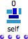
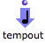
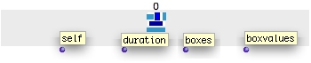
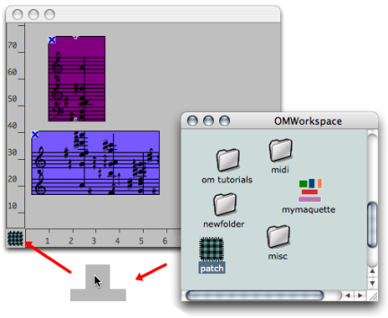
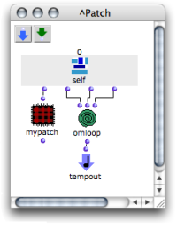

Navigation : [Previous](Synthpatchprog "page précédente\(The
Synthesis Patch\)") | [Next](Synthpatchexample "page
suivante\(Synthesis Patch Example\)")

ci a ete desactive. Certaines fonctionnalites de ce guide sont restreintes.

# Calculating the Value of a Maquette

A synthesis patch is like a standard patch. It produces a value  **from the
content** of a maquette.

To access this content, a ** Maquette Self Input ** :
 must be added in the patch.

The patch can then manipulate this content.

The result of the computation is attributed to the maquette via the
**Tempout** of the patch.

## The Maquette Self Input

Parameters

The  **Maquette Self Input** returns the maquette's content. It can be used
**as a patch input** . The Maquette Self Input returns:

  1. the maquette's  **value** itself,

  2. the  **duration** of the maquette,

  3. the  **list of boxes** contained in the maquette,

  4. the list  **each box's value** contained in the maquette.

## The Synthesis Patch

Creating and Implementing the Patch

  1. Create a blue or red patch.

  2. Drag and drop the patch on the lower-left corner of the maquette editor. 

  3. Add a  **Maquette Self Input** in the patch :

`Ctrl` / right click and choose `TemporalBoxes / Maq Self Input`.

  4. Add a  **Tempout** to the patch : 

`Ctrl` / right click and choose `TemporalBoxes / Temporal Output`.

You can now manipulate the data returned by the Maquette Self Input with the
program you will design in the synthesis patch.  The maquette's value will be
that of the object connected to the Tempout  **of the synthesis patch** .

|

  
  
---|---  
  
Evaluation Program

The resulting synthesis patch actually is the  **evaluation program, or
evaluation tool** of the maquette. When the maquette is evaluated, the
Maquette Self Input of the  synthesis patch is updated, and the  synthesis
patch is evaluated too.

Accessing the Results of a Synthesis Patch ?

The result of a synthesis patch is computed **when the maquette is evaluated**
. The information produced is returned to other boxes only for  **subsequent
computation** : the Self Input box must be considered a virtual storage box.
Consequently, information won't be displayed in the Listener, unless a
specific function, like print, is resorted to.

This synthesis patch prints the list returned by the Maquette Self Input : its
reference, duration, TemporalBoxes references, and the objects contained in
the TemporalBoxes.

Assigning a Synthesis Patch via a Maquette Input

  * [Assigning a Synthesis Patch to a Maquette with the Set-Eval Function](Seteval)

Internal Patches / Synthesis Patch

Modifying an internal patch doesn't affect the other references of the patch,
including the patch that was dropped in the corner of the maquette. Out of
security, we advise you to make a copy of the last version of this internal
patch.

References :

Plan :

  * [OpenMusic Documentation](OM-Documentation)
  * [OM User Manual](OM-User-Manual)
    * [Introduction](00-Sommaire)
    * [System Configuration and Installation](Installation)
    * [Going Through an OM Session](Goingthrough)
    * [The OM Environment](Environment)
    * [Visual Programming I](BasicVisualProgramming)
    * [Visual Programming II](AdvancedVisualProgramming)
    * [Basic Tools](BasicObjects)
    * [Score Objects](ScoreObjects)
    * [Maquettes](Maquettes)
      * [Creating a Maquette](Maquette)
      * [TemporalBoxes](TemporalBoxes)
      * [The Maquette Editor](Editor)
      * [Maquette Programming](Programming%20Maquette)
        * [Functional Components](InputsOutputs)
        * [Evaluation](MaquetteEvaluation)
        * [The Synthesis Patch](Synthpatchprog)
          * Maquette Value
          * [Synthesis Patch Example](Synthpatchexample)
          * [Set-Eval Function](Seteval)
        * [TempBoxes Programming](TempProgramming)
      * [Maquettes in Patches](Maquettes%20in%20Patches)
    * [Sheet](Sheet)
    * [MIDI](MIDI)
    * [Audio](Audio)
    * [SDIF](SDIF)
    * [Lisp Programming](Lisp)
    * [Errors and Problems](errors)
  * [OpenMusic QuickStart](QuickStart-Chapters)

Navigation : [Previous](Synthpatchprog "page précédente\(The
Synthesis Patch\)") | [Next](Synthpatchexample "page
suivante\(Synthesis Patch Example\)")

