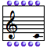
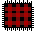
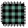
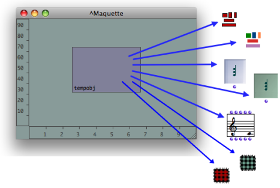

Navigation : [Previous](Maquette "page précédente\(Creating a
Maquette\)") | [Next](AddingTempbox "Next\(Adding
TemporalBoxes\)")

# TemporalBoxes

The boxes used within maquettes are called  **TemporalBoxes** .

## References

A TemporalBox can refer to several types of items :

  * an instance : 

|

 

|

  * a patch : 

|

 

|

  * a maquette : 

|

   
  
---|---|---|---|---|---  
  

## Uses

Using TemporalBoxes as Programs

TemporalBoxes can be used in a maquette for manipulating data, like mere
programs. In this case, data is returned to and from TemporalBoxes  **through
standard inputs and outputs** .

The program of the TemporalBox can implement its relation to the maquette's
context via a  **temporal input** .

Using TemporalBoxes as Musical Objects

TemporalBoxes can also be used in a maquette for producing a musical value,
like musical objects, which are **played** in the maquette. This musical value
is expressed by a  **temporal output** .

References :

Plan :

  * [OpenMusic Documentation](OM-Documentation)
  * [OM 6.6 User Manual](OM-User-Manual)
    * [Introduction](00-Sommaire)
    * [System Configuration and Installation](Installation)
    * [Going Through an OM Session](Goingthrough)
    * [The OM Environment](Environment)
    * [Visual Programming I](BasicVisualProgramming)
    * [Visual Programming II](AdvancedVisualProgramming)
    * [Basic Tools](BasicObjects)
    * [Score Objects](ScoreObjects)
    * [Maquettes](Maquettes)
      * [Creating a Maquette](Maquette)
      * TemporalBoxes
        * [Adding TemporalBoxes](AddingTempbox)
        * [Elementary Manipulations](elementary)
        * [Temporalboxes Appearance](Appearance)
        * [TemporalBoxes Value](TempValues)
      * [The Maquette Editor](Editor)
      * [Maquette Programming](Programming%20Maquette)
      * [Maquettes in Patches](Maquettes%20in%20Patches)
    * [Sheet](Sheet)
    * [MIDI](MIDI)
    * [Audio](Audio)
    * [SDIF](SDIF)
    * [Lisp Programming](Lisp)
    * [Errors and Problems](errors)
  * [OpenMusic QuickStart](QuickStart-Chapters)

Navigation : [Previous](Maquette "page précédente\(Creating a
Maquette\)") | [Next](AddingTempbox "Next\(Adding
TemporalBoxes\)")

