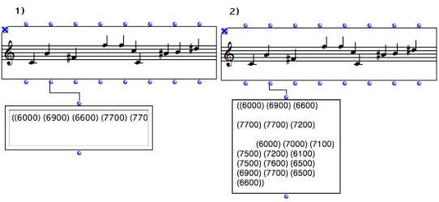
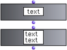
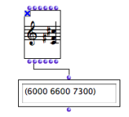

Navigation : [Previous](GeneralFeatures "page précédente\(General
Features\)") | [Next](CheckBox "Next\(Check Box\)")

# Text Boxes

Text boxes allow to input or visualize a text in a visual program. There exist
two types of text boxes :

  * **text-boxes** are limited to **a single line**. They accept neither line returns, nor tabulations.

  * ** text-views  ** can have several lines and accept line returns or tabulations.

1) TEXT-BOX and 2) TEXT-VIEW

## Inputs / Outputs

Text-Box and Text-View

|

Text boxes have one input and output :

  * "text" input : something to display, such as a  string[1] or other type of data.

  * "text" output : returns the current contents of the box.

  
  
---|---  
  
## Uses

Displaying Results

Text boxes are convenient tools for the visualization of intermediate results
returned by boxes.

|

Using a text box to display a result.  
  
---|---  
  
Modifying Inputs Intermediate Data

Text boxes can also be use for inputting or modifying f-data in OM visual
programs.

|

Using a text box to input data. Lock the box to preserve its content at the
evaluation.  
  
---|---  
  
"Lock" Mode

Text boxes must be locked not to be reinitialized and return their current
content at the evaluation.

To lock a box, press `b` .

References :

  1. String

A characters chain between two inverted commas.

Contents :

  * [OpenMusic Documentation](OM-Documentation)
  * [OM User Manual](OM-User-Manual)
    * [Introduction](00-Contents)
    * [System Configuration and Installation](Installation)
    * [Going Through an OM Session](Goingthrough)
    * [The OM Environment](Environment)
    * [Visual Programming I](BasicVisualProgramming)
    * [Visual Programming II](AdvancedVisualProgramming)
      * [Abstraction](Abstraction)
      * [Evaluation Modes](EvalModes)
      * [Higher-Order Functions](HighOrder)
      * [Control Structures](Control)
      * [Iterations: OMLoop](OMLoop)
      * [Instances](Instances)
      * [Interface Boxes](InterfaceBoxes)
        * [General Features](GeneralFeatures)
        * Text Boxes
        * [Check Box](CheckBox)
        * [List Boxes](ListBoxes)
        * [Button](Button)
        * [Slider Box](Slider)
        * [Pop-Up Menu Box](MenuBoxes)
        * [Examples of Use](InterfaceExample)
      * [Files](Files)
    * [Basic Tools](BasicObjects)
    * [Score Objects](ScoreObjects)
    * [Maquettes](Maquettes)
    * [Sheet](Sheet)
    * [MIDI](MIDI)
    * [Audio](Audio)
    * [SDIF](SDIF)
    * [Lisp Programming](Lisp)
    * [Reactive mode](Reactive)
    * [Errors and Problems](errors)
  * [OpenMusic QuickStart](QuickStart-Chapters)

Navigation : [Previous](GeneralFeatures "page précédente\(General
Features\)") | [Next](CheckBox "Next\(Check Box\)")

