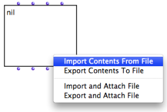
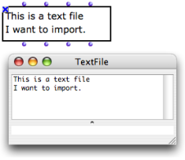
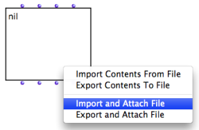
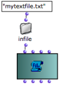
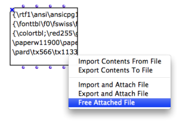
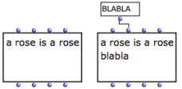

Navigation : [Previous](TextFileEdition "page précédente\(TextFile
Edition\)") | [Next](Picture "Next\(Picture\)")

# TextFile and Outer Environment

## Importing / Exporting Contents

The contents of  textfile can be imported or exported from / to a **** file on
the disk.

Import and Export From a Box

|

To import or export a contents :

  1. `Ctrl` / right click on the  textfile box

  2. choose `Import Contents from File` or `Export contents to File` in the contextual menu

  3. choose a file and directory in the dialogue window. 

  
  
---|---  
  
The imported file appears in the textfile box and in the buffer.

|

  
  
---|---  
  
Import or Export from the Editor

  * To import contents from an external file to the open text editor, select `File / Import From...`

  * To export contents, select `File / Savec As...`

## External File Attachment

Other options allow to attach the object permanently to an **external file on
the disk** .

From the TextFile Box

|

  * To fill  textfile with the contents of a persistent file, Ctrl / right click on the box, select `Import and Attach File` . 
  * To save the contents of textfile in an external file, select `Export and Attach File`.

These option are alike "Import" and "Export" options, but they link the
content of the object with a file on the hard drive of the computer.  
  
---|---  
  
With a File Pathname

To initialize a  textfile with a file :

  1. enter the name of a file in the "self" input of an  infile , outfile or tempfile box

  2. connect the output of the box to the "self" input of the textfile box.

The  textfile is then  attached to the corresponding file.

|

Connecting a pathname to TextFile  
  
---|---  
  
About Pathnames

  * [Creating and Using Pathnames](Pathnames)

Example : Reading a Pathname

When a box returns a **pathname** , this pathname can be visualized via a
textfile box.

The editsco function from the OM2Csound userlibrary writes a text file - a
Csound score - and returns the file
pathname.[Zoom](../res/csound2text_scr_1.png "Zoom \(nouvelle fenêtre\)")

Removing Attachements

To remove a link to a file, select `Free Attached File`.

This option is only available if the textfile is already attached to a file.
Once the attached file is is "freed", the contents of the  textfile is
**internalized** in the patch.

|

  
  
---|---  
  
## File Modification

Save Command

Inputting data via "exp-list" on append mode.

|

To modify an attached file :

  1. input data via the "exp-list" input

  2. evaluate the box

  3. from the text editor, press `cmd` \+ `s` to store the modifications in the box.

When the object is saved, the related file on the hard drive is modified as
well.  
  
---|---  
  
Externalized Contents

The attached file has been deleted. The Listener displays an error message.

|

Contrary to the "import" and "export" options, the `attach` option implies
that the textfile object itself refers to a persistent file. Hence, its
content won't be stored int the patch itself.

  * Parallel modifications of the attached file will affect the textfile box's content.

  * If the **attached file** is deleted of moved, the textfile will be empty when the patch is reloaded.

  
  
---|---  
  
References :

Contents :

  * [OpenMusic Documentation](OM-Documentation)
  * [OM User Manual](OM-User-Manual)
    * [Introduction](00-Contents)
    * [System Configuration and Installation](Installation)
    * [Going Through an OM Session](Goingthrough)
    * [The OM Environment](Environment)
    * [Visual Programming I](BasicVisualProgramming)
    * [Visual Programming II](AdvancedVisualProgramming)
    * [Basic Tools](BasicObjects)
      * [Curves and Functions](CurvesAndFunctions)
      * [Array](ClassArray)
      * [TextFile](textfile)
        * [TextFile Edition](TextFileEdition)
        * Outer Environment
      * [Picture](Picture)
    * [Score Objects](ScoreObjects)
    * [Maquettes](Maquettes)
    * [Sheet](Sheet)
    * [MIDI](MIDI)
    * [Audio](Audio)
    * [SDIF](SDIF)
    * [Lisp Programming](Lisp)
    * [Errors and Problems](errors)
  * [OpenMusic QuickStart](QuickStart-Chapters)

Navigation : [Previous](TextFileEdition "page précédente\(TextFile
Edition\)") | [Next](Picture "Next\(Picture\)")

