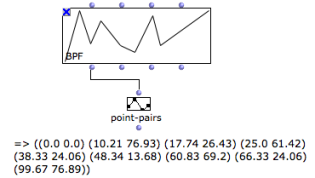
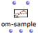
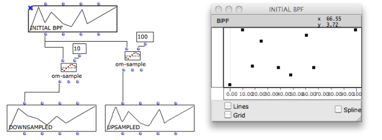
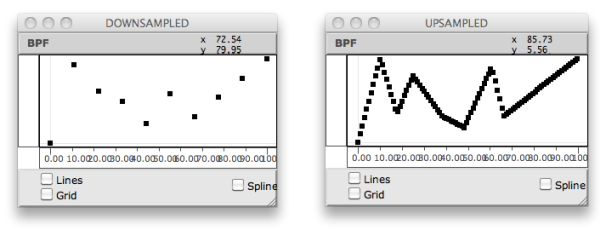
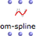
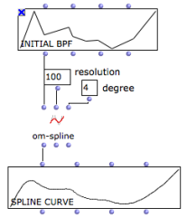

Navigation : [Previous](BPFLibEditors "page précédente\(BPF-Lib /
BPC-Lib Editors\)") | [Next](3D "Next\(3D Objects\)")

# BPF and BPC Tools

This section details a set of important concept and tools. Among these, a
number of function boxes allow to build or manipulate BPFs and BPCs. To access
these tools, go to `Functions / Basic Tools / Curves & Functions`.

Online Documentation Reference

The online function reference provides more detailed information about the
following (and more) functions, as well as different arguments. To refer to
it, select a function and press `d`.

## Getting Coordinates : Transfer and Point Coordinates

Point-Pairs : Points of the Curve

The ** point-pairs ** function returns the points of the curve as a list of (x
y) coordinates.

Point-pairs : list of (x y) points in the curve.

Transfer : Selected Points

Two  **transfer** tools return the values of points that are not explicitly
given in the curve.

  * **" X-transfer" ** returns the ordinates for a given abscissa. 

  * **" Y-transfer" ** returns the abscissa values corresponding to given ordinates.

Transfers : x-transfer returns the y-coordinate for x=5. Y-transfer returns
the various abscissa for y=20.

## Sampling a Curve : Om-Sample

|

Sampling consists in creating a new curve of n regularly sampled points, out
of an initial set of points.  
  
---|---  
  
Inputs

The  **om-sample** function has two default inputs :

  * "self" : a list of points,  BPF or  BPC objects. 

  * "sample-rate" : a **number of samples** in integers, or a **sample-rate** in floats. 

It has three optional inputs :

  * "x-min" and "x-max" define a segment to sample within the curve.

  * "decimals" :

|

The sampling rate can be expressed as a float input to Om-
sample[zoom](../res/SRsample_scr_1.png "Zoom \(nouvelle fenêtre\)")  
  
---|---  
  
"sample-rate" input : Integer or Float

Be a curve whose min = 0 and max = 100.

  * Integer :  n = 20 we get 20 points, whose values are (0 5 10 15 20 25 30 35 .... 100).
  * Float : SR = 20.0, we get 5 points, whose values are (0 20.0 40.0 60.0 80.0 100.0). 

In any case  n = (xmax - xmin) / SR

Outputs

Om-sample returns 3 values :

  * a sampled object, such as a  BPF ,  BPC ...
  * a list of  x -coordinates
  * a list of  y -coordinates

Up-Sampling and Down-Sampling

If  n is lower than the initial number of points, curves are **down-sampled**.
If  n is higher, curves are **up-sampled**.

## Splines : Om-Spline

|

**Splines** are mathematical functions defined piecewise by polynomial
interpolation. They are used for generating  smoothed interpolated shapes ,
starting from a set of control points.

The ** om-spline ** function generates spline curves starting from the points
of a BPF or BPC.  
  
---|---  
  
Inputs

  * "resolution" : a number of points in the spline preview. 

  * "degree" : a number of **adjacent control points** used for computing the spline curve points. Higher values produce smoother curves.

Outputs

The three outputs of om-spline return :

  * a spline object (BPF, BPC...)

  * a list of x-coordinates

  * a list of y-coordinates

|

  
  
---|---  
  
Spline Preview

The BPF and BPC editors allow to visualize a preview of the output spline
object.

Spline Preview in the BPF/BPC Editors.

  * [Display Options](Display)

References :

Plan :

  * [OpenMusic Documentation](OM-Documentation)
  * [OM User Manual](OM-User-Manual)
    * [Introduction](00-Sommaire)
    * [System Configuration and Installation](Installation)
    * [Going Through an OM Session](Goingthrough)
    * [The OM Environment](Environment)
    * [Visual Programming I](BasicVisualProgramming)
    * [Visual Programming II](AdvancedVisualProgramming)
    * [Basic Tools](BasicObjects)
      * [Curves and Functions](CurvesAndFunctions)
        * [BPF / BPC](BPF-BPC)
        * [BPF/BPC-Libs](MultiBPF)
        * [Editors](BPFEditors)
        * BPF / BPC Tools
        * [3D Objects](3D)
      * [Array](ClassArray)
      * [TextFile](textfile)
      * [Picture](Picture)
    * [Score Objects](ScoreObjects)
    * [Maquettes](Maquettes)
    * [Sheet](Sheet)
    * [MIDI](MIDI)
    * [Audio](Audio)
    * [SDIF](SDIF)
    * [Lisp Programming](Lisp)
    * [Errors and Problems](errors)
  * [OpenMusic QuickStart](QuickStart-Chapters)

Navigation : [Previous](BPFLibEditors "page précédente\(BPF-Lib /
BPC-Lib Editors\)") | [Next](3D "Next\(3D Objects\)")

