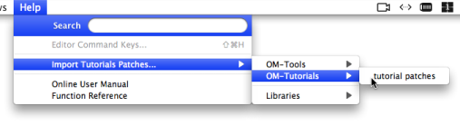

Navigation : [Previous](UserLibraries "\(Extra Libraries\)") | [Next](resources "\(Resources\)")

# Examples Patches and Tutorials

The OM application and libraries generally come with a set of example patches and tutorial allowing to get into different aspects and features of the compositional environment.

To import this material, go to the `Help / Import Tutorial Patches` menu.

When an item is selected, a corresponding new folder is created in the current workspace (or folder) window, filled with a set of tutorial patches.

## Contents :

  * [OpenMusic Documentation](OM-Documentation)
  * [OM User Manual](OM-User-Manual)
    * [Introduction](00-Contents)
    * [System Configuration and Installation](Installation)
    * [Going Through an OM Session](Goingthrough)
    * [The OM Environment](Environment)
      * [Environment Windows](MainWindows)
      * [Preferences](Preferences)
      * [Workspace](Workspace)
      * [Library](Library)
      * Tutorials
      * [Resources](resources)
    * [Visual Programming I](BasicVisualProgramming)
    * [Visual Programming II](AdvancedVisualProgramming)
    * [Basic Tools](BasicObjects)
    * [Score Objects](ScoreObjects)
    * [Maquettes](Maquettes)
    * [Sheet](Sheet)
    * [MIDI](MIDI)
    * [Audio](Audio)
    * [SDIF](SDIF)
    * [Lisp Programming](Lisp)
    * [Reactive mode](Reactive)
    * [Errors and Problems](errors)
  * [OpenMusic QuickStart](QuickStart-Chapters)

Navigation : [Previous](UserLibraries "\(Extra Libraries\)") | [Next](resources "\(Resources\)")

